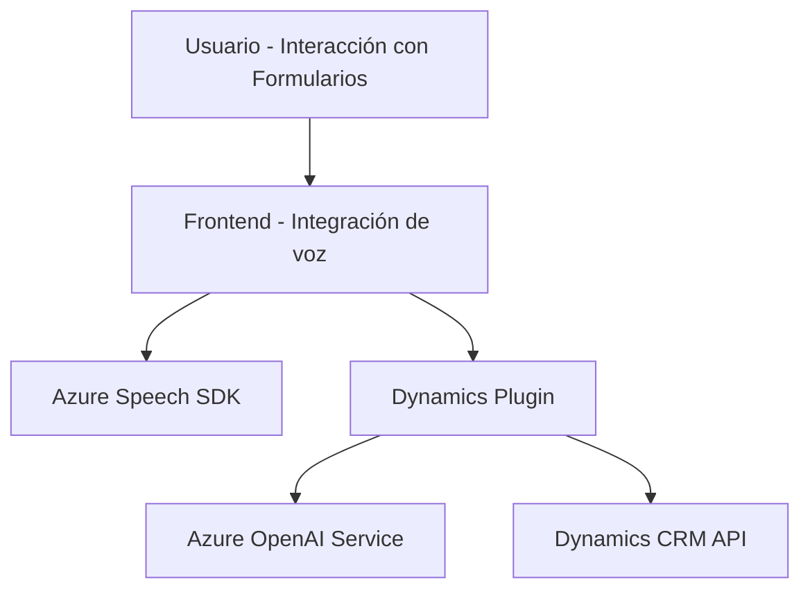

### Breve Resumen Técnico
Este repositorio describe componentes que pertenecen a una solución que integra **Azure Speech SDK** y posiblemente **Azure OpenAI** para ofrecer funcionalidades avanzadas de reconocimiento y síntesis de voz, junto con procesamiento de texto basado en IA. La solución abarca un frontend para la interacción del usuario y plugins extendibles en Dynamics CRM.

---

### Descripción de Arquitectura
1. **Tipo de Solución:**  
   La solución presenta características de una **aplicación híbrida** conformada por:
   - **Front-end modular funcional** para interactuar con formularios y servicios de voz.
   - **Plugins en Dynamics CRM** que realizan integraciones basadas en IA como complemento del ecosistema de Microsoft Dynamics.

2. **Arquitectura:**  
   La arquitectura general parece estar basada en la **n-capas**, donde cada capa cumple una función distinta:
   - **Presentación (Frontend):** Interactúa con el usuario para captar datos del formulario y realizar procesos de síntesis/reconocimiento de voz.
   - **Aplicación (Plugins):** Encapsula lógica relacionada con reglas y transformación de texto con Azure OpenAI.
   - **Integración (Servicios Externos):** Incluye servicios de Speech SDK y OpenAI en Azure, gestionados mediante llamadas dinámicas.

3. **Patrones Observados:**  
   - **Fachada Modular:** Métodos simplificados para iniciar interacciones de voz y datos.
   - **Proxy:** Comunicación abstracta con APIs externas (Azure SDKs y Dynamics API).
   - **Carga dinámica de dependencias:** Garantiza que sólo se descarguen los recursos necesarios en tiempo de ejecución.

---

### Tecnologías Usadas
1. **Azure Speech SDK:**  
   - Procesos de síntesis y reconocimiento de voz.

2. **Azure OpenAI Service:**  
   - Para procesamiento de texto utilizando modelos GPT en aplicaciones SaaS.

3. **Dynamics CRM Plugin API:**  
   - Extensiones específicas dentro del entorno de Dynamics CRM.

4. **JavaScript:**  
   - Para el manejo de lógica en el front-end.

5. **C# (.NET Framework):**  
   - Para la implementación de plugins en Dynamics CRM.

---

### Dependencias Externas Presentes
- **Azure Services:** Speech SDK y OpenAI para integración de servicios cloud.
- **Dynamics 365 API:** Comunicación directa con la plataforma Dynamics CRM.
- **Librerías comunes:**  
  - Newtonsoft.Json, System.Text.Json: Para el procesamiento de datos JSON y serializaciones.
  - System.Net.Http: Para comunicación HTTP externa.

---

### Diagrama **Mermaid** 100% compatible con GitHub Markdown

---

### Conclusión Final
La solución presentada es una integración híbrida que combina un front-end modular con servicios dinámicos de voz y un back-end con funcionalidades avanzadas de IA, extendiendo el ecosistema de Microsoft Dynamics CRM. Su arquitectura basada en **n-capas** con patrones de carga dinámica, fachada y proxy lo hace escalable y adaptable. Es ideal para organizaciones que busquen mejoras en accesibilidad (voz) y automatización avanzada (IA) en sus sistemas empresariales.