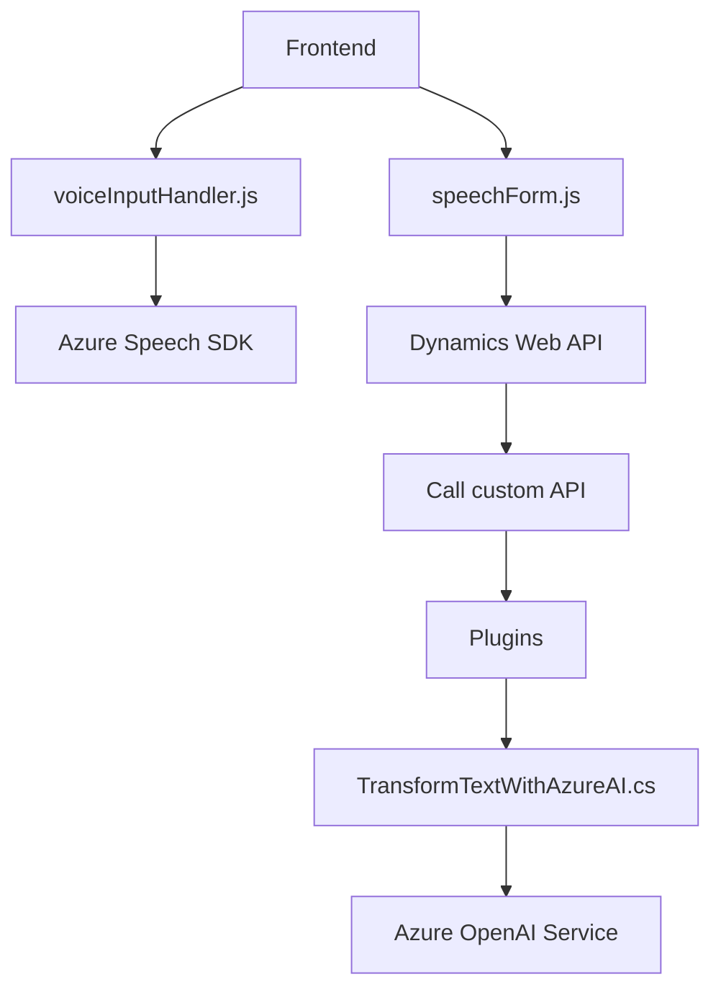

### Breve resumen técnico
El repositorio consta principalmente de tres archivos con funcionalidades interconectadas:
1. Modulos **Frontend** en JavaScript que gestionan interacciones entre voz y formularios, utilizando **Azure Speech SDK** para síntesis y reconocimiento, así como conexiones con **Dynamics CRM**.
2. Un **Plugin backend en .NET** que interactúa con **Dynamics CRM** y el servicio de **Azure OpenAI**, con el propósito de procesar texto ingresado, transformarlo según reglas y generar salidas estructuradas tipo JSON.

### Descripción de arquitectura
- **Tipo de solución**: Combina elementos **frondend y backend**, con integración hacia servicios externos como Azure Speech SDK y OpenAI. Es extensible para sistemas de CRM que requieran procesamiento avanzado de datos vía voz e inteligencia artificial.
- **Arquitectura general**:
  - **Front-end**: Modularidad con un diseño funcional basado en JavaScript. Utiliza servicios cloud y APIs externas para sintetizar voz y aplicar datos a formularios.
  - **Back-End**: Plugin orientado a microservicios. A diferencia de un monolito, cada funcionalidad está encapsulada en servicios externos (CRM/Dynamics y Azure API).
  - En general, la solución sigue una arquitectura de **n capas**, con separación entre una capa de presentación (JavaScript), lógica de negocio (backend en .NET) y una capa en la nube (Azure).

### Tecnologías usadas
1. **Frontend:**
   - JavaScript ES6.
   - SDKs externos: **Azure Speech SDK** y Dynamics 365 Web API.
   - Programación asincrónica (`async/await`, Promesas).
2. **Backend:**
   - Lenguaje **C#**.
   - Frameworks .NET para plugins: **Microsoft.Xrm.Sdk**, `HttpClient`.
   - Serialización con **Newtonsoft.Json** o `System.Text.Json`.
   - Conexión a servicios externos: Azure OpenAI.

### Dependencias y componentes externos
1. **Azure Speech SDK**: Para síntesis de voz y reconocimiento.
2. **Azure OpenAI API**: Para transformaciones avanzadas de texto basadas en IA.
3. **Dynamics 365 CRM Web API**: Para gestión de datos del CRM.
4. **Componentes internos**:
   - Capa lógica del formulario de Dynamics, con su estructura interna de atributos y procesos (`formContext`).

---

### Diagrama Mermaid válido para GitHub:

---

### Conclusión final
Este repositorio implementa una solución técnica sólida que aprovecha tecnologías cloud con procesamiento basado en seguridad y modularidad. Sus capacidades en síntesis y reconocimiento de voz, además del manejo de textos con inteligencia artificial, lo hacen ideal para la entrada avanzada de datos en ambientes empresariales (como un CRM). Sin embargo, se puede mejorar con mayor seguridad en los datos sensibles y agregando tolerancia a fallos en los servicios.