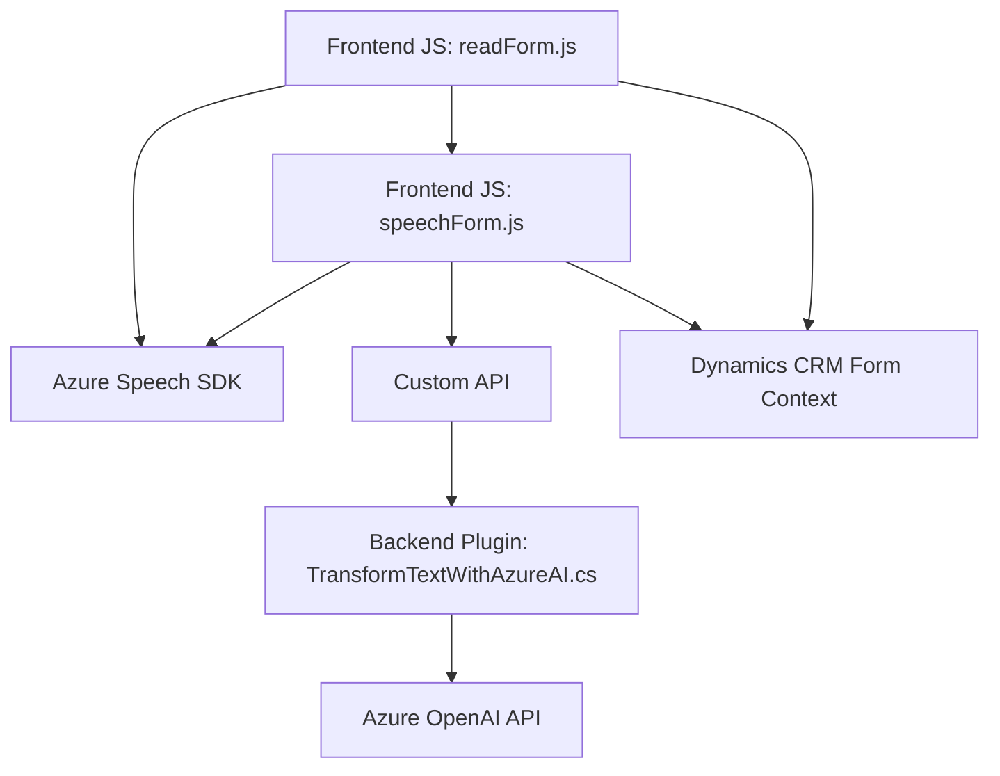

### Breve resumen técnico

El repositorio hace uso de una solución basada en **Microsoft Dynamics CRM** para manipular formularios mediante reconocimiento y síntesis de voz con el **Azure Speech SDK**. Adicionalmente, incluye un plugin en **C#** que aprovecha la API de **Azure OpenAI** para transformar texto en un formato estructurado.

### Descripción de arquitectura

La solución sigue un modelo **n capas**, donde cada componente tiene responsabilidades bien definidas:

1. **Frontend**: Interactúa con el usuario. Utiliza JavaScript para manejar los formularios y funciones de reconocimiento y síntesis de voz en el navegador integrado en el entorno CRM.  
   - La capa de presentación incluye dos archivos clave: `readForm.js` y `speechForm.js`. Estos scripts se ejecutan sobre un contexto cliente del CRM, y emplean JavaScript junto con el SDK de Azure Speech para procesar eventos relacionados con el reconocimiento y síntesis de voz.
   
2. **API personalizada**: Se integra mediante `Xrm.WebApi.online.execute` desde los archivos JavaScript del frontend para llamadas al backend y acceso a bases de datos.  
   
3. **Plugins del CRM (Backend)**: Componentes en C# como `TransformTextWithAzureAI.cs` añaden comportamiento personalizado al CRM y actúan como mediadores entre el cliente y servicios externos, como Azure OpenAI.  

En resumen, la arquitectura está diseñada para ser flexible, adoptando un enfoque de **Service-Oriented Architecture (SOA)** al integrar servicios externos como Azure Speech SDK y Azure OpenAI.

---

### Tecnologías, frameworks y patrones usados

#### **Tecnologías y Frameworks**
1. **JavaScript**: Usado en la capa de presentación del frontend para funciones relacionadas con el reconocimiento y procesamiento de voz.
2. **Azure Speech SDK**: Para reconocimiento y síntesis de voz basado en el servicio cloud de Azure.
3. **Microsoft Dynamics CRM SDK (JavaScript y C#)**: Para interactuar con los datos del sistema CRM.
4. **Azure OpenAI API**: En el backend, para transformar texto mediante inteligencia artificial.
5. **Newtonsoft.Json** (C#): Para trabajar con objetos JSON en el plugin.
6. **System.Net.Http** (C#): En el plugin C# para enviar y recibir datos desde servicios web.

#### **Patrones**
1. **Event-driven architecture**: Los archivos JS escuchan y procesan eventos generados por el usuario en el CRM.
2. **Separation of concerns**: El diseño modular separa la lógica de reconocimiento/síntesis de voz (frontal) de la lógica de transformación de texto (backend).
3. **Dependency Injection via IServiceProvider**: El plugin utiliza DI para obtener dependencias necesarias durante la ejecución.
4. **Dynamic Dependency Loading**: El SDK de Azure Speech se carga solo cuando es necesario, reduciendo la dependencia inicial y acelerando la carga de la aplicación.
5. **Façade Pattern**: Simplifica y controla el acceso a servicios externos como Azure Speech SDK y Azure OpenAI API.

---

### Diagrama Mermaid

El siguiente diagrama describe cómo las principales componentes del sistema interactúan entre sí.

### Conclusión final

Esta solución implementa una interacción fluida entre **usuarios**, el entorno **Dynamics CRM**, y los servicios externos de **Microsoft Azure**. La arquitectura modular facilita la extensibilidad del sistema, permitiendo agregar nuevas funcionalidades como procesamiento de voz o manejo de datos estructurados.

El sistema es robusto al incluir:
1. **Capas bien separadas** (frontend presentación, backend procesamiento, y servicios externos).
2. **Uso de servicios cloud altamente integrados** (Azure Speech, OpenAI).
3. **Manejo de dependencias dinámicas** que optimiza la carga inicial.

Sin embargo, hay espacio para mejorar:
- **Testing unitario** y validación explícita de datos para evitar posibles fallos durante el reconocimiento y procesamiento de voz.
- Mejorar la gestión de los errores en los servicios externos para proporcionar una experiencia más sólida al usuario.