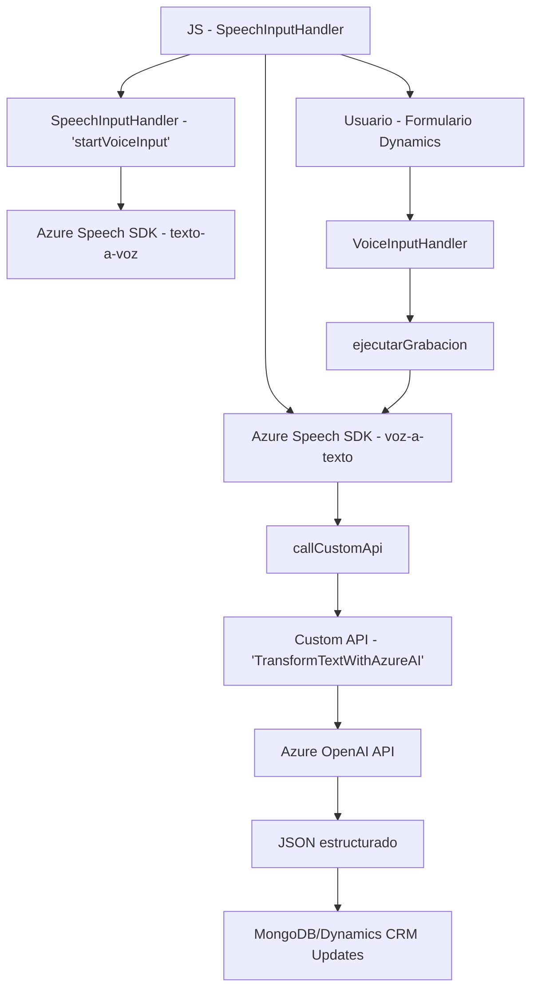

### Breve resumen técnico

El repositorio contiene una solución que integra funcionalidades de conversión de texto a voz y voz a texto, para la interacción con formularios en entornos de Microsoft Dynamics CRM. La integración utiliza el **Azure Speech SDK** y **Azure OpenAI API** mediante componentes JavaScript para la lógica en el frontend, mientras que un plugin `TransformTextWithAzureAI` en **C#** interactúa directamente con Dynamics CRM para realizar transformaciones programadas de texto utilizando AI.

---

### Descripción de arquitectura

- **Tipo de solución:** API integrada con Microsoft Dynamics CRM, una solución para mejorar la interacción con formularios mediante la extensión de funcionalidades de entrada y salida de voz.
- **Arquitectura:**  
  La solución está basada en una arquitectura de n capas, con el siguiente desglose:
  1. **Capa de cliente (Frontend)**: Incluye scripts JavaScript ejecutados en el entorno del navegador. Usa Azure Speech SDK para interacción voz-texto en los formularios.
  2. **Capa Backend (Plugins CRM)**: Desarrollada en C#, actúa como intermediaria para las operaciones en Dynamics CRM usando su SDK y realizando llamadas a APIs externas como Azure OpenAI.
  3. **Capa externa (Servicios API)**: Incluye el Azure Speech SDK y la API de Azure OpenAI para la síntesis y transformación del texto.

---

### Tecnologías usadas

1. **Frontend (JavaScript):**
   - **Azure Speech SDK**: Para el procesamiento de voz y generación de texto hablado.
   - **Web APIs (window.SpeechSDK)**: Para interactuar con el navegador y cargar dinámicamente scripts.

2. **Backend (C#, Plugins):**
   - **Microsoft Dynamics CRM API (XRM SDK):** Para interacción directa con formularios, atributos y datos CRM.
   - **Azure OpenAI API:** Para realizar transformaciones inteligentes de texto en el servidor mediante inteligencia artificial.
   - **System.Net.Http:** Para realizar solicitudes HTTP a servidores externos.
   - **JSON parsers:** Manejo de objetos JSON usando las bibliotecas `System.Text.Json` y `Newtonsoft.Json.Linq`.

3. **APIs externas:**
   - Azure Speech SDK.
   - Azure OpenAI API.
   - Custom APIs definidas para el procesamiento de texto en Dynamics CRM (ejemplo: `TransformTextWithAzureAI.cs`).

---

### Diagrama **Mermaid** válido para GitHub

---

### Conclusión final

La solución implementada es una aplicación de cliente y servidor basada en la integración con servicios en la nube de Microsoft Azure y Dynamics CRM. Presenta una arquitectura de n capas que permite separar claramente la lógica de negocio (frontend y backend) de los servicios externos (Azure Speech SDK y OpenAI API). Este enfoque facilita la escalabilidad y modularidad del sistema.

- El uso del **Azure Speech SDK** permite la entrada y salida de voz para formularios en Dynamics, aportando accesibilidad y facilidad.
- El backend en C# aprovecha la **Azure OpenAI API** para realizar transformaciones avanzadas en el texto mediante inteligencia artificial.
- Las arquitecturas de servicio acopladas a Dynamics y Azure ofrecen una solución robusta pero con dependencia de servicios externos y del SDK de Dynamics.

Se podrían explorar posibles mejoras, como encapsular aún más la lógica en clases y asegurar el manejo seguro de las claves de API. Esta solución es ideal para implementar funcionalidades de asistencia de voz basadas en AI para entornos específicos como Microsoft Dynamics CRM.