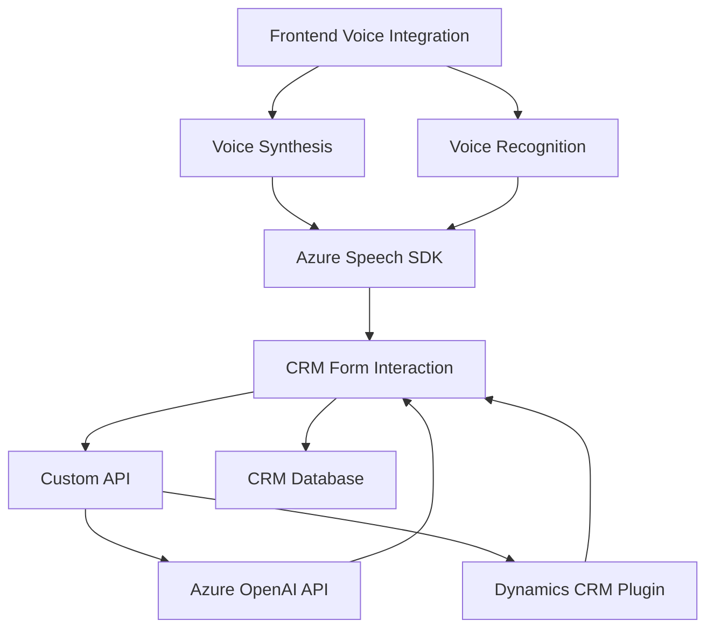

# Análisis técnico y estructural del repositorio

## Breve resumen técnico
El repositorio contiene implementaciones para integrar reconocimiento y síntesis de voz con formularios de Microsoft Dynamics CRM utilizando Azure Speech SDK y Azure OpenAI. Está dividido en dos componentes principales:

1. **Frontend:** consta de archivos JavaScript para gestionar el reconocimiento de voz, síntesis de texto a voz y procesamiento de datos en formularios dinámicos.
2. **Backend:** un plugin en C# que extiende Microsoft Dynamics CRM al interactuar con Azure OpenAI para transformar y estructurar los textos reconocidos.

---

## Descripción de arquitectura

La arquitectura sigue un enfoque **híbrido**, que combina los siguientes elementos:
1. **Microservicio:** El plugin de Dynamics actúa como parte de una arquitectura de microservicios al interactuar con la Custom API de Microsoft y Azure OpenAI en un flujo externo. Se encapsula la responsabilidad de manejar texto con reglas de transformación específicas.
2. **N-capas:** El frontend: utiliza una aproximación en capas. Se separan las responsabilidades del SDK, la lógica de reconocimiento/síntesis de voz y la manipulación de datos en formularios.
3. **Event-driven Architecture:** En el frontend se trabaja con callbacks para gestionar flujos asincrónicos, como la carga del Azure Speech SDK y el manejo de eventos de registro/reconocimiento.

---

## Tecnologías usadas

### **Frontend**
- **JavaScript ES6+**
- **Azure Speech SDK** (para la síntesis y el reconocimiento de voz).
- **Microsoft Dynamics CRM SDK**: Integración directa controlada tanto por el frontend como por la API para manipular campos del CRM.

### **Backend**
- **C#:**
  - Framework base de ASP.NET para construir el plugin.
  - Microsoft Dynamics CRM SDK (`Microsoft.Xrm.Sdk`) para extender formularios e integrarse con datos organizacionales.
- **Azure OpenAI API:** Llamadas a un servicio de IA para transformar textos dictados en datos JSON estructurados.
- **System.Net.Http:** Para realizar solicitudes HTTP.
- **Newtonsoft.Json.Linq y System.Text.Json:** Para manejar procesos JSON en la comunicación con APIs externas.

---

## Dependencias y componentes externos

1. **Azure Speech SDK:** Para manejar datos de voz tanto en síntesis como en reconocimiento.
2. **Azure OpenAI API:** Utilizada en el plugin backend para procesar y transformar texto según reglas estructuradas.
3. **Microsoft Dynamics CRM SDK:** Escucha eventos y modifica datos del formulario en integración con el CRM.
4. **Custom API** (trial_TransformTextWithAzureAI): Posible microservicio externo para convertir transcripciones en anotaciones estructuradas.
5. **CDNs:** Azure Speech SDK se carga dinámicamente desde un enlace a través de la función `ensureSpeechSDKLoaded`. Dependencia de conectividad a servidores externos en cada ejecución.

---

## Diagrama **Mermaid** válido para GitHub Markdown

---

## Conclusión final

La solución presenta una arquitectura híbrida, combinando elementos de microservicios, n-capas y event-driven programming para lograr integración fluida entre reconocimiento/síntesis de voz y el sistema CRM de Dynamics. Utiliza Microsoft y Azure SDKs para interactuar de forma dinámica en el frontend y el backend.

Desde el punto de vista técnico, es modular y bien estructurada, con funciones desacopladas para facilitar el mantenimiento y la ampliación. Sin embargo, una observación crítica sería la presencia de credenciales sensibles en el código plugin, lo que compromete la seguridad general del sistema y debería solucionarse utilizando vaults o configuraciones de entorno seguras.

La representación visual en formato Mermaid demuestra la interacción de componentes, dejando claro cómo los diferentes subsistemas cooperan para realizar reconocimiento, síntesis y manipulación de datos en tiempo real.