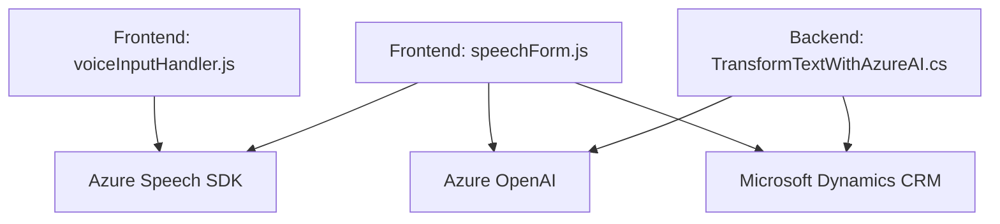

### Breve Resumen Técnico
El repositorio contiene diversos archivos que interactúan con **Azure Speech SDK** y **Microsoft Dynamics CRM**. La funcionalidad principal del sistema está orientada al procesamiento de datos provenientes de formularios web y el aprovechamiento de servicios externos como **Azure Speech SDK** y **Azure OpenAI** para sintetización de voz, reconocimiento de voz y estructuración avanzada de textos.

---

### Descripción de Arquitectura
La solución implementa una arquitectura híbrida:
1. **Frontend (JS)**:
   - Es estructurado de manera modular para gestionar la interfaz y sus interacciones con los servicios externos.
   - Con funciones organizadas que implementan patrones de eventos y callbacks para cargar SDKs dinámicamente.
   - Formato similar a **MVC-like**, donde los datos del modelo (formulario) son manipulados en el cliente.

2. **Backend (C#)**:
   - Usa una arquitectura **plugin-based** facilitada por Microsoft Dynamics CRM para extender las funcionalidades nativas del sistema.
   - Implementa comunicación hacia **Azure OpenAI API** con diseño altamente orientado a servicios.

3. **Patrones arquitectónicos mayores:**
   - **Event-driven** (Frontend): Las acciones dependen de eventos como clics, transcripciones o la carga del SDK.
   - **Service-Oriented** (Backend): Se estructura en torno al consumo de APIs externas (Azure Speech SDK, Azure OpenAI).
   - **Modularidad**: Organización clara de funciones para trazabilidad y separación de responsabilidades.

---

### Tecnologías Usadas
1. **Lenguajes y Marcos de trabajo**:
   - **JavaScript (Frontend)**: Para implementar reconocimiento de voz y procesamiento de texto en Dynamics.
   - **C# (Backend)**: Para implementar el plugin en Microsoft Dynamics 365.
   
2. **Servicios Externos**:
   - **Azure Speech SDK**: Reconocimiento y síntesis de voz.
   - **Azure OpenAI**: Procesamiento avanzado de texto con modelos GPT.

3. **Dependencias Backend**:
   - **Microsoft.Xrm.Sdk**: Integración con CRM Dynamics.
   - **Newtonsoft.Json** y **System.Text.Json**: Manejo de JSON.
   - **System.Net.Http**: Para solicitudes HTTP/HTTPS.

4. **APIs Internas/Custom**:
   - APIs de Dynamics 365 para formularios (`Xrm.WebApi.create/update`).

---

### Diagrama Mermaid Compatible con GitHub
El siguiente diagrama representa las interacciones principales entre los componentes y servicios externos:

---

### Conclusión Final
La solución destaca por su enfoque modular y por su integración con servicios de Azure y Microsoft Dynamics CRM. Desde el frontend, se implementa reconocimiento de voz y síntesis mediante **Azure Speech SDK**, y los datos se procesan utilizando **Azure OpenAI** para estructuración avanzada. En el backend, el plugin de Dynamics extiende la funcionalidad del CRM mediante solicitudes asincrónicas a **Azure OpenAI**.

La arquitectura es híbrida, combinando un sistema backend basado en plugins (Dynamics CRM) con un frontend que interactúa mediante llamadas API y SDKs externos. La solución es escalable y aprovecha patrones modernos como orientación a servicios, modularidad y manejo de eventos. Esto la hace ideal para entornos empresariales que requieran capacidades de procesamiento y conversión avanzada como parte de su flujo de trabajo.