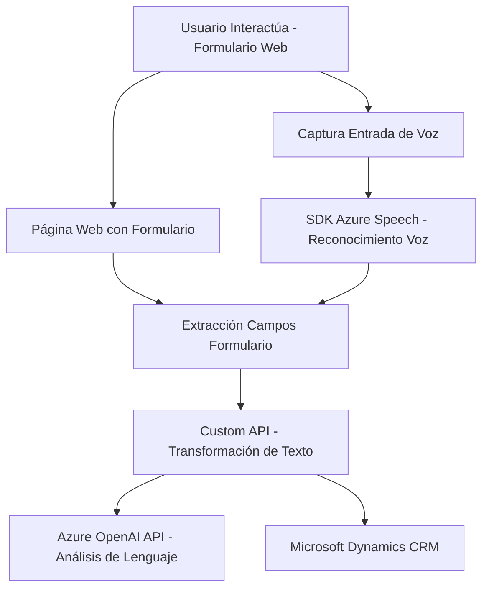

### Breve Resumen Técnico
El repositorio contiene tres archivos principales (`readForm.js`, `speechForm.js`, y `TransformTextWithAzureAI.cs`) que implementan una solución para la interacción entre usuarios y formularios. El sistema permite la extracción de datos visuales de formularios, entrada de voz para la transcripción de texto utilizando Azure Speech SDK, y la transformación semántica del texto vía Azure OpenAI API. Está diseñado para integrarse dentro de Microsoft Dynamics CRM.

---

### Descripción de Arquitectura
La arquitectura del sistema tiene las siguientes características fundamentales:
1. **N-capas**:
   - La solución está estructurada en tres capas principales:
     - **Capa de Presentación (Frontend/JS)**: Manejo de la interfaz de usuario, extracción de datos de formularios, y entrada por voz.
     - **Capa de Lógica de Negocios (Plugins)**: Transformación del texto usando reglas específicas a través del plugin de Dynamics.
     - **Capa de Acceso a Servicios Externos (Azure Speech SDK, Azure OpenAI)**: integración con APIs de reconocimiento de voz y procesamiento de lenguaje natural.
2. **Integración con Servicios Externos**:
   - Utiliza servicios externos para el reconocimiento de voz y transformación semántica del texto.
3. **Orientación a eventos**: 
   - La arquitectura está basada en eventos, con activadores como la entrada de voz, transcripción automática, y llamadas a APIs externas.
4. **Modularidad**:
   - Los archivos de frontend están organizados en funciones auxiliares para mejorar la reutilización y la limpieza del código.
5. **Extensibilidad**:
   - Gracias al diseño plugin-oriented y la implementación de `IPlugin`, el código es reutilizable y puede integrarse en otras funcionalidades de Dynamics CRM.

---

### Tecnologías y Frameworks
1. **Frontend**:
   - **JavaScript**: Script principal para procesar JSON, tratar formularios HTML y ejecutar métodos asincrónicos.
   - **Azure Speech SDK**: API para la transcripción y síntesis de voz.
   - **Microsoft Dynamics Web API**: Para realizar llamadas a la Custom API y manipular los atributos del formulario.

2. **Backend (plugin)**:
   - **Microsoft Dynamics CRM SDK**: Framework nativo para desarrollo extensible dentro del CRM.
   - **System.Text.Json & Newtonsoft.Json**: Serialización/deserialización JSON y procesamiento avanzado de datos estructurados.
   - **HttpClient (.NET)**: Para integrar servicios REST externos.

---

### Dependencias o Componentes Externos
1. **Azure Speech SDK**: Para servicios de reconocimiento de voz y síntesis de texto a voz.
2. **Azure OpenAI API**: Procesamiento semántico de texto basado en inteligencia artificial (GPT).
3. **Microsoft Dynamics Web API**: Manejo de formularios y atributos en el sistema CRM.
4. **Entidades personalizadas en Dynamics CRM**: Custom APIs y mapeo dinámico de campos del formulario.
5. **General Web APIs**: Llamadas REST (HttpClient).

---

### Diagrama Mermaid
 

### Conclusión Final
La solución presentada opera como un servicio que procesa datos de formularios a través de interacción por voz, transformándolos y conectándolos con un sistema CRM mediante plugins programados. La arquitectura en capas permite una separación clara de responsabilidades, mientras que la integración con APIs externas (Azure Speech SDK y Azure OpenAI) facilita capacidades avanzadas como reconocimiento de voz y procesamiento semántico. Este enfoque modular asegura escalabilidad y extensibilidad dentro del entorno empresarial.