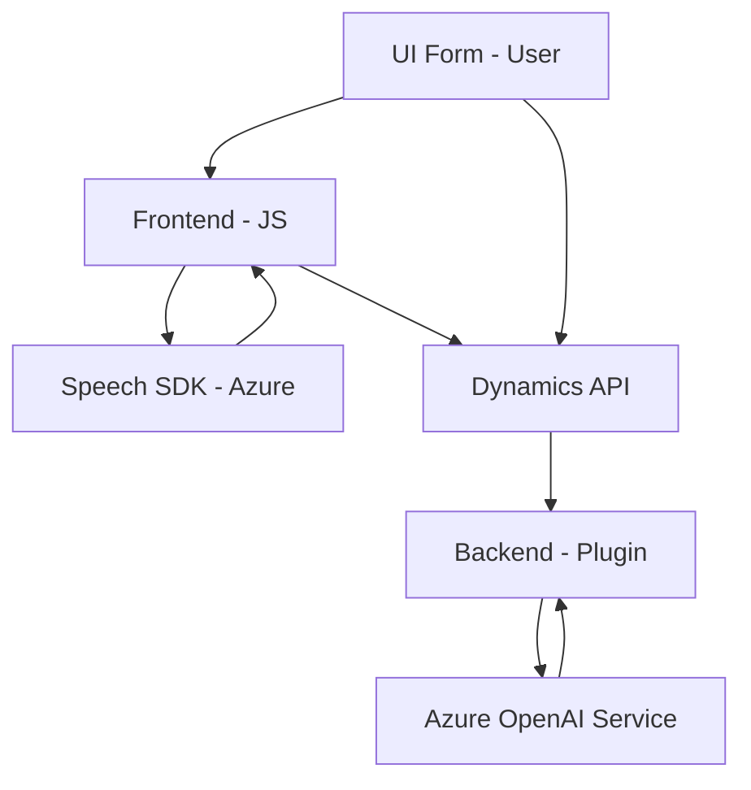

### Breve resumen técnico

La solución combina funciones para interacción avanzada entre formularios y servicios de voz de Azure, reconocimiento de voz y procesamiento de datos con inteligencia artificial, y un plugin para extensibilidad en Dynamics CRM. Se trata de un entorno híbrido que integra frontend, servicios de voz, microservicios de inteligencia artificial, y extensibilidad backend.

---

### Descripción de arquitectura

**Arquitectura principal:**  
Se trata de una arquitectura de **n capas**, orientada a servicios, que incluye componentes distribuidos:
1. **Frontend (JS):**
   - Incluye módulos para manejar formularios, reconocimiento y síntesis de voz utilizando el **Azure Speech SDK**.
   - Funciones organizadas en módulos que interactúan con formularios y gestionan datos, aplicando el patrón Facade.
   - Programación modular con componentes reutilizables.
   
2. **Backend (Plugins en Dynamics CRM):**
   - Utiliza una arquitectura basada en **plugins**.
   - Hace uso de patrones como el proveedor de servicios (`IServiceProvider`) y la integración con una API externa(**Microservicio de Azure OpenAI Service**) para procesamiento de datos.

El sistema sigue un diseño híbrido. El frontend se organiza en capas funcionales para manejar la interacción del usuario y formularios, mientras que el backend ejecuta lógica de negocio mediante plugins integrados con sistemas de terceros.

---

### Tecnologías y patrones usados

1. **Frontend (JavaScript archivos)**:
   - **Lenguaje:** JavaScript.
   - **SDK externo:** Azure Speech SDK: usado para reconocimiento y síntesis de voz.
   - **Integración:** Integración con Dynamics CRM mediante el uso de `Xrm.WebApi`, trabajando directamente con formularios y APIs personalizadas.
   - **Patrones de diseño:** 
     - **Facade** para simplificar el acceso a funcionalidades complejas (manipulación de formularios y servicios de voz). 
     - **Modularización** para mejorar testabilidad y reusabilidad (cada función realiza un rol bien definido). 
     - **Callback**: Para carga diferida del SDK de Azure Speech.

2. **Backend (C# plugin):**
   - **Lenguaje:** C#.
   - **Framework:** .NET para desarrollos en Dynamics CRM.
   - **Dependencias:** Microsoft.Xrm.Sdk para interacción con CRM; Newtonsoft.Json y System.Text.Json para manejo de datos JSON; integraciones HTTP mediante System.Net.Http.
   - **Patrones de diseño:** 
     - **Extensibilidad mediante plugins**: para ampliar la lógica de negocios en Dynamics CRM.
     - **Inversión de dependencia** (Uso de IServiceProvider).
     - **Microservicio**: Consumo de la API de Azure OpenAI para procesamiento de texto.

---

### Diagrama Mermaid

---

### Conclusión final

Esta solución representa una integración entre frontend y servicios backend en un sistema de **n capas** con una orientación a servicios. Está diseñado para la interacción entre texto y voz mediante integración con APIs de Microsoft Dynamics CRM y Azure (Speech SDK y OpenAI). La arquitectura y los patrones de diseño usados, como Facade, Inversion of Control y integración con microservicios, hacen que esta solución sea escalable y mantenible para escenarios empresariales de alta disponibilidad. 

Incorporando tecnologías modernas como el SDK de Azure Speech y un plugin extensible para Dynamics CRM, la solución está completamente alineada con principios de diseño modular y componibilidad. Sin embargo, su función principal se centra en enriquecer aplicaciones CRM con capacidades de IA y voz.