### Breve resumen técnico
El repositorio integra tres componentes: un **frontend** en JavaScript, un **backend** en .NET para Dynamics CRM y dependencias externas orientadas a servicios como **Azure Speech SDK** y **Azure OpenAI**. Su propósito principal es realizar procesos de síntesis y reconocimiento de voz en formularios basados en Dynamics CRM, así como utilizar la inteligencia artificial de Azure para transformar textos.

---

### Descripción de la arquitectura
La solución es una mezcla de **arquitectura de n capas** y **Service-Oriented Architecture (SOA)**. El sistema consiste en:
1. Una capa **frontend**, que implementa interacción del usuario con formularios y dependencias dinámicas (Azure Speech SDK).
2. Una capa **backend** en Dynamics CRM que utiliza plugins para conectarse a **Azure OpenAI** mediante APIs HTTP.
3. Dependencia de servicios externos (Azure Speech y OpenAI), integrados como microservicios fuera del sistema principal.

Se utiliza una separación clara de responsabilidades: los archivos JavaScript en el frontend procesan formularios y llaman APIs, mientras que los archivos C# en el backend procesan eventos en base a acciones del usuario.

---

### Tecnologías usadas
- **Frontend:**
  - **JavaScript**: Desarrollo de scripts para síntesis y reconocimiento de voz.
  - **Azure Speech SDK**: Reconocimiento y síntesis de voz.
- **Backend:**
  - **.NET Framework**: Desarrollo de plugins con C# para Dynamics CRM.
  - **Microsoft.Xrm.Sdk**: Librería oficial para interactuar con el entorno CRM.
  - **Azure OpenAI API**: Procesamiento de texto usando modelos como GPT-4.

### Patrones utilizados
- **Separación de responsabilidades**: Cada módulo y clase tiene una función específica: extracción de datos, síntesis/reconocimiento de voz, procesamiento de texto con IA, y actualización de formularios.
- **Integración de servicios externos**: Uso de patrones de llamado dinámico a SDKs y APIs de terceros (Azure Speech, Azure OpenAI).
- **Módulo**: Estructuración del código por funcionalidades específicas facilita la reutilización.

---

### Arquitectura general
- **n capas**: La solución tiene una separación funcional en una capa de presentación (frontend) y una capa de servicios (backend y APIs).
- **SOA**: Predomina la colaboración con servicios externos abarrotados de microfuncionalidades, como Azure Speech y OpenAI.
- **Cliente-servidor**: Frontend y backend interactúan con APIs para procesar e interpretar información.

---

### Diagrama Mermaid válido para GitHub

```mermaid
graph TD
    A["Usuario - Accede a formulario CRM"]
    B["Frontend - VozInput.js &#38; voiceInputHandler.js"]
    C["Azure Speech SDK - Sintetiza/Reconoce voz"]
    D["Backend Dynamics CRM"] 
    E["Plugin - TransformTextWithAzureAI.cs"]
    F["Azure OpenAI API - Procesa texto"]

    A --> B
    B --> C
    B --> D
    D --> E
    E --> F
```

---

### Conclusión final
La solución implementa una arquitectura flexible basada en n capas para interacción con formularios dinámicos, voz y servicios de inteligencia artificial. Con la integración de herramientas de Azure, este sistema es ideal para automatización en entornos CRM como Dynamics. Sin embargo, sería beneficioso definir estrategias para tratamiento de errores y límites en las llamadas a servicios externos. La estructura modular facilita la escalabilidad, pero podría beneficiarse de técnicas avanzadas como la arquitectura hexagonal para optimizar aún más la separación de servicios y dependencias externas.