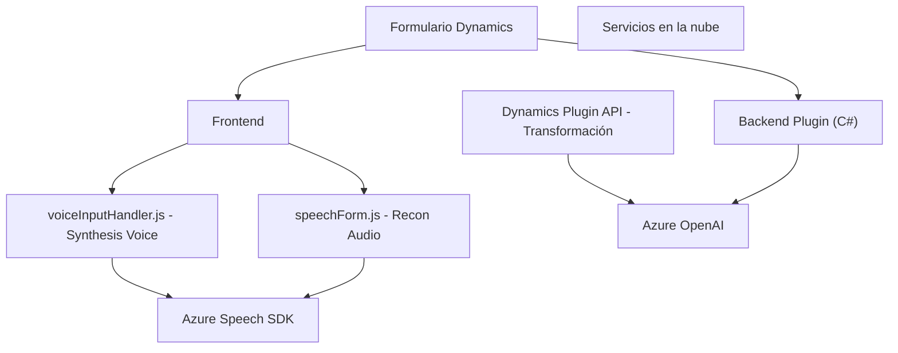

### Breve resumen técnico:
El repositorio que has proporcionado contiene archivos relacionados con dos áreas principales:
1. **Frontend en JavaScript**: Implementa funcionalidades relacionadas con reconocimiento y síntesis de voz (e.g., `voiceInputHandler.js`, `speechForm.js`) en formularios pertenecientes a Microsoft Dynamics.
2. **Backend en C#**: Define un plugin (`TransformTextWithAzureAI.cs`) que extiende Microsoft Dynamics CRM al integrarse con servicios de Azure OpenAI para transformar texto según reglas predefinidas.

---

### Descripción de arquitectura:
#### **Tipo de solución**:
- La solución es un **ecosistema híbrido local y en la nube**, combinando funciones que interactúan con:
  - Formularios del cliente (frontend).
  - Plugins backend (Dynamics CRM) que acceden a servicios en la nube (Azure Speech SDK, OpenAI).

#### **Arquitectura**:
1. **Estructura general**:
   - Se emplea una arquitectura de **n capas**:
     - **Presentación (Frontend)**: Los ficheros JavaScript gestionan reconocimiento de voz, síntesis y la conexión entre los datos de los formularios de Dynamics.
     - **Capa de Lógica (Plugin C#)**: Procesa, transforma el texto, y asegura que los datos se manejen según las reglas definidas.
     - **Capa de Servicios en la nube**: Usa Azure Speech SDK y OpenAI para externalizar tecnologías avanzadas como reconocimiento, síntesis de voz e inteligencia artificial generativa.
2. **Patrones de diseño presentes**:
   - **Modularización**: Código altamente dividido en funciones específicas con responsabilidades claras.
   - **Integración basada en servicios**: Utilización de APIs externas (Azure Speech, OpenAI).
   - **Callback y asincronía**: Carga dinámica del SDK en el frontend, manejo de promesas en el plugin backend.
   - **Adaptador**: Traducción entre datos locales del sistema CRM y formatos específicos para servicios externos.
   - **Plugin Design**: El plugin de Dynamics sigue el patrón estándar de `IPlugin` para extender las capacidades del sistema CRM.
   - **Cliente-Servidor**: El backend actúa como cliente de APIs externas, delegando responsabilidades en la nube.

---

### Tecnologías usadas:
1. **Frontend**:
   - **JavaScript**: Gestión dinámica de formularios y servicios de voz.
   - **Azure Speech SDK**: Reconocimiento y síntesis de voz.
   - **DOM**: Para carga de scripts y manipulación de formularios.

2. **Backend**:
   - **C# (.NET Framework)**:
     - Plugin basado en interfaces de Microsoft Dynamics CRM (`IPlugin`).
     - Comunicación con API de Azure OpenAI vía `HttpClient`.
   - **Newtonsoft.Json**: Manejo de datos en JSON.
   - **Azure OpenAI**: Transformación avanzada de texto.
   - **Regex** (opcional): Posibles validaciones sintácticas.

3. **Servicios en la nube**:
   - **Azure Speech Services**: Para reconocimiento y síntesis de voz.
   - **Azure OpenAI (GPT)**: Procesamiento y transformación textual con ML/IA.

---

### Dependencias y componentes externos:
- **Azure Speech SDK**: Dinámicamente cargado en el frontend.
- **Azure OpenAI endpoint** (OpenAI/GPT): Plugin backend consume texto y regla de transformación.
- **Microsoft Dynamics CRM**:
  - Formularios y datos (`executionContext`, `formContext`).
  - El plugin opera directamente sobre entidades CRM y sus atributos asociados.
- **Servicios de red HTTP**: Para llamar a APIs como Speech y OpenAI.
- **DOM (Frontend)**: Para cargar scripts y manejar dinámicamente valores del formulario.

---

### Diagram Mermaid 100 % compatible con GitHub Markdown:

---

### Conclusión final:
Esta solución híbrida integra formulación dinámica en el frontend con servicios avanzados de ML/IA en la nube mediante plugins backend de Dynamics CRM. La arquitectura basada en n capas permite mantener una separación clara de responsabilidades entre presentación, lógica y servicios externos. Azure Speech SDK y OpenAI actúan como componentes clave para abordar las funcionalidades de reconocimiento de voz, síntesis y transformación avanzada de texto, respectivamente.

La estructura es modular, reutilizable y extensible para futuros desarrollos que empleen más funcionalidades o integren otros servicios.