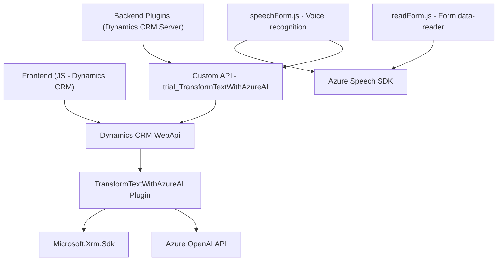

### Breve Resumen Técnico
El repositorio implementa una solución orientada a Dynamics CRM con funcionalidades avanzadas de reconocimiento y síntesis de voz, así como procesamiento de texto mediante servicios de inteligencia artificial. Está compuesto por archivos que interactúan con formularios dinámicos del sistema CRM, utilizando **Azure Speech SDK** y **Azure OpenAI** en combinación con plugins y servicios personalizados. 

### Descripción de Arquitectura
La arquitectura combina elementos de una solución **n-capas** y una integración extensible mediante plugins. Los archivos de frontend (`JS`) interactúan con los formularios dinámicos de Dynamics CRM mediante la API de cliente (`Xrm.WebApi`) y servicios externos (Azure Speech SDK y Azure OpenAI). Por otro lado, los plugins en el backend (`TransformTextWithAzureAI.cs`) ejecutan lógica enriquecida orientada al procesamiento de texto mediante un servicio REST externo, utilizando patrones como **Plugin Pattern** y **Request-Response**.

Aunque los módulos individuales están altamente especializados, la arquitectura general sigue el paradigma monolítico extendido (Dynamics CRM como base del sistema) con integración de servicios externos para funciones avanzadas.

### Tecnologías Usadas
1. **Frontend (readForm.js, speechForm.js):**
   - **Azure Speech SDK:** Síntesis y reconocimiento de voz.
   - **JavaScript:** Para manipulación de DOM, formularios y lógica de cliente.
   - **Dynamics CRM APIs:** `Xrm.WebApi` y otras herramientas para obtener datos dinámicos y actualizar atributos en formularios CRM.
   - **Event-driven programming:** Emplea eventos de formularios para desencadenar acciones de síntesis y reconocimiento de voz.
   - **Integration with external APIs:** Comunicación con Azure OpenAI y Speech SDK para tratamiento avanzando de voz y texto.

2. **Backend (Plugins):**
   - **C#:** Implementación de un plugin en Microsoft Dynamics CRM.
   - **Microsoft Dynamics SDK (`IPlugin`):** Para extender la funcionalidad de CRM mediante plugins.
   - **Azure OpenAI:** Transformación de texto mediante servicios avanzados de IA: interacción REST.
   - **Newtonsoft.Json y System.Text.Json:** Para parseo y manejo de datos JSON.
   - **System.Net.Http:** Para comunicación HTTP con APIs externas.

### Diagrama Mermaid Válido para GitHub

### Conclusión Final
El repositorio refleja una solución diseñada para trabajar dentro del ecosistema de Dynamics CRM, extendiendo sus capacidades mediante un diseño modular que emplea integraciones API con proveedores externos de inteligencia artificial y servicios cognitivos. Aunque presenta características de integración con microservicios externos, la solución sigue un enfoque basado en **n-capas**, manteniendo un núcleo monolítico sobre Dynamics CRM.