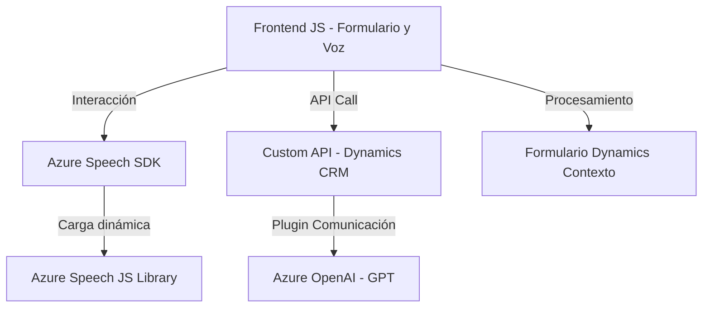

### Breve Resumen Técnico
El repositorio contiene tres componentes principales:
1. **Frontend** (JavaScript): Maneja la interacción con formularios y reconocimiento de voz utilizando **Azure Speech SDK**. Se enfoca en capturar datos visibles del formulario, realizar síntesis de voz y procesar transcripciones mediante servicios externos y algoritmos.
2. **Backend (Dynamics CRM plugin)**: Un plugin de Dynamics CRM que transforma texto según reglas específicas proporcionadas por el usuario, utilizando el modelo GPT de Azure OpenAI.
3. **Interacción con APIs externas**: Integración directa con Azure Cognitive Services (Speech y OpenAI).

### Descripción de Arquitectura
Siguiendo un enfoque **modular y multicapa**, el proyecto tiene dos componentes principales: el frontend que interactúa con formularios y servicios de voz, y el backend que maneja la lógica avanzada (usando el patrón **plugin** típico en Dynamics CRM para la interacción con el servidor). Ambas capas se comunican mediante APIs para procesar datos enriquecidos en formatos estandarizados (JSON).

- **Tipo de arquitectura:** 
  - **Frontend:** Modular, con separación clara de responsabilidades (lectura del formulario, conversión a texto, llamadas a APIs externas).
  - **Backend:** **Plug-in basado en Dynamics CRM** (similar a Monolito en el contexto del CRM como contenedor), con integración a través de SDKs y servicios web. Representa un patrón de cliente-servidor tradicional.

### Tecnologías usadas:
1. **Frontend:**
   - **Lenguaje:** JavaScript.
   - **Servicios:** Azure Speech SDK para reconocimiento y síntesis de voz.
   - **Frameworks o patrones:** Event-driven, modularidad (separación de funciones específicas).

2. **Backend:**
   - **Lenguaje:** C# con Microsoft Dynamics SDK.
   - **Servicios:** Azure OpenAI para procesamiento de texto.
   - **Frameworks o patrones:** 
     - Plugin Pattern (Dynamics CRM).
     - Repository Pattern (para trabajar con datos de CRM).
     - External API Integration.

### Dependencias o componentes externos presentes:
1. **SDKs:**
   - Azure Speech SDK (https://aka.ms/csspeech/jsbrowserpackageraw).
   - Dynamics CRM SDK (`IPlugin`, `IOrganizationService`, etc.).
2. **APIs externas:**
   - Azure Cognitive Services - Speech SDK.
   - Azure OpenAI (GPT).
3. **Librerías adicionales (Backend):**
   - Newtonsoft.Json.Linq (manejo de JSON avanzado).
   - System.Net.Http (comunicación HTTP con Azure API).
   - System.Text.Json (serialización/deserialización JSON).

---

### Diagrama Mermaid
El siguiente diagrama muestra los componentes principales del sistema y cómo se relacionan:

---

### Conclusión Final
Este repositorio implementa una solución **híbrida basada en Dynamics CRM**, conectando un **frontend altamente interactivo** (que aprovecha el Azure Speech SDK para la interacción por voz) con un **backend extensible** mediante plugins personalizados que usan servicios de IA de Azure. La modularidad del sistema lo hace adaptable para crear experiencias más ricas y prácticas en la interfaz de usuario, mientras que la elección de tecnologías como Dynamics CRM y Azure demuestra un enfoque en ecosistemas empresariales.

La estructura refleja buenas prácticas en segmentación funcional y cumplimiento de principios de responsabilidad única (**S.O.L.I.D**) tanto en frontend como en backend. Una integración adicional o mejora a considerar sería el uso de eventos en tiempo real para sincronizar datos entre las capas frontend y backend (por ejemplo, a través de WebSockets o SignalR).