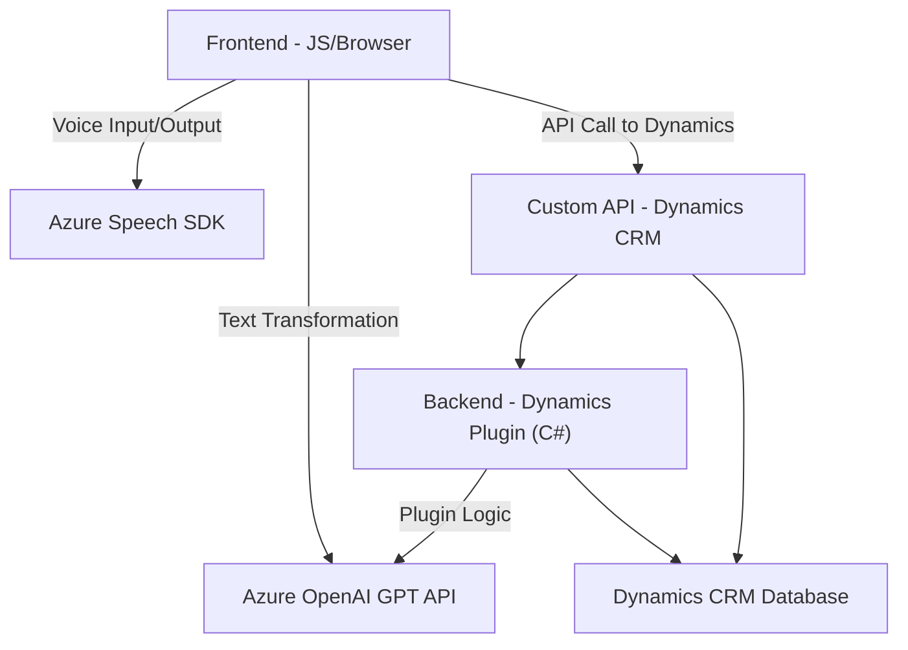

## Breve resumen técnico

Este repositorio contiene tres archivos principales que implementan funcionalidades relacionadas con la síntesis de voz, reconocimiento de voz, procesamiento de transcripciones y transformación de datos mediante servicios de IA como Azure Speech SDK y Azure OpenAI. Se observa una fuerte integración con Dynamics CRM, tanto para operaciones en frontend (JavaScript) como mediante un plugin en backend (C#).

---

## Descripción de arquitectura

### Estructura y propósito
1. **Frontend:** Los dos archivos de JavaScript (`readForm.js`, `speechForm.js`) controlan las interacciones del usuario en el navegador, como la captura de voz, lectura de datos en formularios y síntesis de texto en voz. Incorporan servicios de IA (Azure Speech SDK y Custom APIs en Dynamics).
   
2. **Backend:** El archivo C# (`TransformTextWithAzureAI.cs`) se ejecuta como plugin en el entorno Dynamics CRM, transformando entradas de texto mediante un servicio de IA alojado en la nube (Azure OpenAI).

### Tipo de arquitectura
- **Arquitectura n-capas:** El repositorio se encuentra dividido en dos componentes separados (backend y frontend), lo cual implementa el patrón tradicional de n-capas. El backend se centra en lógica ligada al CRM y servicios de Azure, mientras que el frontend maneja directamente la interfaz del usuario y la interacción con APIs externas para reconocimiento de voz y síntesis.
- **Extendibilidad a microservicios:** El uso de Custom APIs en Dynamics y servicios externos como Azure OpenAI sugiere una arquitectura adaptable a microservicios en el futuro, aunque actualmente se orienta más hacia una solución integrada con modularización.

---

## Tecnologías usadas

1. **Frontend:**
   - **Env. de cliente:** JavaScript.
   - **SDK:** Azure Cognitive Services (Speech SDK).
   - **Framework:** Dynamics CRM (Xrm).
   - **Patrones:** Lazy-loading (para cargar recursos externos como Azure Speech SDK); Modular programming (en las funciones de JS); Adapter pattern (mapeo de campos visibles/lógicos).

2. **Backend:**
   - **Lenguaje:** C#.
   - **Framework:** Dynamics CRM Plugin SDK.
   - **Servicios de IA:** Azure OpenAI (GPT-4o deployment).
   - **Librerías:** 
     - Newtonsoft.Json, System.Net.Http, System.Text.Json.
   - **Patrones:** Plugin pattern, IoC (Inversion of Control), Integration layer, Facade pattern.

---

## Dependencias o componentes externos

1. **Azure Speech SDK:** Utilizado en los archivos JS para síntesis de voz y reconocimiento de voz.
   - Se carga dinámicamente desde una URL: `https://aka.ms/csspeech/jsbrowserpackageraw`.
2. **Azure OpenAI API:** Utilizado en el plugin backend para transformar texto con normas específicas. 
   - Endpoint: `https://openai-netcore.openai.azure.com/`.

3. **Dynamics CRM APIs:**
   - `Xrm.WebApi`: Usado en el frontend para interactuar con el CRM para tareas como llamadas a la Custom API (e.g., `callCustomApi()`).
   - `Microsoft.Xrm.Sdk` (C#): Para el manejo de contexto en plugins CRM.

---

## Diagrama Mermaid válido para GitHub

---

## Conclusión final

El proyecto implementa una solución que combina tecnologías de frontend y backend para construir una aplicación centrada en la interacción con formulaciones dinámicas del CRM y servicios de IA. La arquitectura utiliza n-capas con una clara separación entre la lógica del cliente (frontend), el servidor (Dynamics Plugin) y recursos cloud externos (Azure APIs).

La integración con Azure Speech SDK y la OpenAI API eleva la funcionalidad del sistema, permitiendo procesamiento de voz, transcripción avanzada y análisis de texto. Además, al implementar patrones como lazy-loading y modularización en el frontend, junto con el patrón Plugin en el backend, la solución está diseñada para ser extensible y escalable. La dependencia de servicios externos en la nube sugiere un enfoque moderno basado en la integración de APIs y el uso de inteligencia artificial para ampliar la funcionalidad del proyecto.