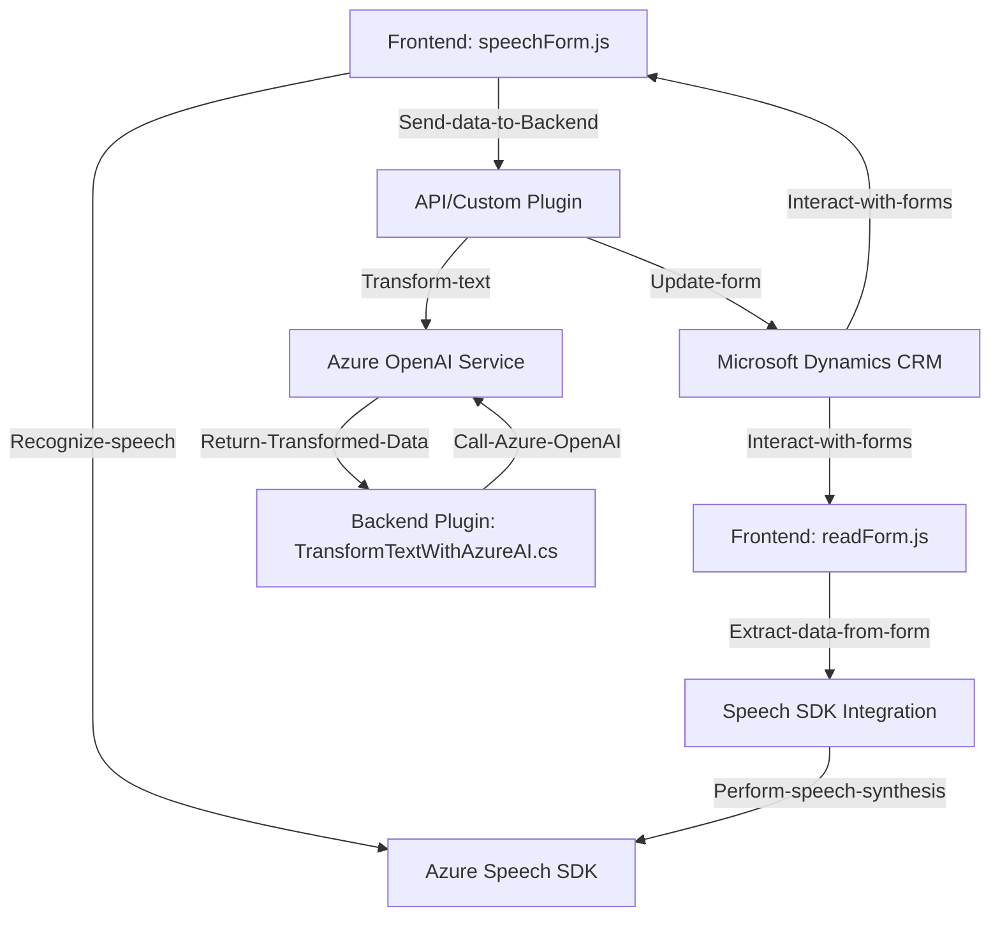

### Breve resumen técnico:

El repositorio contiene tres archivos principales orientados a integrar funcionalidades avanzadas con los servicios de Microsoft Azure. Los primeros dos archivos están basados en JavaScript para el frontend, donde se implementa entrada y reconocimiento de voz utilizando Azure Speech SDK (y su integración con formularios). El tercer archivo, en C#, implementa un **plugin de backend** para Microsoft Dynamics CRM, que utiliza el servicio Azure OpenAI (GPT-4) para procesar textos conforme a reglas específicas y devolver un JSON estructurado. 

### Descripción de arquitectura:

La solución presenta una arquitectura híbrida que mezcla los elementos de **n capas** y **arquitectura de plugins**:
1. **Frontend**:
   - Utiliza una separación clara entre funciones (extraer datos, procesar voz) y logra modularidad activa. Todas las funciones son autónomas y respondieron a un contexto específico (formularios en Dynamics).
   - La programación es basada en eventos, códigos asincrónicos y callbacks.
   
2. **Backend**:
   - Implementación de un modelo basado en plugins (orientado a parámetros de eventos en sistemas CRM) para extender la funcionalidad de Dynamics.
   - Arquitectura API-centric: Externaliza el procesamiento avanzado hacia el servicio Azure OpenAI, lo que introduce un patrón de microservicio/servidor HTTP como capa externa útil cuando se maneja NLP.

---

### Tecnologías usadas:

1. **Frontend** (JavaScript):
   - **Microsoft Azure Speech SDK**: Para reconocimiento y síntesis de voz.
   - **Dynamics CRM Form Context API**: Para la manipulación y actualización de objetos en formularios.
   - **Promises y async patterns**: Para gestionar operaciones asíncronas (verificación de dependencias, configuración).
   - **Dynamic Loading Pattern**: Uso de `ensureSpeechSDKLoaded` para cargar librerías externas.

2. **Backend** (C#):
   - **Azure OpenAI Service**: Generación de respuestas avanzadas en formato JSON utilizando modelos GPT-4.
   - **Microsoft Dynamics CRM SDK**:
     - `IPluginExecutionContext`: Contexto de ejecución de plugins.
     - `Xrm.WebApi`: API de integración con la gestión de entidades en Dynamics CRM.
     - `IServiceProvider`: Gestión de dependencias del plugin.
   - **HTTP Client Pattern**: Para realizar solicitudes a servicios externos.

---

### Diagrama **Mermaid** válido para GitHub:

---

### Conclusión final:

Este repositorio representa una solución arquitectónica híbrida con integración entre **frontend** y **backend** en un entorno gestionado, enfocado en sistemas empresariales, posiblemente Microsoft Dynamics CRM. Ambos componentes (frontend y backend) interactúan con servicios externos de Microsoft Azure, usando **Azure Speech SDK** para funciones de voz y **Azure OpenAI Service** para procesar texto mediante inteligencia artificial.

El diseño implementa patrones como separación de responsabilidades, modularización y callbacks en el frontend, mientras que en el backend se adoptan patrones de servicios (microservicios), plugins y gestión de dependencias para trabajar con APIs externas. Aunque funcional y modular, podría beneficiarse enormemente de mejoras como un sistema centralizado de configuración (por ejemplo, con **Azure Key Vault**) para asegurar las credenciales externas.