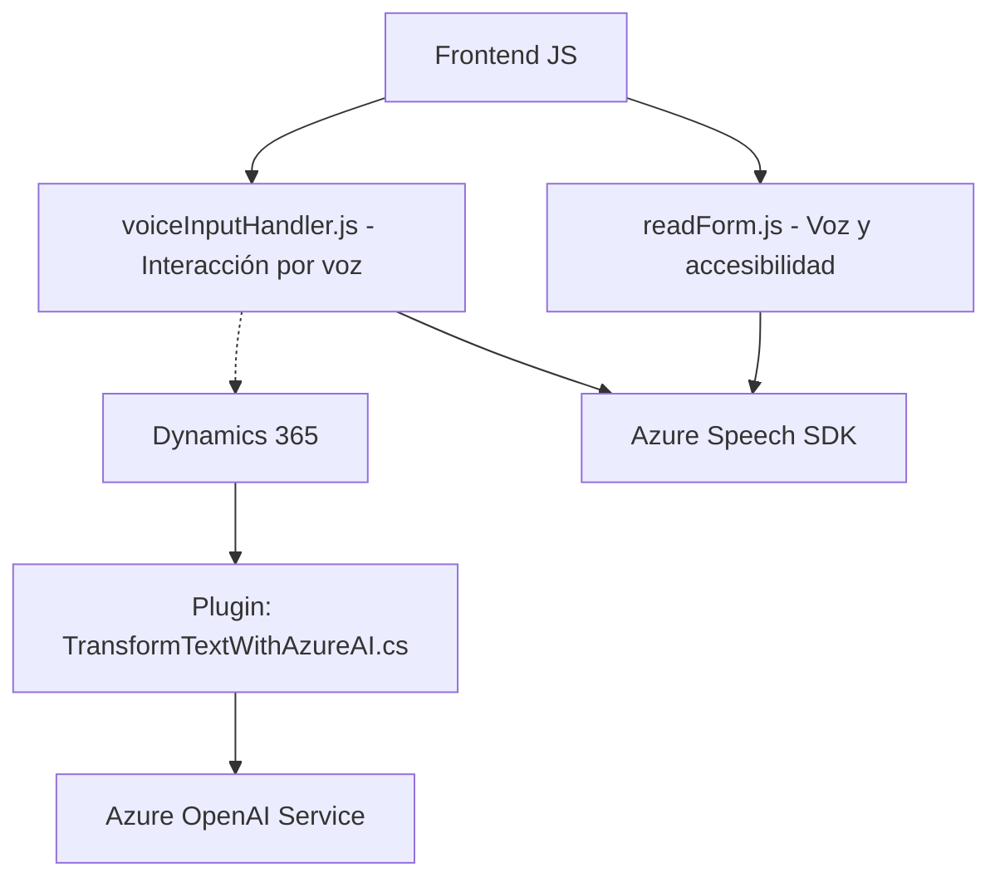

### Breve resumen técnico
El repositorio analiza tres componentes principales: dos archivos JavaScript (`readForm.js` y `voiceInputHandler.js`) que implementan voz y reconocimiento de entrada, y un archivo `.cs` (`TransformTextWithAzureAI.cs`) que actúa como un plugin para Dynamics CRM integrando servicios de Azure OpenAI para transformar texto. Los archivos están diseñados para aplicaciones vinculadas con Dynamics 365, accesibilidad por voz y procesamiento de texto mediante servicios externos de Azure.

---

### Descripción de arquitectura
La solución implementa una arquitectura **orientada a servicios** dentro de un entorno Dynamics CRM. Adoptando un enfoque de extensibilidad, se integra con servicios en la nube como Azure Speech SDK y Azure OpenAI. Los módulos están bien separados por función:
1. **Frontend (voz y accesibilidad):** Procesa los datos del formulario y los manipula mediante Speech SDK, integrando voz para usuarios.
2. **Backend (transformación con Azure AI):** Un plugin que actúa como intermediario para Dynamics CRM y servicios de Azure OpenAI, transformando texto en una estructura JSON estándar.

La arquitectura global se alinea con un enfoque **n capas** entre frontend (JavaScript), middleware/servicios web (API y plugins) y servicios externos (Azure Speech, Azure OpenAI). 

---

### Tecnologías usadas
1. **Frontend:**
   - **Azure Speech SDK:** Reconocimiento de voz y síntesis de texto a voz.
   - **JavaScript:** Modularización para lógica de frontend y accesibilidad.

2. **Backend:**
   - **Microsoft Dynamics CRM SDK:** Para plugin y manipulación de datos/formularios.
   - **Azure OpenAI Service:** GPT-4 para procesamiento avanzado de texto.
   - **C#:** Lógica del plugin y conexión con servicios externos.
   - **JSON:** Serialización de datos entre servicios.

---

### Diagrama Mermaid válido para GitHub

---

### Conclusión final
La solución representa un ecosistema modular basado en la integración de servicios externos y Dynamics CRM, manejando voz (a través de Azure Speech SDK) y procesamiento de texto (con Azure OpenAI). La arquitectura sigue principios de **n capas**, aprovechando los servicios en la nube para extender las características de accesibilidad y transformación de datos de Dynamics. El diseño está bien estructurado y se ajusta a estándares modernos, pero podría optimizarse la seguridad en el manejo de claves y autenticación con Azure.