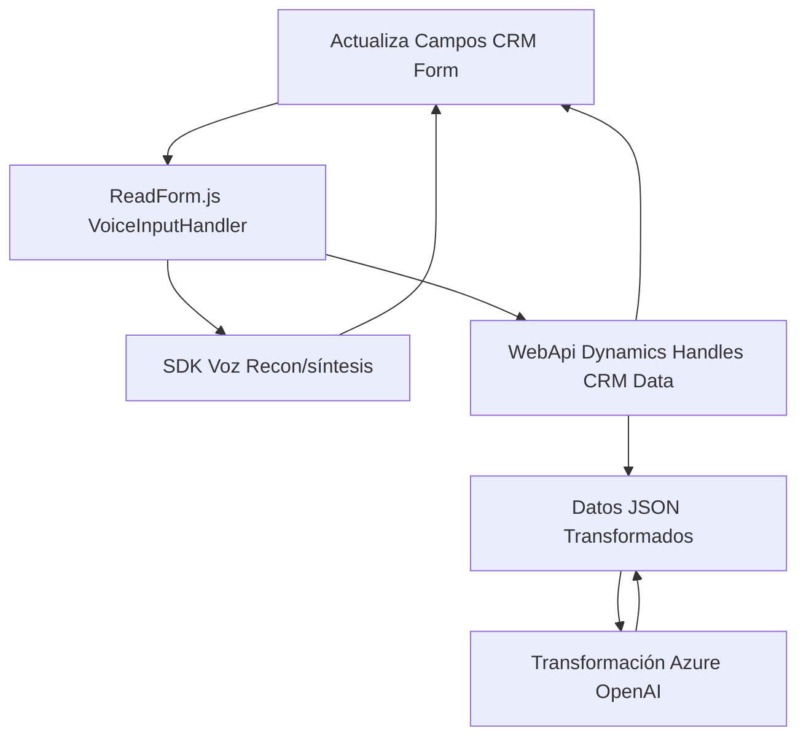

### Breve resumen técnico:
Los archivos y descripción detallada en el repositorio se relacionan con una solución destinada a la integración de entrada y procesamiento de voz en un entorno de formularios dinámicos basado en Microsoft Dynamics CRM. Además, utiliza la capacidad de análisis de texto de Azure OpenAI para realizar transformaciones, generando un JSON estructurado según reglas predefinidas.

---

### Descripción de arquitectura:
La arquitectura exhibe una mezcla de patrones que facilitan la implementación de funcionalidades interactivas y consumo de APIs externas. Las características principales incluyen:
1. **Cliente-Servidor (API integrada):** Comunicación con servicios externos como Azure Speech SDK y Azure OpenAI, además del uso de internamente la API `Xrm.WebApi` de Dynamics CRM para gestionar datos del sistema.
2. **Modularidad:** Separación de responsabilidades por propósito en cada archivo, como entrada de voz, procesamiento de transcripciones e integración con Azure OpenAI sin dependencia directa entre módulos (excepto la configuración del SDK que parece ser común).
3. **Evento-driven y Asincronía:** Uso extensivo de promesas y callbacks para controlar la carga dinámica del SDK y las respuestas del servicio de Azure.

---

### Tecnologías usadas:
1. **Frontend:**
   - **JavaScript**: Uso del lenguaje base para manipulación de DOM y lógica de interacción.
   - **Azure Speech SDK (JavaScript)**: API para reconocimiento y síntesis de voz compilado dinámicamente desde el servidor de Microsoft.
   - **Xrm.WebApi (Dynamics CRM)**: API nativa de Dynamics para interacción con los datos del CRM.

2. **Backend:**
   - **Microsoft Dynamics SDK**: Framework estándar de servicios (en .NET) para extensiones del CRM.
   - **Azure OpenAI (GPT-4 Model)**: Backend para ejecución lógica de transformación textual.
   - **Newtonsoft.Json**: Manipulación de datos JSON en el servicio de plugin.

---

### Diagrama **Mermaid** válido para GitHub

---

### Conclusión final:
La solución opera bajo una arquitectura **modular** y **evento-driven**, con integración explícita de servicios cloud orientados a la inteligencia artificial y el manejo de voz. En el backend, el plugin cumple con la práctica de extensibilidad en Microsoft Dynamics, utilizando patrones como **Plugin Design**, **Command**, y **encapsulation** para desacoplar la interfase y lógica. Por otro lado, el frontend introduce patrones como **Facade** y **Modularidad** que simplifican la gestión de entrada y procesamiento de voz al interactuar con formularios dinámicos y APIs externas. La solución es adecuada para entornos empresariales que buscan automatizar flujos basados en voz y texto.