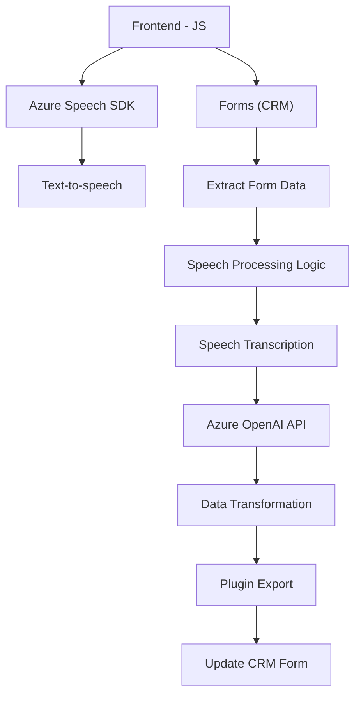

### Breve resumen técnico:
Este repositorio contiene archivos para una solución que integra **Microsoft Dynamics CRM** con **Azure Speech SDK** y **Azure OpenAI**, proporcionando capacidades avanzadas de procesamiento de voz y transformación de texto. La solución está compuesta de varios módulos: un frontend basado en JavaScript que maneja la interacción del usuario y la integración con API externas, y un backend con plugins en C# integrados con Dynamics CRM.

---

### Descripción de arquitectura:
La arquitectura consiste en:
1. **Frontend (JavaScript)**: Implementa una funcionalidad para extraer datos de formularios CRM, convertirlos a texto y realizar transcripciones de voz con Azure Speech SDK.
2. **Backend (C# Plugin)**: Contiene plugins que interactúan directamente con Microsoft Dynamics CRM, enviando texto a Azure OpenAI para su transformación en JSON estructurado.
3. **API externa (Azure)**: Emplea servicios como Speech SDK para procesar voz y el OpenAI para transformar texto.
4. **Patrones utilizados**:
   - **Modular**: Cada función/archivo tiene una responsabilidad específica, lo cual facilita la escalabilidad y el mantenimiento.
   - **Plugin Pattern**: En el backend, la lógica se ejecuta automáticamente en respuesta a eventos de CRM.
   - **MVC-like**: En el frontend, se distingue entre el model (datos del formulario), view (campos) y controller (procesamiento de voz/texto).
   - **Integración API**: Utilización intensiva de APIs externas (Azure y CRM Dataverse).

---

### Tecnologías usadas:
1. **Frontend**:
   - **JavaScript**: Maneja la lógica de interacción y modifica dinámicamente formularios CRM.
   - **Azure Speech SDK**: Para transcripción y síntesis de voz.
   - **Browser-based SDKs**.
2. **Backend**:
   - **C#**: Programación de plugins en Microsoft Dynamics CRM.
   - **Microsoft.Xrm.Sdk**: Para manejar el contexto del CRM.
   - **Azure OpenAI API**: Transformación de texto.
3. **Infraestructura**:
   - Microsoft Dynamics CRM (Dataverse).
   - Microsoft Azure (Speech SDK y OpenAI).
4. **Patrones**:
   - Modular, Plugin pattern, MVC.

---

### Dependencias o componentes externos:
1. **Azure Speech SDK**: Usado en el frontend para la transcripción y síntesis de voz.
2. **Azure OpenAI API**: Utilizado en el backend para transformar texto en JSON estructurado.
3. **Microsoft Dynamics CRM**: Plataforma principal para formularios y datos empresariales.
4. **Microsoft Dataverse**: Proporciona el contexto API para interactuar con el backend del CRM.
5. **External Scripts**:
   - `https://aka.ms/csspeech/jsbrowserpackageraw` para cargar dinámicamente el Speech SDK.

---

### Diagrama Mermaid:

---

### Conclusión final:
La solución ofrece una well-structured integration entre frontend y backend utilizando APIs de Microsoft Dynamics CRM y Azure. El diseño modular y el uso de SDKs y plugins permiten manejar eficientemente procesos de voz y transformación de datos. Sin embargo, se recomienda asegurar valores sensibles mediante archivos de configuración protegidos, revisar dependencias innecesarias y optimizar el manejo de errores, especialmente en la integración con Azure OpenAI.