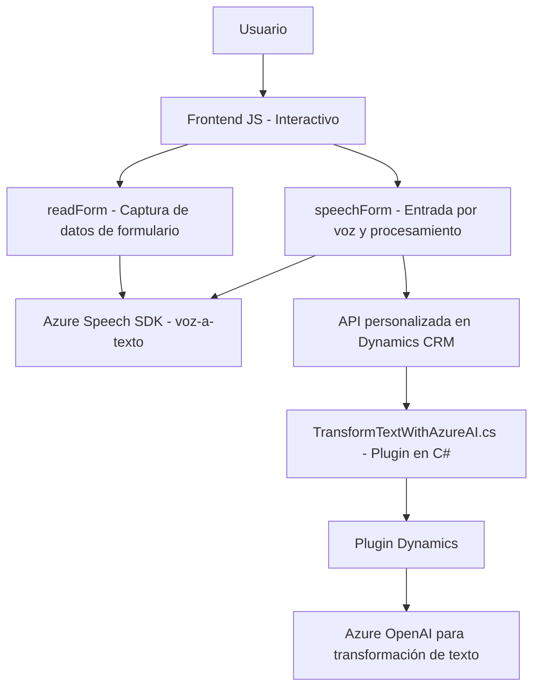

**Breve resumen técnico:**

El repositorio describe una solución que integra múltiples componentes para lectura de formularios e interacción por voz, utilizando Microsoft Dynamics CRM y servicios de Azure. El código está dividido entre frontend (JavaScript) para interacción del usuario y backend (C# plugins) que realizan operaciones de más alto nivel, como conectarse al servicio Azure OpenAI.

---

**Descripción de arquitectura:**

La arquitectura global del sistema se puede inferir como **n-capas**, con lógica distribuida entre frontend y backend:
1. **Frontend Layer:** Actúa como una capa de presentación que interactúa directamente con los usuarios. Hay dos aspectos:
   - Lectura de formulario en voz (text-to-speech).
   - Reconocimiento de voz (speech-to-text) y procesamiento resultante.
   - Lógica en JavaScript, complementada con SDKs de Azure Speech para análisis de voz y texto.
2. **Backend Layer:** Implementado mediante plugins de Dynamics CRM que realizan la transformación de datos usando Azure OpenAI. Funciona como el núcleo que interactúa con servicios externos.

---

**Tecnologías usadas:**
1. **Frontend:**
   - Lenguaje: JavaScript (para lógica del cliente).
   - Framework: SDK dinámico de Azure Speech (`SpeechSDK`).
   - Dependencias: Microsoft Dynamics CRM para formularios.

2. **Backend:**
   - Lenguaje: C# en .NET.
   - Framework y SDK: Dynamics CRM SDK para creación de plugins.
   - Servicio externo: Azure OpenAI (GPT-4o) para procesamiento textual avanzado.

3. **Servicios externos:**
   - Azure Speech SDK (para conversión texto-voz y voz-texto).
   - Azure OpenAI Service (para transformar texto a través de modelos avanzados de lenguaje).

4. **Patrones:**
   - **Event-Driven y Callback Handling:** Para carga dinámica del SDK y ejecución dependiente de eventos.
   - **Plugin Design Pattern:** Extensión de funcionalidades en Dynamics CRM.
   - **Microservice Pattern:** Uso de servicios externos como componentes desacoplados (Azure Speech y OpenAI).
   - **Modular Design:** Separación clara de funciones en frontend y backend.

---

**Dependencias o componentes externos presentes:**
1. **Azure Speech SDK:** Para convertir texto en voz y viceversa.
2. **Azure OpenAI Service:** Procesamiento avanzado de texto basado en IA (GPT-4o). Utilizado para la lógica del plugin en C#.
3. **Microsoft Dynamics CRM API y SDK:** Base para formularios y plugins.
4. **Newtonsoft.Json:** Para manejo y parseo de respuestas JSON.
5. **HTTP Client:** Usado en el plugin para consumir la API del servicio de Azure OpenAI.

---

**Diagrama Mermaid 100 % válido para GitHub Markdown:**

---

**Conclusión final:**  
La solución representa una arquitectura **modular de n-capas** que combina lógica interactiva en el frontend, potencia de procesamiento en el backend y servicios externos de computación avanzada para capacidades de lenguaje natural. El uso del SDK de Azure Speech y servicios como OpenAI minimiza la complejidad interna al aprovechar APIs bien definidas. Además, la estructura mantiene un enfoque en modularidad y separación de responsabilidades. Algunas áreas para considerar incluyen seguridad en el manejo de credenciales y optimización de dependencias.