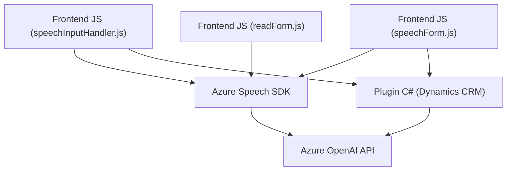

### Breve resumen técnico
El repositorio contiene diversos archivos que implementan funcionalidades con integración de servicios de Microsoft Azure (Speech SDK y OpenAI). Está orientado a la interacción con formularios, reconocimiento de voz, síntesis y procesamiento del texto basado en IA. Es una solución modular con dependencias relacionadas que incluyen Dynamics CRM y servicios externos para habilitar capacidades avanzadas en aplicaciones empresariales.

---

### Descripción de arquitectura
1. **Arquitectura modular:** Aunque no es estrictamente un microservicio, cada módulo está diseñado para cumplir funciones específicas, como reconocimiento de voz (frontend con JS), generación de audio (speechInputHandler.js), y transformación de texto con IA (plugin en C#).
2. **Patrones:**
   - **Single Responsibility:** Cada archivo tiene su propia responsabilidad bien definida.
   - **Integración con APIs externas:** Azure Speech SDK y OpenAI API.
   - **Plugin Architecture:** El módulo en C# utiliza el patrón específico de Microsoft Dynamics CRM para integrarse como extensión del sistema.
   - **Servicio desacoplado:** El SDK de Speech y OpenAI se integran vía HTTP, lo que evita dependencias directas con el entorno subyacente.
3. **Tipo de arquitectura general:** Es una aplicación **n-capas**, con componentes front-office (uso en formularios y voz) que interactúan dinámicamente con capas backend (como Dynamics y OpenAI).

---

### Tecnologías usadas
1. **Frontend:** JavaScript para el manejo de interactividad con el usuario y Azure Speech SDK.
2. **Backend:** 
   - **C#:** Implementación de plugins para Microsoft Dynamics CRM, procesamiento personalizado.
   - **Integración IA:** Azure OpenAI para transformaciones avanzadas de texto.
3. **Servicios externos:**
   - **Azure Speech SDK:** Para reconocimiento y síntesis de voz.
   - **Azure OpenAI:** Procesamiento avanzado mediante modelos de lenguaje.
   - **Xrm.WebApi:** Acceso a APIs internas de Dynamics CRM.

---

### Diagrama Mermaid (válido para GitHub Markdown)

---

### Conclusión final
El repositorio contiene tres módulos principales (frontend JS + plugin backend en C#), todos orientados al procesamiento de interacción de texto y voz en aplicaciones empresariales mediante integración con servicios de Azure. La arquitectura modular utiliza patrones como la separación de responsabilidades y la desacoplo de dependencias gracias al uso de SDKs externos y APIs. Es una solución efectiva para accesibilidad y automatización procesada con IA.

Recomendaciones futuras:
1. Refactorizar la gestión de claves API en el plugin de C# para mayor seguridad.
2. Evaluar mejoras como el uso de sistemas de configuración seguros (por ejemplo, Azure Key Vault).
3. Revisar redundancias en el uso de librerías como `Newtonsoft.Json` o revisar espacio para mayor optimización en la estructura general.