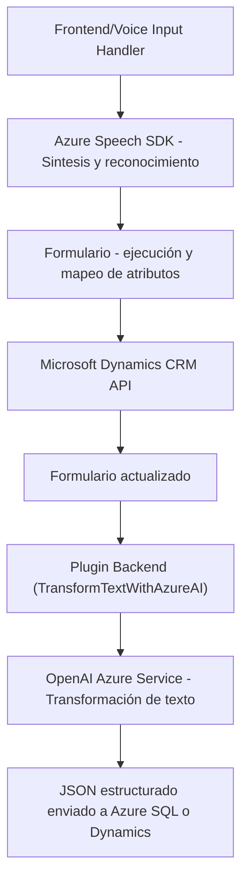

### Breve resumen técnico

El repositorio contiene una combinación de tecnologías y soluciones integradas en un sistema para procesamiento de texto y voz. Incluye archivos en JavaScript (frontend) y C# (backend/plugin), con interacción entre un sistema CRM (Microsoft Dynamics 365), servicios de reconocimiento y síntesis de voz (Azure Speech SDK), y un modelo de IA de transformación de texto en JSON estructurado (Azure OpenAI).

---

### Descripción de arquitectura

La arquitectura es modular con componentes frontend para la captura y síntesis de voz y backend mediante plugins de Dynamics 365 CRM para procesar datos entrantes usando servicios de Azure OpenAI. Adicionalmente, hay integración directa con APIs de Microsoft Dynamics y servicios Azure. Se puede identificar una estructura típica de **n capas**, con separación entre la presentación (frontend), lógica de negocio (backend/plugin), y servicios externos (Azure SDKs y APIs).

---

### Tecnologías usadas

#### **Frontend**
1. **JavaScript**: Utilizado para el procesamiento de formularios, entrada de voz, y síntesis de texto.
2. **Azure Speech SDK**: Integrado dinámicamente a través de un archivo de JavaScript para reconocimiento y síntesis de voz.
3. **Promesas y asincronismo**: Usadas en diversas funciones para carga de SDK y para operaciones API externas.

#### **Backend**
1. **C# (.NET Framework)**: Para la implementación de plugins en Dynamics 365 CRM.
2. **Microsoft Dynamics Web API**: Usado en frontend y backend para la manipulación de datos CRM.
3. **Azure OpenAI Service**: API para transformar texto en formato JSON estructurado.
4. **Newtonsoft.Json/JToken**: Para manejo de objetos JSON.

#### **Estilos y patrones detectados**
- **Modularidad**: Los componentes están bien separados y cumplen el principio de responsabilidad única.
- **Integración de servicios externos**: Conexión directa con Azure Speech y OpenAI, utilizando conceptos de microservicios.
- **Eventos y asincronía**: Para SDK dinámicos y la interacción con APIs externas.

---

### Diagrama Mermaid válido

---

### Conclusión final

La solución ofrecida en el repositorio combina tecnologías modernas de **Microsoft** (Dynamics 365, Azure Speech SDK) y servicios de **IA en Azure OpenAI**, facilitando funciones avanzadas como entrada de voz y procesamiento de texto estructurado. La arquitectura modular en **n capas** garantiza separación entre presentación (frontend), lógica de negocio (plugins) e infraestructura de servicios. Sin embargo, se podrían optimizar aspectos como la gestión de configuración (por ejemplo, las claves de API) y evitar redundancia en algunas funciones del frontend.