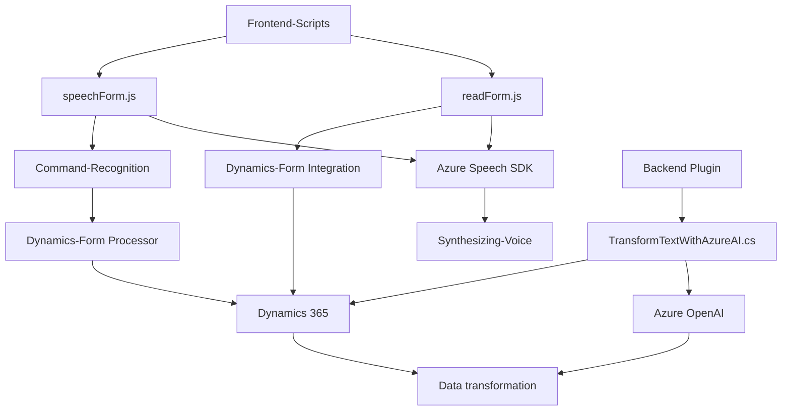

### Breve Resumen Técnico

El repositorio describe tres componentes principales:
1. `readForm.js`: Código frontend que procesa formularios dinámicos y sintetiza texto en voz mediante Azure Speech SDK.
2. `speechForm.js`: Código frontend que reconoce comandos de voz utilizando Azure Speech SDK y actualiza formularios, compatible con Dynamics 365.
3. `TransformTextWithAzureAI.cs`: Plugin de Dynamics CRM que interactúa con Azure OpenAI para transformar texto basado en normas definidas por el usuario.

### Descripción de Arquitectura

La solución es híbrida, con las siguientes características:
1. **Arquitectura de solución**:
   - **Frontend**: Scripts modulares diseñados para trabajar en un contexto específico de formularios integrados en Dynamics 365, con interacción y transformación de información por voz.
   - **Backend**: Un plugin basado en Dynamics CRM que aporta procesamiento usando Azure OpenAI.

2. **Patrones arquitectónicos identificados**:
   - **Modularidad**: Scripts y funciones divididas por responsabilidades (e.g., procesamiento de voz, carga SDK).
   - **Service-Oriented Architecture (SOA)**: Interactúa con servicios externos como Azure Speech SDK y Azure OpenAI.
   - **Layered Architecture**: En el plugin de Dynamics CRM, con capas de entrada de datos y lógico para transformaciones.

3. **Tipo de arquitectura de solución completa**:
   - **Multicapa híbrida**: Una combinación de frontend modular, integración con servicios en la nube y backend procesador basado en Dynamics CRM.

### Tecnologías Usadas

1. **Frontend**:
   - **JavaScript**: Desarrollo de scripts para sintetizar texto, reconocimiento de voz y manipulación de formularios.
   - **Azure Speech SDK**: Servicios de nube para reconocimiento y síntesis de voz.
   - **Dynamics 365 (Xrm APIs)**: Interfaz de API para manipulación de formularios en Dynamics CRM.

2. **Backend**:
   - **C#**: Implementación del plugin.
   - **Azure OpenAI Service**: Procesamiento de texto mediante AI (API REST).
   - **Newtonsoft.Json**: Manejo de JSON estructurado.

3. **Patrones de diseño**:
   - **Callbacks y Promesas** en JavaScript para manejo asincrónico.
   - **Interface Segregation** en el plugin al implementar `IPlugin`.
   - **Integración RESTful** para comunicación con Azure.

### Dependencias o Componentes Externos

1. **Externos**:
   - Azure Speech SDK.
   - Azure OpenAI Service (API REST).
   - Microsoft Dynamics 365 SDK.
2. **Internos**:
   - APIs específicas de Dynamics (e.g., `Xrm.WebApi`).
   - No hay conexión directa entre los scripts de frontend y el plugin según el diseño actual.

### Diagrama **Mermaid** 100% Compatible con GitHub Markdown

### Conclusión Final

La solución combina procesamiento de voz y comandos hablados con procesamiento adjunto de inteligencia artificial. Es una **arquitectura modular híbrida** diseñada para trabajar en el contexto de Dynamics 365, con una clara separación de responsabilidades en el _frontend_ y _backend_. Las dependencias en Azure Speech SDK y OpenAI destacan una integración SOA. Aunque el diseño cubre bien los objetivos funcionales, podría mejorar con mayor externalización de configuraciones (e.g., credenciales de Azure) y refinamiento en la gestión de errores.