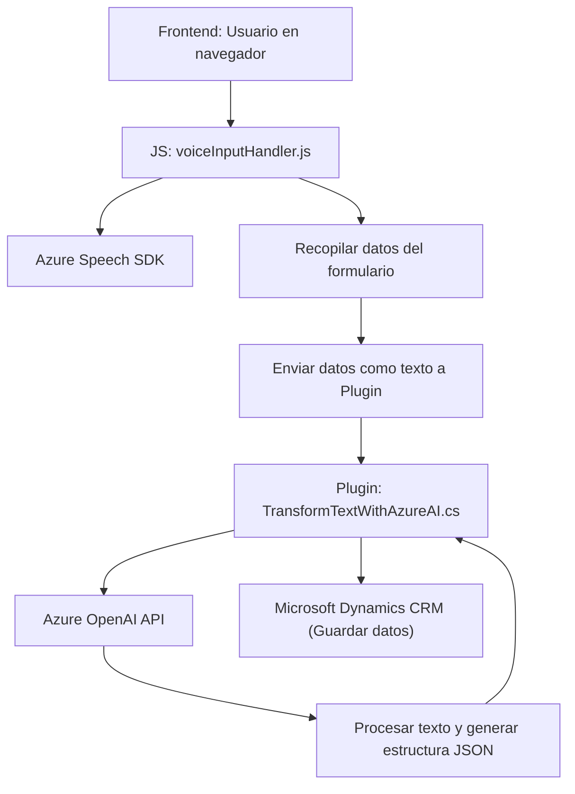

#### Breve resumen técnico:
La solución descrita es un sistema integrado que combina un frontend para la interacción dinámica con formularios, integración de reconocimiento y síntesis de voz a través del **Azure Speech SDK**, y un backend conectado a Microsoft Dynamics CRM mediante un plugin. También utiliza **Azure OpenAI** para transformar texto en estructuras JSON. Este ecosistema está destinado a automatizar y facilitar la captura y procesamiento de datos en sistemas CRM.

---

#### Descripción de arquitectura:
1. **Arquitectura general:** Multi-n capas con integración de servicios cloud.
   - **Capa de presentación:** Funciona en el navegador como un módulo JS interactivo que gestiona la entrada y salida de voz.
   - **Capa lógica intermedia:** Orquesta la integración entre la interfaz y los servicios, adaptando y transformando los datos.
   - **Capa backend:** Implementada como un **plugin** en Microsoft Dynamics CRM que invoca la **Azure OpenAI API** para la transformación de datos y almacenamiento en estructuras CRM.

2. **Patrones arquitectónicos usados:**
   - Modularidad: Separación por componentes y funciones específicas.
   - Cliente-Servidor: Para la comunicación entre frontend y backend (usando APIs y SDKs).
   - External Service Integration: Uso de servicios externos como **Azure Speech SDK** y **Azure OpenAI API**.
   - Plugin-Based Architecture: Extensión de funcionalidades en Microsoft Dynamics CRM.

---

#### Tecnologías usadas:
1. **Frontend:**
   - JavaScript para formularios dinámicos y llamadas al SDK.
   - Azure Speech SDK: Para síntesis y reconocimiento de voz.
   - HTML y CSS para estructura/formato del formulario CRM.

2. **Backend:**
   - Plugin de Dynamics 365 escrito en C#.
   - Microsoft Dynamics CRM SDK para interacción directa con los datos del sistema.
   - Azure OpenAI API para procesamiento de texto con modelos GPT.

3. **Dependencias:**
   - **Externas:**
     - Azure Speech SDK (para voz).
     - Azure OpenAI API (para texto estructurado).
   - **Internas:**
     - Microsoft Dynamics CRM SDK.
     - APIs locales o personalizadas en CRM.

---

#### Diagrama Mermaid válido para GitHub:

---

#### Conclusión final:
La solución implementa una arquitectura multi-n capas con interacción entre frontend y backend, y fuerte dependencia en servicios cloud (Azure). El módulo en JavaScript se encarga de captar/interactuar con entradas de voz y formularios dinámicos, mientras que el backend, como plugin en Dynamics CRM, transforma y guarda datos estructurados mediante AI avanzada. La arquitectura es modular y extensible, permitiendo una integración futura con más servicios o adaptaciones para otros contextos de CRM.