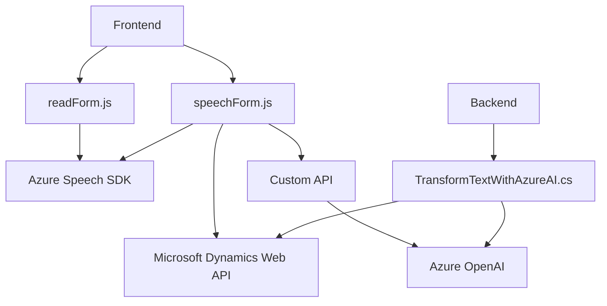

### Breve Resumen Técnico

El repositorio se centra en funcionalidades complementarias para aplicaciones Dynamics CRM usando Azure Speech SDK y Azure OpenAI. Los archivos proporcionan capacidades de reconocimiento y síntesis de voz, procesamiento de texto con inteligencia artificial para normalización y asignación dinámica en formularios CRM, y generación de respuestas estructuradas mediante Azure OpenAI en un plugin C#.

### Descripción de Arquitectura

La arquitectura general se asemeja a una solución de **N-capas**, donde cada componente tiene roles específicos que interactúan entre sí:
- **Capa de Frontend:** Archivos JavaScript (`readForm.js`, `speechForm.js`) enfocándose en la interacción directa con el contexto de formularios y servicios relacionados.
- **Capa de Backend:** Plugin en C# (`TransformTextWithAzureAI.cs`) para extendido dinámico de funcionalidades en el CRM.
- **Integración de servicios externos:** Microsoft Dynamics Web API, Azure Speech SDK y Azure OpenAI API.

#### Patrones Usados
1. **Modularización:** En frontend, las funciones están bien separadas por responsabilidades específicas.
2. **Integración con servicios:** Uso de SDK de Azure y API para construir un sistema orientado a servicios.
3. **Asincronía:** Uso extensivo de promesas y callbacks en frontend para manejar dependencias externas y eventos dinámicos.
4. **Plugin Architecture:** En backend se utiliza el patrón de plugins para extender capacidades de Dynamics CRM.

### Tecnologías Usadas

1. **Frontend:**
   - **JavaScript:** Para lógica de procesamiento de voz y formularios.
   - **Azure Speech SDK:** Para reconocimiento y síntesis de voz.
   - **Microsoft Dynamics Web API:** Consulta y manipulación de formularios CRM.

2. **Backend:**
   - **C#:** Lenguaje utilizado en el plugin (`TransformTextWithAzureAI.cs`) para conectar Dynamics y Azure OpenAI.
   - **Azure OpenAI API (GPT-4):** Procesamiento de texto mediante modelos avanzados de lenguaje.
   - **Microsoft.Xrm.Sdk:** Framework para desarrollo en Dynamics CRM.

3. **Dependencias internas y externas:**
   - Azure Speech SDK y OpenAI API específicas de cada archivo.
   - APIs de Dynamics CRM (`executionContext`, `Xrm.WebApi`) que manejan datos del formulario y extensiones configurables.

### Diagrama **Mermaid** 100% compatible con GitHub Markdown

### Conclusión Final

Este repositorio implementa una arquitectura **N-capas** con una integración fuerte de servicios externos (Azure y Dynamics). Las capacidades se dividen entre un frontend que gestiona interacción y lógica de reconocimiento/síntesis de voz, y un backend que conecta el CRM con IA avanzada para procesamiento. Su eficiencia radica en la modularización y el uso de SDK altamente especializados, ofreciendo una solución extensible con servicios en la nube. Ideal para entornos empresariales que requieran interacción dinámica y análisis inteligente en aplicaciones CRM.