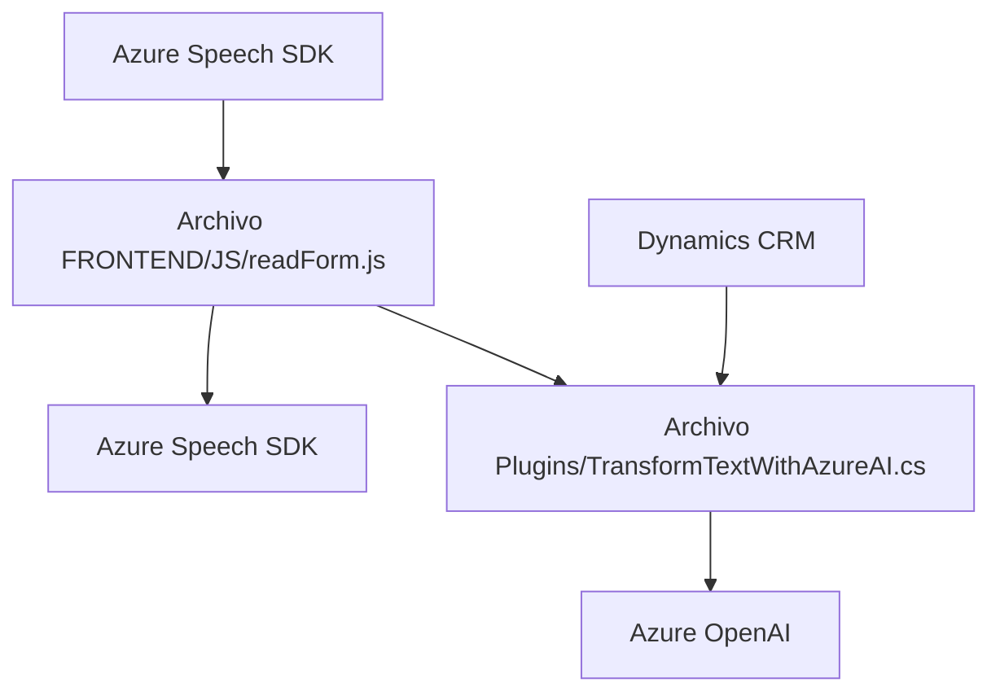

### Breve resumen técnico:
Se trata de una solución híbrida que integra tecnologías frontend y backend con servicios externos de cloud computing para la interacción con formularios y procesamiento de voz. Utiliza SDKs como **Azure Speech SDK** y servicios como **Azure OpenAI**, junto con una arquitectura de integración hacia Dynamics CRM.

---

### 1. Descripción de arquitectura:
La solución está orientada hacia la comunicación entre tres capas:
1. **Frontend (JS archivos)**: Capacidades relacionadas con formularios web y eventos de entrada salida de voz usando Azure Speech SDK. Las funciones permiten lectura, síntesis de texto a voz y transcripción de campos visuales.
2. **Backend (plugins)**: Un plugin en Dynamics CRM (`TransformTextWithAzureAI.cs`) procesa datos enviados desde el JS y utiliza Azure OpenAI para transformar texto bajo reglas específicas. 
3. **Azure Services**: Azure Speech SDK para síntesis y transcripción de voz, y Azure OpenAI para procesamiento avanzado de texto y generación de estructuras JSON.

La arquitectura general puede clasificarse como **n capas**, aunque existe integración directa con servicios externos, lo que denota cierta inspiración en la arquitectura **hexagonal (puertos y adaptadores)**.

---

### 2. Tecnologías usadas:
- **Frontend**:
  - Lenguaje: JavaScript.
  - Entorno: Formularios web integrados en Dynamics CRM.
  - Principal SDK: Azure Speech SDK (`window.SpeechSDK`).

- **Backend**:
  - Lenguaje: C#.
  - Framework: Dynamics CRM SDK.
  - Dependencias clave: `Newtonsoft.Json`, `System.Net.Http`, `Microsoft.Xrm.Sdk`.

- **Cloud Services**:
  - Azure Speech para reconocimiento y síntesis de voz.
  - Azure OpenAI para generación y transformación de texto estructurado.

### Patrones de diseño implementados:
- **Modularidad funcional**: Funciones segmentadas por responsabilidad específica en el código JS.
- **Plugin architecture**: En el backend, el plugin de CRM se conecta como una extensión orientada a eventos.
- **Integración API**: Dinámico llamado entre servicios de Azure y CRM mediante HTTPS.

---

### 3. Dependencias o componentes externos:
- **Azure Speech SDK**: Para síntesis y reconocimiento de voz.
- **Azure OpenAI**: Generación y transformación de texto avanzado mediante IA.
- **Dynamics CRM**: Extensión y manipulación de formularios CRM.
- **Librerías externas para manejo JSON y HTTP** (`Newtonsoft.Json`, `System.Net.Http`).

---

### Diagrama Mermaid válido para GitHub:

---

### Conclusión final:
La arquitectura de esta solución se basa en un sistema **integrado de n capas** con comunicación bidireccional entre:
1. **Frontend** (manejo de formularios y síntesis de voz),
2. **Backend CRM** (extensible mediante plugins para manejar lógica de negocio y gestionar datos dinámicos),
3. **Servicios Cloud** (Azure Speech y Azure OpenAI), que proporcionan capacidades distribuidas de IA.

Es adecuada para sistemas que dependan de interacción humana y procesamiento avanzado de datos como CRMs adaptados a lógica personalizada. Sin embargo, hay áreas de mejora como el manejo seguro de claves y regiones de Azure.