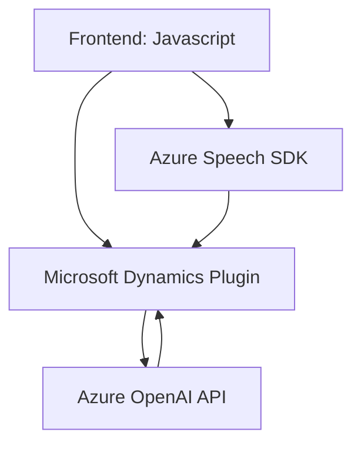

# Breve Resumen Técnico:
El repositorio integra múltiples partes para la interacción entre un frontend, un sistema de plugins dentro de Dynamics 365, y servicios en Azure. El objetivo principal es facilitar la entrada y salida de datos mediante procesamiento basado en lenguaje natural, habilitando síntesis de voz (text-to-speech) y asignación dinámica de valores en formularios.

---

## Descripción de Arquitectura:
El proyecto está dividido en tres áreas principales:
1. **Frontend**: Implementado en JavaScript, se comunica directamente con el usuario para lectura de datos de formularios y proporciona una interfaz para entrada y salida de datos mediante Azure Speech SDK.
2. **Middle Layer**: Incluye lógica en forma de un plugin para Microsoft Dynamics CRM que interactúa con usuarios y servicios de Azure.
3. **Servicios Externos**: Usa Azure OpenAI para la transformación de texto, así como otros servicios de Azure Cloud para la integración de capacidades de IA y análisis de lenguaje.

La arquitectura es una combinación entre **arquitectura basada en capas (n-Capas)** y **orientada a servicios/microservicios**, centrada en la integración con servicios externos y estructuras separadas según la responsabilidad. La capa de datos sigue un modelo de dominio típico en Dynamics mientras que la capa de presentación (frontend) se diseñó como un módulo desacoplado.

---

## Tecnologías, Frameworks y Patrones:
### **Tecnologías Usadas**:
- **Frontend**: JavaScript con integración dinámica del Azure Speech SDK (`https://aka.ms/csspeech/jsbrowserpackageraw`).
- **Backend CRM Plugin**:
  - Lenguaje: C#, orientado hacia Dynamics CRM.
  - Librerías: `Newtonsoft.Json.Linq` para JSON, `System.Net.Http` para integraciones API.
  - Dependencias externas: Azure OpenAI.

### **Patrones Usados**:
1. **Dynamic Service Loader Pattern**:
   - Ejemplo: Carga dinámica del Speech SDK en el frontend.
2. **Event-driven Design**:
   - Uso de callbacks para procesar eventos de SDK y entradas de usuario.
3. **Single Responsibility Principle**:
   - Cada clase o función tiene una tarea específica (por ejemplo, síntesis de voz, procesamiento de atributos de formulario).
4. **Plugin Pattern**:
   - Ejemplo: Implementación en Dynamics CRM para personalización del manejo de datos y transformación de texto.
5. **API Integration**:
   - Interacción con Azure OpenAI mediante HTTP para enriquecimiento del sistema.

---

## Dependencias o Componentes Externos Potenciales:
1. **Azure Speech SDK**:
   - Responsable de síntesis y reconocimiento de voz.
2. **Microsoft Dynamics 365 API**:
   - Gestiona los objetos de datos del CRM.
3. **Azure OpenAI API**:
   - Procesamiento de texto y generación de JSON basado en lenguaje natural.
4. **Newtonsoft.Json y System.Text.Json**:
   - Manejo de estructuras JSON para la integración entre los sistemas.
5. **Custom APIs**:
   - Integración opcional con APIs personalizadas (e.g., `trial_TransformTextWithAzureAI`).

---

## Diagrama Mermaid:

---

## Conclusión Final:
El repositorio representa un sistema que combina un frontend para interacción del usuario con capacidades avanzadas de speech-to-text y text-to-speech, integrado con un backend basado en plugins para Dynamics CRM usando Azure como núcleo para AI y enriquecimiento de datos. La arquitectura modular y la separación de responsabilidades facilita la extensión, el mantenimiento y la integración con otros servicios externos.