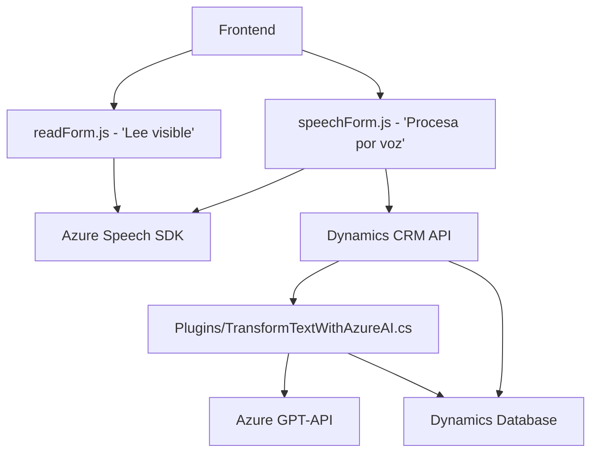

### Breve Resumen Técnico
Este repositorio contiene tres archivos clave que implementan una solución integrada para el manejo de reconocimiento de voz, procesamiento de texto y manipulación de datos en formularios CRM mediante APIs externas. Los componentes interactúan con servicios de Microsoft Azure Speech SDK y Azure OpenAI API, así como la plataforma Dynamics CRM.

---

### Descripción de Arquitectura
La solución emplea una arquitectura de **event-driven** y **modular**, diseñada para manejar diferentes flujos de procesamiento de datos en un entorno de CRM. Incluye:

1. **Frontend**: Compuesto por dos archivos JS, que implementan funciones de procesamiento de voz y reconocimiento de comandos mediante el SDK de Azure Speech. Estas funciones están acopladas con formularios de Dynamics CRM.
2. **Backend Plugin**: Un archivo C# define un plugin para Dynamics CRM, que utiliza la API Azure OpenAI (GPT) para transformar texto y retornar un resultado en formato JSON estructurado.

### Tecnologías Usadas
1. **Languages and Runtime**:
   - JavaScript (Frontend: procesamiento de voz y manejo de formularios).
   - C# (Backend: plugin para Dynamics CRM).
2. **Frameworks and APIs**:
   - **Azure Speech SDK**: Reconocimiento y síntesis de voz.
   - **Azure OpenAI API**: Uso de GPT-4 para procesamiento de texto.
   - **Dynamics CRM SDK**: Manipulación de formularios y datos en Microsoft Dynamics.
   - **Newtonsoft.Json**: Parseo y manejo de estructuras JSON en C#.
3. **Patrones y Modularidad**:
   - **Event-driven architecture**: Asincronía en cargas dinámicas y procesamiento por voz.
   - **SDK Integration Pattern**: Uso y carga dinámica de SDKs de Microsoft.
   - **Data Mapper**: Adaptación de datos de formularios al formato para APIs.
   - **Encapsulated Plugin Architecture**: Backend diseña lógica separada dentro de la infraestructura del CRM.

---

### Diagrama **Mermaid**
El siguiente diagrama representa los componentes principales y su interacción:

---

### Conclusión Final
La solución está diseñada para ofrecer integración estrecha entre funcionalidades avanzadas de voz y procesamiento de texto mediante la infraestructura de Microsoft Azure y Dynamics CRM. La arquitectura modular y desacoplada del frontend permite escalar la funcionalidad de interfaces gráficas utilizando el reconocimiento de voz. El backend, aunque eficiente dentro de su diseño como Plugin, tiene un alto acoplamiento con Azure OpenAI, lo cual podría ser un riesgo en entornos con requisitos de alta disponibilidad.

Este tipo de solución se adapta perfectamente a sistemas manejados vía formularios CRM, optimizando la interacción humano-tecnología mediante mecanismos modernos como IA y reconocimiento de voz.