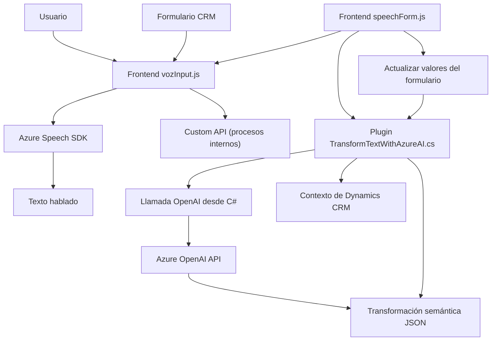

### Breve resumen técnico
El repositorio parece abarcar una solución basada en Microsoft Dynamics 365 para gestionar e integrar funcionalidades de síntesis y reconocimiento de voz, así como manipulación de datos mediante API de Azure Speech y Azure OpenAI. Además, incorpora un plugin en el lado del backend para transformaciones avanzadas de texto utilizando servicios de inteligencia artificial.

---

### Descripción de arquitectura
- **Tipo de solución:**  
  Una extensión o integración sobre Microsoft Dynamics 365 que incorpora:
  - Reconocimiento de voz y síntesis de voz de Azure en el frontend para manipulación de formularios y datos.
  - Análisis semántico y transformación de texto en el backend mediante un plugin que interactúa con Azure OpenAI.
- **Arquitectura:**  
  - **Frontend:** Segregación modular basada en el patrón MVC. El frontend emplea Azure Speech SDK, mientras que las funciones están organizadas para manejar la lógica del controlador (entrada de voz) y el modelo/formulario (modificación de datos).  
  - **Backend:** Un diseño de plugin extensible basado en Dynamics 365 y una arquitectura orientada a servicios (servicio de Azure OpenAI).
  - **Tipo de arquitectura general:** Según los archivos proporcionados, la solución combina patrones de diseño de **n-capas** (modular entre interfaz, lógica de negocio y datos) y **arquitectura orientada a servicios (SOA)** mediante las integraciones con Azure.

---

### Tecnologías usadas
1. **Frontend:**
   - **JavaScript** (ecma estándar), encapsulado en módulos.
   - **Azure Speech SDK (JS)**: Reconocimiento de voz, síntesis de texto y captura de comandos de usuario.
   - **Xrm.WebApi (Dynamics 365)**: Para manipular datos en formularios del CRM.
   - **HTTP dinámico**: Usado para llamar al servicio Azure Speech SDK y obtener datos externos.

2. **Backend:**
   - **C# y Microsoft Dynamics SDK:** Para plugins de control y transformación de datos en tiempo de ejecución.
   - **Azure OpenAI API:** Para procesamiento de lenguaje natural y transformación de texto según reglas semánticas.
   - **Bibliotecas populares de manejo JSON:** `Newtonsoft.Json` y `System.Text.Json` para estructuras dinámicas.
   - **HTTPClient:** Para comunicación con servicios REST API de Azure.

---

### Dependencias y componentes externos
1. **Dependencias externas Frontend:**
   - Azure Speech SDK cargado dinámicamente (`https://aka.ms/csspeech/jsbrowserpackageraw`).
   - Xrm.WebApi (API interna de Dynamics 365).
   
2. **Dependencias externas Backend:**
   - API de Dynamics CRM para contexto y entidades (`Microsoft.Xrm.Sdk`).
   - Azure OpenAI API para procesamiento semántico.
   
3. **Posibles componentes según arquitectura:**
   - Formulario de Dynamics 365 como base para las interacciones de usuario.
   - Conexión a un servicio externo alojado en Azure.
   - Integración CRM con plugin para ejecución de transformación por OpenAI.

---

### Diagrama **Mermaid**

---

### Conclusión final
La solución presentada combina las siguientes características:
- Modularidad en el frontend para integración de reconocimiento de voz (input) y síntesis de texto hablado (output).
- Uso extensivo de servicios de Azure para ampliar las capacidades estándar del CRM Microsoft Dynamics 365, con una arquitectura orientada a servicios basada en APIs externas (Azure Speech y OpenAI).
- Conexión directa entre usuario del frontend (entiendo que esto incluye formularios CRM como base de entrada) y el backend plugin, proporcionando una experiencia completa y automatizada para manipulación y consulta de datos.

Este repositorio demuestra una ejecución técnica efectiva, basada en estándares y herramientas modernas, que permite extender funcionalidades al entorno CRM en escenarios que involucren tanto interacción humana directa como procesamiento de datos mediante IA.