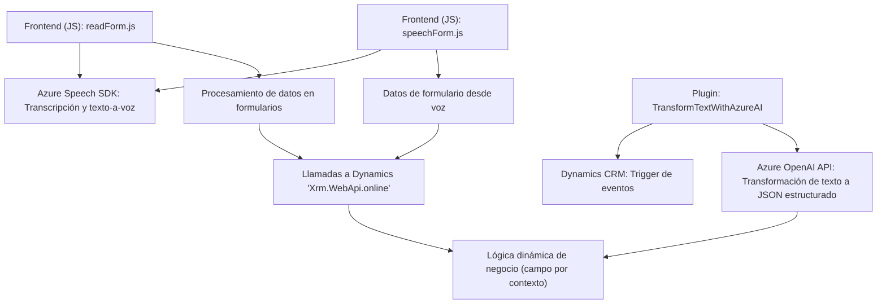

### Breve resumen técnico

El repositorio contiene tres archivos asociados integrados en un sistema de front-end y Dynamics CRM que:
1. Facilitan la entrada y salida de datos mediante voz y texto.
2. Interactúan con Azure Speech SDK y Azure OpenAI para análisis y síntesis de datos.
3. Usan plugins de Dynamics CRM para extender la funcionalidad del sistema de formularios.

El enfoque general se centra en interacción con APIs externas y SDKs, aprovechando patrones de modularización y eventos específicos del sistema Dynamics CRM.

---

### Descripción de arquitectura

#### Arquitectura lógico-estructural:
- **Tipo de arquitectura**: Modular y basada en capas sobre un sistema de Dynamics CRM.
- **Características principales**:
  - **N-capas**: Hay separación funcional entre **front-end**, **lógica de negocio** (procesamiento de datos, generación de voz/transcripción), y **gestión con API de IA**.
  - **Cliente/Servidor**: Se observa el patrón cliente-servidor como base de comunicación entre Dynamics CRM, APIs externas (Azure), y módulos de front-end.
  - **Dependencias externas**: La solución depende fuertemente de SDKs y APIs de Microsoft (Dynamics y Azure Speech/OpenAI).

---

### Tecnologías usadas

1. **Front-end (JavaScript)**:
   - **Azure Speech SDK**: Para síntesis y reconocimiento de voz.
   - **Microsoft Dynamics CRM API (`Xrm.WebApi.online`)**: Para integración directa con formularios y entidades.
   - **Integraciones dinámicas**: Las funciones JavaScript operan con modelos de datos de Dynamics CRM y cargan librerías externas en tiempo de ejecución usando peticiones HTTP.

2. **Back-end (C#)**:
   - **Plugins de Dynamics CRM**: Extienden la funcionalidad del software mediante clases que implementan `IPlugin`.
   - **Azure OpenAI API**: Usada en un plugin para transformar datos textuales en JSON estructurado.
   - **Dependencias .NET**:
     - `Microsoft.Xrm.Sdk`.
     - `System.Net.Http` para peticiones HTTP.
     - `Json` para serialización y deserialización de datos.

3. **Patrones de diseño**:
   - **Modularización** para segmentar la funcionalidad.
   - **Interacción con SDKs** mediante abstracciones como loaders dinámicos.
   - **Plugin architecture** en el backend para ejecutar lógica CRM basada en eventos específicos.

---

### Diagrama **Mermaid** (compatible con GitHub Markdown)

---

### Conclusión final

La solución definida en el repositorio se muestra como una integración avanzada de un front-end basado en JavaScript (operando sobre formularios de Dynamics CRM) con capacidades de entrada y salida de voz proporcionadas por Azure Speech SDK. Complementariamente, utiliza plugins en el back-end de Dynamics CRM que se integran con Azure OpenAI API para proveer transformaciones inteligentes de datos textuales a estructuras JSON aplicables al modelo del CRM.

**Ventajas**:
1. Uso de tecnologías líderes como Microsoft Dynamics y Azure para soluciones de interacción por voz e IA.
2. Modularidad y claridad en la estructuración del código, separando responsabilidades por función.
3. Integración directa con APIs externas y manejo de datos dinámicos en entornos de CRM.

**Consideraciones**:
- Evaluar la seguridad del uso de credenciales de APIs directamente en el código (como en el plugin `TransformTextWithAzureAI.cs`).
- Verificar posibles problemas de latencia y procesamiento al depender de múltiples servicios en tiempo real (Azure APIs y SDK).
- Señalar mejoras en estrategias de prueba para garantizar la calidad y la coherencia del JSON transformado por OpenAI.