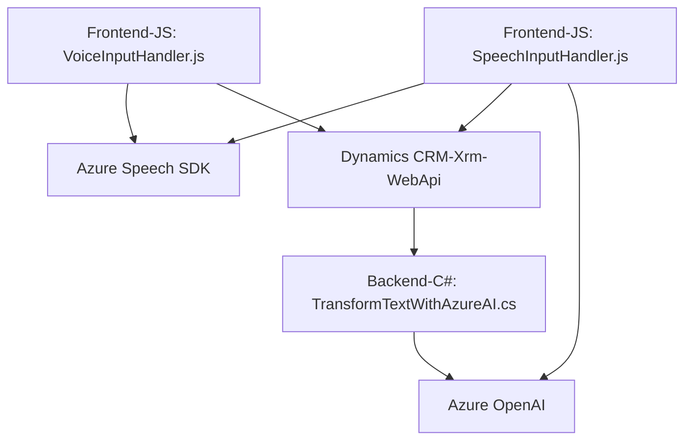

## Breve resumen técnico
El repositorio describe la implementación de integración entre un sistema de formularios dinámicos (posiblemente una solución basada en Microsoft Dynamics 365 o similar) y servicios de Azure Speech SDK y Azure OpenAI. Contiene archivos para el frontend que gestionan reconocimiento de voz y síntesis de texto a voz, junto con un archivo de plugin desarrollado en C# para interactuar con Azure OpenAI a nivel de backend.

## Descripción de arquitectura
Este repositorio parece ser una solución que integra tres principales componentes:
1. **Frontend (JavaScript)**: Interfaz que gestiona la interacción del usuario, reconocimiento y síntesis de voz, y mapeo de datos con formularios.
2. **Backend Plugin (C#)**: Plugin implementado en el CRM que utiliza Azure OpenAI para procesamiento avanzado de texto.
3. **APIs de Servicios Externos**: Para la integración con Azure Speech SDK, Azure OpenAI, y demás APIs web necesarias.

La arquitectura general está basada en **n capas**:
- **Capa de presentación**: Archivos frontend que gestionan la interacción directa con el usuario, la integración de la voz, y la extracción de datos del formulario.
- **Capa de lógica**: Implementada mayoritariamente en el backend (plugin C#), donde se delega la lógica compleja de procesamiento de texto a servicios como Azure OpenAI.
- **Capa de acceso a datos externos**: Dependencias como la API de Azure OpenAI y las APIs de Microsoft Dynamics CRM se utilizan para la interacción con servicios externos y almacenamiento.

Adicionalmente, el diseño muestra características propias de una **arquitectura hexagonal**, donde se aprovecha la integración con servicios como Azure Speech SDK y OpenAI a través de puertos (APIs) y adaptadores (módulos externos). Esto fomenta un desacoplamiento entre capas y facilita la evolución del sistema hacia un enfoque más orientado a microservicios.

## Tecnologías usadas
1. **Frontend (JavaScript)**:
   - Lenguaje: JavaScript.
   - SDK/API: Azure Speech SDK, Xrm.WebApi (Dynamics CRM).

2. **Backend (C#)**:
   - Lenguaje: C#.
   - Framework: Dynamics CRM SDK (`Microsoft.Xrm.Sdk`).
   - Librerías de apoyo: `Newtonsoft.Json`, `System.Net.Http`.

3. **Servicios externos**:
   - **Azure Speech SDK** (Reconocimiento de voz y síntesis de texto).
   - **Azure OpenAI** (Procesamiento avanzado de texto con GPT-4).
   - **Dynamics CRM API** (Xrm.WebApi para operaciones con formularios y entidades).

## Diagrama Mermaid válido con sintaxis básica

## Conclusión final
La solución adoptada en el repositorio se centra en diseñar e implementar un sistema que use reconocimiento y síntesis de voz, junto con capacidades avanzadas de procesamiento de texto. La arquitectura es una combinación de n capas con una tendencia hacia el diseño hexagonal, lo que permite flexibilidad y escalabilidad gracias a la integración de servicios externos como Azure Speech SDK y OpenAI.

Mientras el frontend maneja la interacción del usuario y la comunicación con APIs de servicios (para voz y formularios dinámicos), el backend extiende la funcionalidad mediante un plugin de Dynamics CRM que incluye externalización con APIs avanzadas. Esto hace que todas las partes trabajen juntas para proporcionar una experiencia de integración robusta y extensible.