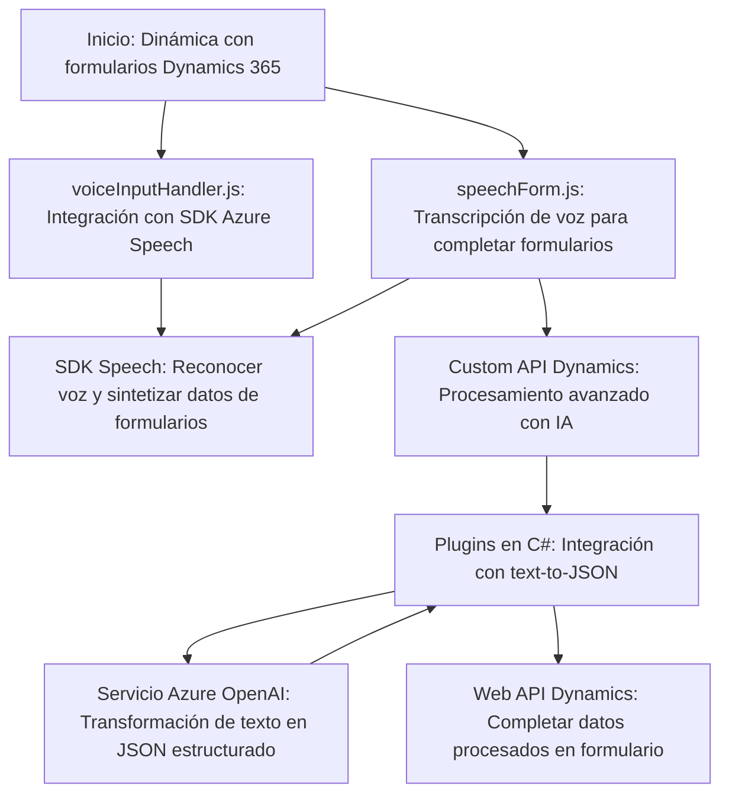

### Breve resumen técnico
El repositorio contiene múltiples componentes enfocados en integrar servicios externos, como **Azure Cognitive Services Speech SDK** y **Azure OpenAI**, dentro de un entorno de Microsoft Dynamics 365. Hay presencia de funcionalidad de frontend en JavaScript para manejar interacción de formularios y voz, así como plugins en C# para manipulación avanzada de datos utilizando APIs externas.

---

### Descripción de arquitectura
La arquitectura observable desde el repositorio muestra:
1. **Frontend con integración de SDK externos:** Modulos JavaScript que interactúan con formularios Dynamics 365 y servicios de Azure Speech.
2. **Backend basado en plugins (C#):** En Dynamics CRM, los **plugins** actúan como servicios orientados a eventos, procesando datos con el servicio de Azure OpenAI y transformándolo en JSON estructurado.
3. **Patrón SOA (Service-Oriented Architecture):** Ambos tipos de componentes dependen de servicios externos (Azure) para realizar tareas específicas como transformación de texto e interacción con voz.

No es una arquitectura monolítica; los puntos de dependencia y desacoplamiento del sistema (como la integración de Azure SDK) sugieren un modelo **arquitectural mixto** con un enfoque modular.

---

### Tecnologías usadas
1. **JavaScript (frontend)**: Para lógica de interacción con formularios de Dynamics 365 y consumo de servicios externos.
2. **Azure Cognitive Services Speech SDK**: Para reconocimiento de voz y síntesis de texto a voz.
3. **Dynamics Web API**: Para interactuar con los datos del entorno Dynamics 365.
4. **C# (backend)**: Utilizado en los plugins que procesan datos y ocupan servicios de Azure OpenAI.
5. **Azure OpenAI Service**: Para transformar texto en datos estructurados (JSON) basado en reglas.
6. **HTTP Requests (System.Net.Http)**: En C# para comunicar con APIs de Azure OpenAI.
7. **JSON libraries**: `System.Text.Json` y otras para manipulación de JSON.

---

### Diagrama Mermaid

---

### Conclusión final
El repositorio implementa una solución híbrida de frontend con backend en Dynamics 365:
1. Aquí se prioriza la interacción del usuario con herramientas de reconocimiento de voz, transcripción, y síntesis (via Azure Speech SDK).
2. En el backend, los plugins administran su propia lógica para transformación de datos mediante el servicio de Azure OpenAI, manteniendo una arquitectura modular y escalable.
3. Aunque las tecnologías son avanzadas, el diseño actual presenta riesgos de seguridad (como claves API estáticas) y depende de servicios externos, lo cual demanda manejo robusto de excepciones.

Esto lo convierte en una solución enfocado a **automatización y asistencia de interacción en entornos empresariales Dynamics 365**, con posibilidad de escalabilidad futura hacia un modelo más descentralizado.