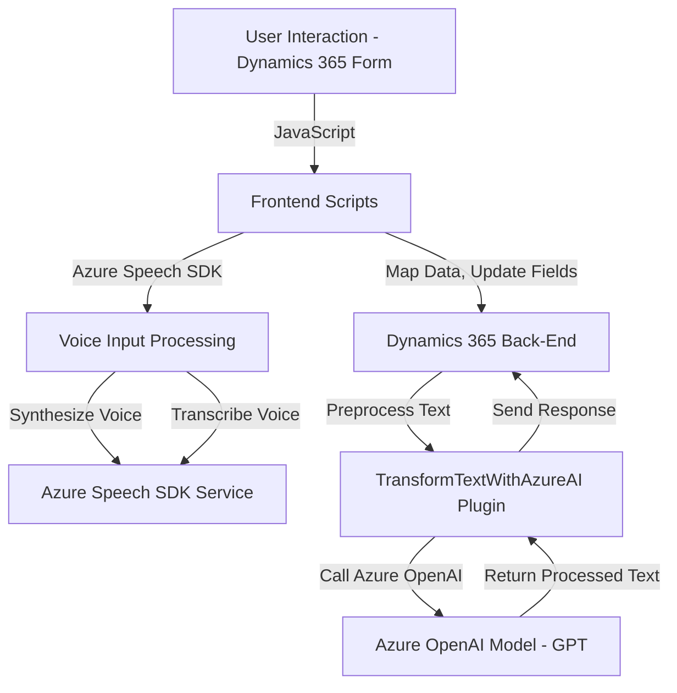

### Breve resumen técnico

El proyecto es una solución integrada que utiliza una combinación de backend y frontend para procesar datos a través de voz y texto en sistemas Dynamics 365. Incluye conectividad con servicios externos de Microsoft Azure (Speech SDK y Azure OpenAI) para reconocimiento, síntesis, y transformación de datos mediante inteligencia artificial. También aplica reglas y mapeos personalizados en formularios dinámicos de Dynamics 365 para administrar la interacción con el usuario.

---

### Descripción de arquitectura

La solución emplea una **arquitectura de tipo N-capas**, combinando:
1. **Frontend dinámico**: Scripts en JavaScript integrados dentro de Dynamics 365 para procesamiento en tiempo real (ej.: manipulación de formularios, síntesis y reconocimiento de voz).
2. **Plugins backend basados en eventos**: Escritos en C#, ejecutan lógica en respuesta a operaciones de Dynamics CRM y se conectan con servicios externos como Azure OpenAI para transformación avanzada de texto.
3. **Externos orientados a servicios**: Uso de APIs de Azure Speech SDK y Azure OpenAI para manejar funcionalidades de voz y procesamiento de lenguaje natural.

El flujo describe una interacción entre cliente y servidor, con operaciones sincrónicas en el lado cliente (procesamiento de formularios, voz/texto en tiempo real) y asincrónicas en el lado servidor (llamadas a APIs para transformación de texto).

---

### Tecnologías usadas

#### **Frontend**
- **Lenguaje**: JavaScript
- **SDK externo**: Azure Speech SDK, cargado dinámicamente desde la URL `aka.ms/csspeech/jsbrowserpackageraw`.
- **Plataforma de despliegue**: Dynamics 365.

#### **Backend**
- **Lenguaje**: C#
- **Framework**: Dynamics CRM SDK (Microsoft.Xrm.Sdk).
- **API REST**: Uso de `System.Net.Http` para comunicación con Azure OpenAI.

#### **Servicios externos**
- **Microsoft Azure Speech SDK**: Para síntesis y transcripción de voz.
- **Azure OpenAI Service**: Para transformar texto según reglas predefinidas usando modelos GPT.

---

### Diagrama Mermaid

Este diagrama representa la interacción entre los componentes mencionados en la solución, describiendo los flujos de datos entre los elementos principales.

---

### Conclusión final

La solución en el repositorio exhibe un arquitectura bien organizada basada en N-capas, centrada en brindar capacidades avanzadas de interacción con Azure Speech SDK para la entrada/salida de voz y habilitar la integración con servicios de IA para la transformación de texto en sistemas Dynamics 365. La separación entre el frontend y backend proporciona modularidad y escalabilidad, mientras que las funciones asincrónicas y mapas dinámicos de mapeo aseguran un flujo eficiente.

Sin embargo, es recomendable mejorar la seguridad y configuración general del proyecto, por ejemplo, externalizando valores sensibles como claves de API y ajustes de endpoints a un archivo de configuración o entorno seguro, y aplicando alguna técnica de inyección de dependencias para un desacoplamiento más limpio.