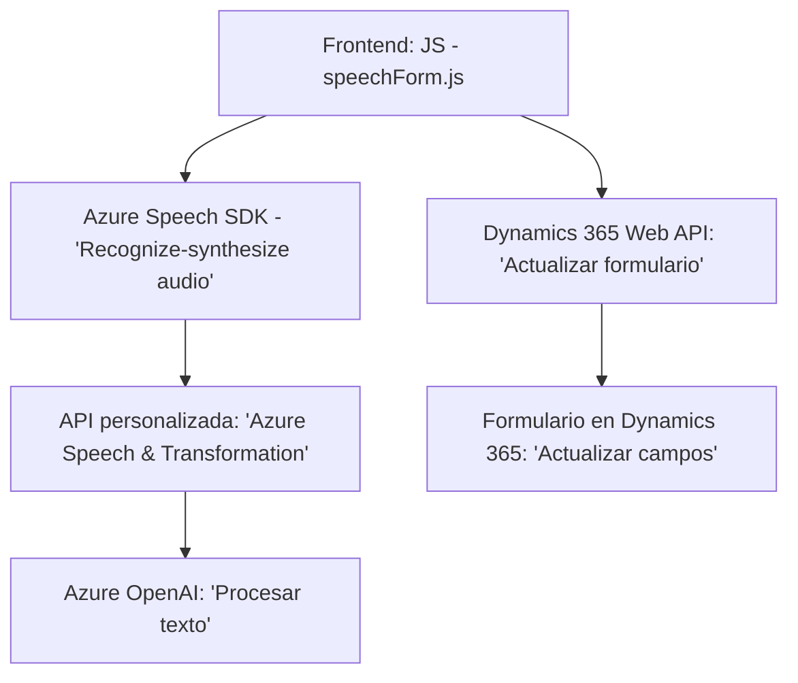

## Breve resumen técnico
El repo parece estar diseñado para interactuar con formularios de Dynamics 365, mejorando la accesibilidad y eficiencia mediante entrada y salida de voz. Usa integraciones avanzadas con Azure Speech SDK para síntesis y reconocimiento de voz, y complementa estas capacidades con procesamiento de texto a través de una Custom API y plugins en Dynamics CRM que consumen Azure OpenAI. La solución presenta las siguientes áreas funcionales principales:
- **Frontend**: Interacción con el usuario en el navegador, procesamiento de voz y asignación de valores al formulario.
- **Backend (plugin)**: Transforma textos con reglas definidas utilizando servicios cloud de inteligencia artificial.

---

## Descripción de arquitectura
La arquitectura de la solución combina patrones **n-capas** y **Service-Based Architecture**. Los puntos de integración destacan la separación entre:
1. **Frontend**: Procesamiento y asignación de datos en tiempo real mediante navegador y SDK.
2. **Backend Plugin**: Procesamiento adicional (transformación de texto a JSON) mediante servicios externos (Azure OpenAI) y reglas definidas en Dynamics CRM.  

Esto favorece modularidad, escalabilidad e integración con capacidades de terceros.

---

## Tecnologías usadas
- **Frontend**:
  - **Azure Speech SDK**: Reconocimiento y síntesis de voz.
  - **Microsoft Dynamics 365 APIs** (`Xrm.WebApi`): Gestión de registros y campos en los formularios CRM.
  - **HTML/JavaScript**: Para la interacción del navegador.
- **Backend**:
  - **Microsoft Dynamics Plugin SDK** (`IPlugin`): Desarrollo de plugins para extender las capacidades de CRM.
  - **C#/.NET Framework**: Lógica de negocio y uso de API externas.
  - **Azure OpenAI API**: Transformación avanzada de textos con IA.
  - **JSON Libraries** (`Newtonsoft.Json`, `System.Text.Json`): Serialización/deserialización.
- **Patrones arquitectónicos**:
  - **Integración externa basada en servicios** (Speech SDK, Azure OpenAI).
  - **Service-Oriented** y **Plugin Pattern** (procesos en Dynamics CRM).

---

## Diagrama Mermaid

---

## Conclusión final
La solución presentada muestra un diseño robusto que atiende las necesidades de accesibilidad y transformación dinámica de datos en un entorno CRM. El uso de tecnologías modernas como Azure Speech SDK y OpenAI garantiza eficacia y escalabilidad, mientras que la arquitectura n-capas con servicios externos mejora la modularidad y facilita su integración futura. Esta implementación es ideal para entornos empresariales que requieren automatización avanzada y personalización de procesos.