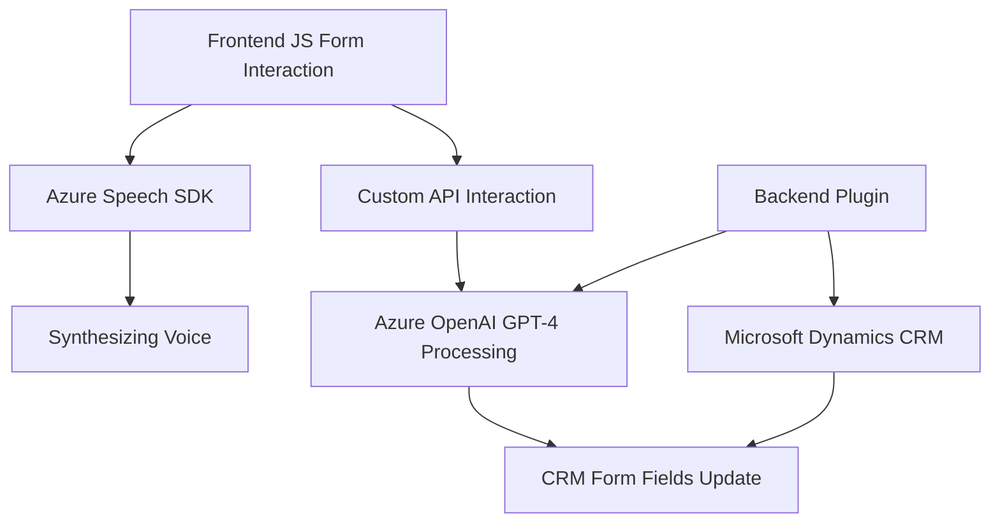

### Breve Resumen Técnico
El repositorio contiene una solución arquitectónica híbrida enfocada en la integración de clientes dinámicos (formulario CRM) con servicios de voz y procesamiento de texto mediante Azure AI. Los archivos expuestos sugieren una estructura dividida en tres componentes principales:
1. **Frontend:** Funciones de JavaScript para interacción con formularios y servicios de voz.
2. **Aplicación Backend:** Un plugin para Dynamics CRM que utiliza Azure OpenAI para procesamiento avanzado de datos.
3. **Integración con servicios externos:** Azure Speech SDK y Azure OpenAI (GPT-4) forman parte clave de la funcionalidad.

---

### Descripción de Arquitectura

La arquitectura es **n-capas** debido a su división lógica entre los siguientes componentes:
- **Capa Cliente/Frontend:** Contiene lógica para capturar y sintetizar voz, actualizar el formulario dinámico, y manejar el procesamiento local de datos con servicios externos.
- **Capa de Servicios:** Comunicación directa con Azure Speech SDK y OpenAI API para recibir respuestas procesadas. Integra el patrón **Service** para facilitar la interacción modular, como en la función `ensureSpeechSDKLoaded`.
- **Capa Backend/Negocio:** Funciona dentro del ecosistema de Microsoft Dynamics CRM (plug-in architecture) al procesar datos y encargarse de normas específicas. Sigue un patrón **Plugin-based** para ejecutar tareas relacionadas con la manipulación del formulario.

---

### Tecnologías Usadas
1. **Lenguajes y Frameworks:**
   - **JavaScript:** Lógica lado cliente.
   - **C#.Net:** Backend para el plugin.
   - **Azure SDK:** Comunicación con Azure Speech y OpenAI.
   - **JSON:** Procesamiento y estructuración de datos en ambos lados.

2. **Servicios Externos:**
   - **Azure Speech:** Para reconocimiento de voz y síntesis de texto.
   - **Azure OpenAI GPT-4:** Procesamiento avanzado de texto con inteligencia artificial.

3. **Patrones de Diseño:**
   - Carga dinámica de dependencias (`ensureSpeechSDKLoaded`).
   - Plugin-based architecture para procesamiento backend en Dynamics CRM.
   - Modularización de funciones (`applyValueToField_IA`, `processTranscript`).
   - Adaptación basada en tipos de datos (`palabrasANumeros`, `getReadableValue`).

---

### Dependencias o Componentes Externos
1. **Frontend:**
   - Azure Speech SDK cargado desde `https://aka.ms/csspeech/jsbrowserpackageraw`.

2. **Backend:**
   - API REST de Azure OpenAI para procesamiento de texto estructurado.
   - Microsoft Dynamics CRM SDK (`Microsoft.Xrm.Sdk`).

3. **Utility Frameworks:**
   - `Newtonsoft.Json.Linq` para tratamiento dinámico de JSON.
   - `System.Net.Http` para solicitudes HTTP.

---

### Diagrama Mermaid

---

### Conclusión Final
La solución presentada está cuidadosamente diseñada para potenciar la integración de formularios dinámicos en Microsoft Dynamics CRM con servicios avanzados de inteligencia artificial y voz. La arquitectura de n-capas garantiza una separación adecuada de responsabilidades y facilita la escalabilidad mediante componentes modulares. La combinación de frontend con servicios externos sugiere un diseño moderno, centrado en la experiencia del usuario y aprovechando tecnologías líderes en el mercado como Azure Speech y OpenAI.

Sin embargo, es esencial considerar posibles puntos de mejora:
- Implementación de pruebas unitaria e integración para asegurar el rendimiento óptimo de las funciones en cada capa.
- Documentación del manejo de errores de servicios externos.