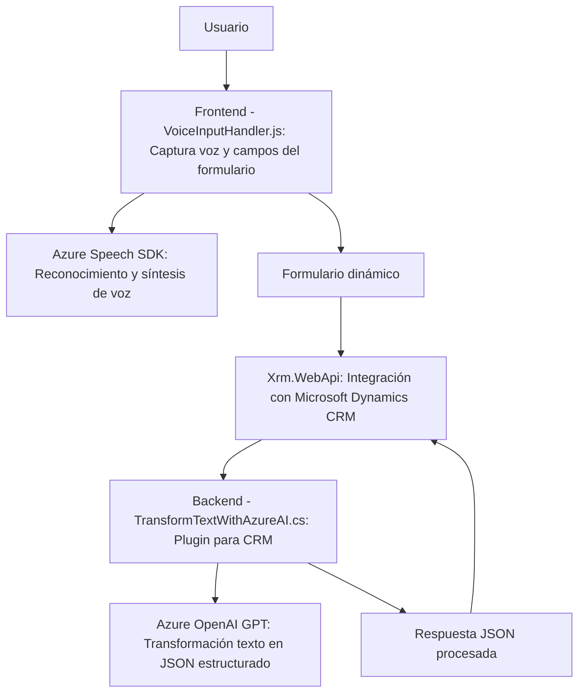

# Resumen técnico
El repositorio contiene tres archivos: dos implementaciones frontend en JavaScript y un backend/plugin en C#. La solución parece ser una integración para formularios y plugins de Microsoft Dynamics CRM con funcionalidades avanzadas basadas en voz y transformación de texto usando APIs de Microsoft Azure.

---

## Descripción de arquitectura
### **Tipo de solución:**
- Híbrida basada en cliente-servidor. Combina frontend (interacción directa con usuario y SDK) y lógica backend (plugin para Dynamics CRM) en una arquitectura que utiliza servicios externos.

### **Arquitectura:**
- **N capas:**
  - Capa frontend: Captura y procesamiento de datos desde inputs de voz y transformación de texto.
  - Capa middleware/Data: Plugin C# para integrar con Dynamics CRM y procesar datos estructurados.
  - Capa API: Uso intensivo de servicios externos como Azure Speech SDK y Azure OpenAI para capacidades avanzadas.

---

## Tecnologías utilizadas
1. **Frontend:**  
   - **JavaScript:** Para manipulación DOM y lógica de cliente.  
   - **Azure Speech SDK:** Reconocimiento y síntesis de voz.  

2. **Backend:**  
   - **C#:** Implementación de plugins en Dynamics CRM.  
   - **Microsoft Dynamics CRM SDK (`IPlugin`, `Xrm.WebApi`).**  

3. **Servicios externos:**  
   - **Azure OpenAI GPT-3:** Transformación de texto.  
   - **Azure Speech SDK:** Reconocimiento y síntesis de voz.

4. **Patrones de diseño:**
   - **Event-driven programming:** Procesamiento basado en eventos de entrada en frontend.
   - **N-layer pattern:** Separación entre presentación, lógica de aplicación y acceso externo (API).
   - **Cliente-servidor:** Uso de servicios Azure para sintetizar voz y datos procesados.

---

## Dependencias o componentes externos
- **Azure Speech SDK:** Para reconocimiento y síntesis de voz en funciones frontend.
- **Azure OpenAI GPT:** Para transformar texto mediante IA en el plugin backend.
- **Microsoft Dynamics CRM SDK:** Adaptación para su integración como plugin en Dynamics.
- **HttpClient:** Realización de llamadas REST API a OpenAI desde C#.
- **Json Serialization:** Procesamiento de datos estructurados mediante `System.Text.Json`.

---

## Diagrama Mermaid (100% compatible con GitHub Markdown)

---

## Conclusión final
La solución implementa una arquitectura **n capas** donde el frontend maneja funcionalidades relacionadas con voz, utilizando **Azure Speech SDK** para lectura y síntesis de texto, mientras el backend realiza transformaciones avanzadas usando **Azure OpenAI GPT** integradas mediante un plugin en **Microsoft Dynamics CRM**. Es una solución robusta orientada a interacción fluida mediante voz, aprovechando servicios externos de inteligencia artificial y capacidades avanzadas como JSON estructurado. 
