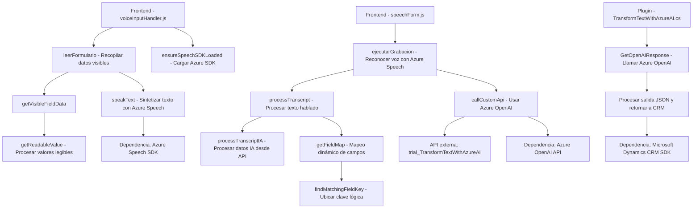

### Breve Resumen Técnico

Este repositorio implementa una solución integrada para la interacción entre formularios en un sistema CRM y tecnologías cognitivo-automatizadas de Microsoft Azure. Se estructuran funcionalidades para lectura de datos de formularios, reconocimiento de voz, síntesis de voz y transformación inteligente de textos mediante Azure OpenAI. Los módulos se enfocan en extender capacidades de CRM mediante interfaces modulares y plugins personalizados.

---

### Descripción de Arquitectura

La arquitectura se basa en un enfoque **híbrido de múltiples capas y servicios externos**:
1. **Frontend en JavaScript**: Gestiona interacción visual y control local (lectura de formularios, síntesis de voz, reconocimiento de voz).
2. **Backend mediante Plugins en Dynamics CRM y Azure**:
   - Plugins como `TransformTextWithAzureAI.cs` procesan texto y se integran con el sistema CRM.
   - Llamadas a servicios externos mediante API (Azure OpenAI y Azure Speech SDK).
3. **Servicios Externos**:
   - Azure Speech SDK para reconocimiento y síntesis de voz.
   - Azure OpenAI para procesamiento inteligente de texto.

Por ende, la solución sigue una arquitectura **modular**, basada en servicios y orientada al uso de APIs externas.

---

### Tecnologías Usadas

#### 1. **Frontend**
- Lenguaje: JavaScript (ES6+).
- Frameworks o bibliotecas: APIs dinámicas como Azure Speech SDK.
- CRM-related APIs: Xrm.WebApi para interacción con Dynamics CRM.

#### 2. **Backend**
- Lenguaje: C#.
- Framework: Microsoft Dynamics CRM SDK.
- Librerías:
  - Newtonsoft.Json (JSON manipulation).
  - System.Net.Http (HTTP requests).
  
#### 3. **Servicios Externos**
- Azure Speech SDK: Reconocimiento y síntesis de voz.
- Azure OpenAI: Procesamiento de texto basado en AI.

---

### Diagrama Mermaid

---

### Conclusión Final

El repositorio implementa un **sistema modular** enfocado en extender dinámicamente la funcionalidad de formularios CRM mediante **procesamiento cognitivo**. La combinación de frontend basado en JavaScript y backend en C# con plugins CRM sigue el paradigma **orientado a servicios (SOA)**, delegando las tareas intensivas a APIs externas como Azure OpenAI y Azure Speech SDK.

#### Recomendaciones
1. **Seguridad de API Keys**: Implementar **Azure Key Vault** para proteger las claves y eliminar acceso directo en el repositorio.
2. **Testing**: Asegurarse de incluir pruebas unitarias tanto en frontend (mock para Azure SDK) como plugins backend para validar comportamiento ante fallos.
3. **Optimización**: Evaluar la carga dinámica de SDK en frontend y plugins, garantizando que no generen sobrecostos en rendimiento.

Este repositorio demuestra alta cohesión y modularidad, siendo ideal para entornos empresariales integrados con Dynamics CRM.