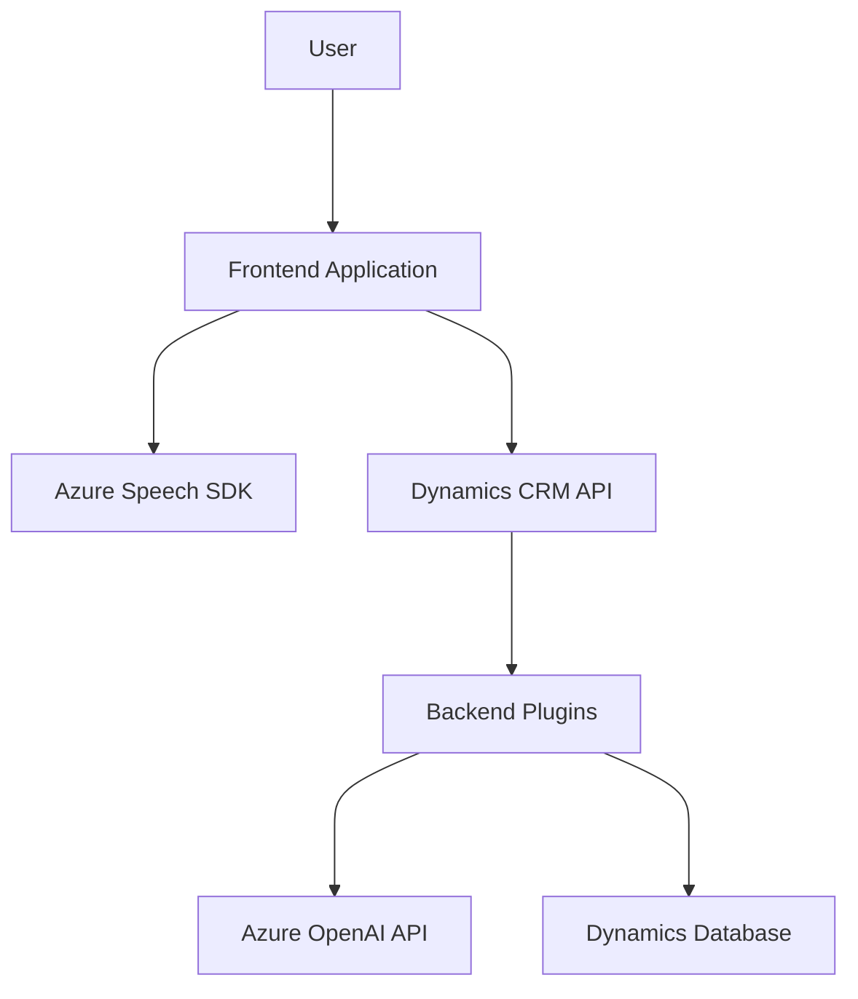

### Breve resumen técnico
El repositorio analizado contiene componentes que integran reconocimiento de voz y procesamiento de texto basado en inteligencia artificial dentro de un entorno primariamente diseñado para Dynamics 365. Los archivos analizados muestran integración con el **Azure Speech SDK** para reconocimiento y síntesis de voz, y con **Azure OpenAI** para transformar texto en formato estructurado. La solución promueve accesibilidad y flujo de trabajo automatizado basado en interacción por voz.

---

### Descripción de arquitectura
La solución presenta una arquitectura híbrida, donde los componentes están organizados como:
1. **Frontend:** Scripts JavaScript para operar en la capa de presentación, integrados con Dynamics 365, para reconocimiento de voz, síntesis de texto y manipulación de formularios.
2. **Backend:** Plugins en un entorno **Microsoft CRM** que actúan como intermediarios entre el usuario, la lógica de negocio, y los servicios externos (Azure OpenAI).
3. **Exposición a APIs externas:** Conexión lógica mediante solicitudes HTTP hacia Azure's Speech y OpenAI.

Se podría calificar la arquitectura global como **n capas**, donde cada capa (presentación, lógica de negocio, acceso a datos) está claramente separada.

---

### Tecnologías usadas
1. **Frontend:**
   - **JavaScript**: Organización modular con funciones asíncronas y callbacks, utilizado para el reconocimiento de voz y síntesis.
   - **Azure Speech SDK**: Integración directa mediante cargado dinámico de scripts desde la web.
   - **Dynamics API**: Comunicación con formularios y entidades de Dynamics 365.
   
2. **Backend (Plugins):**
   - **C#**: Language utilizado para los plugins en Dynamics CRM.
   - **Microsoft.Xrm.Sdk**: Manejo de entidades y servicios específicos de Dynamics CRM.
   - **System.Net.Http**: Consumo de APIs externas (Azure OpenAI).
   - **System.Text.Json** y **Newtonsoft.Json**: Serialización/deserialización de JSON.

3. **Servicios externos:**
   - **Azure Speech SDK**: Reconocimiento y síntesis de voz.
   - **Azure OpenAI**: Transformación de texto en formato estructurado.

---

### Diagrama Mermaid válido para GitHub

---

### Conclusión final
La solución corresponde a un sistema **híbrido de n capas**, cuyo fuerte reside en la integración de tecnologías basadas en accesibilidad por voz y procesamiento semántico avanzado. Aprovecha servicios cloud como Azure Speech y Azure OpenAI para complementar la capacidad nativa de Dynamics 365 y aumentar la productividad mediante interacción dinámica y automatizada de datos.

Esta arquitectura tiene múltiples ventajas:
1. **Escalabilidad:** Puede ser extendida fácilmente integrando más servicios de Azure.
2. **Accesibilidad:** Permite interacción fácil mediante voz para mejorar la usabilidad de formularios.
3. **Modularidad:** Los componentes están separados claramente según su responsabilidad.

Sin embargo, requiere atención en aspectos como:
- **Rendimiento:** La dependencia de servicios externos puede añadir latencia.
- **Seguridad:** Las claves de acceso para Azure Speech/OpenAI deben ser almacenadas y gestionadas con cuidado.

En conjunto, el diseño permite una experiencia enriquecida y automatizada para escenarios empresariales avanzados.