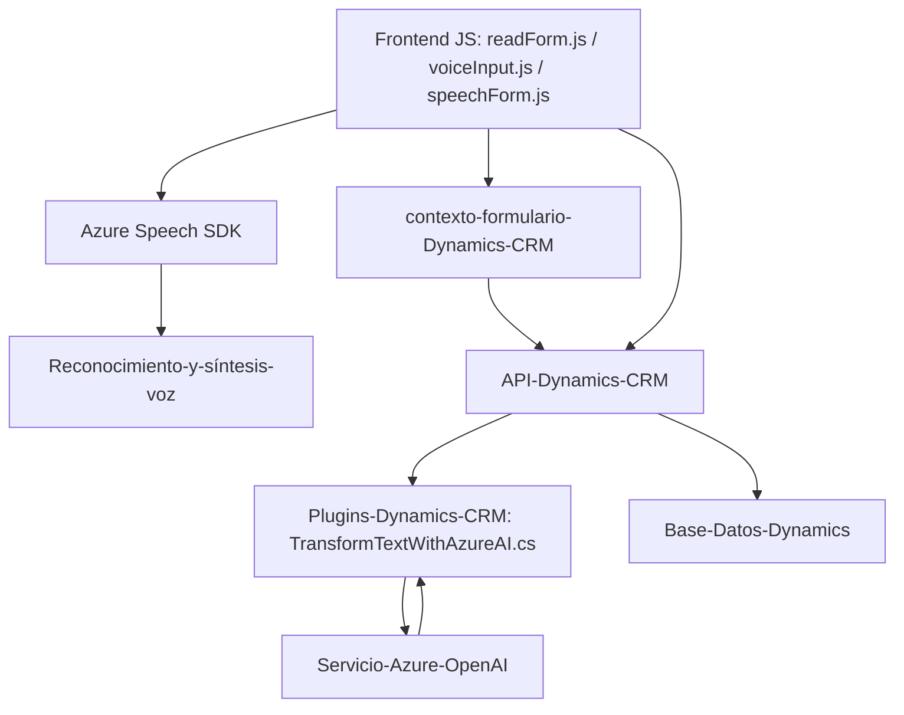

# Análisis Técnico

## Breve resumen técnico

El repositorio representa una solución diseñada para interactuar con Microsoft Dynamics CRM utilizando funciones relacionadas con la voz y la inteligencia artificial. La arquitectura es una combinación de frontend, complementos para Dynamics CRM, y llamadas a APIs personalizadas que también integran servicios externos como Azure Speech SDK y Azure OpenAI. Es un sistema orientado a servicios (SOA), con patrones de separación modular para mantener roles claros entre frontend y backend.

---

## Descripción de arquitectura

1. **Tipo de solución**  
   La solución integra un **frontend JavaScript** (interacciones del usuario en formularios) conectado directamente con una **API de Dynamics CRM y plugins personalizados en .NET**. Utiliza servicios externos como Azure Speech SDK y Azure OpenAI para reconocimiento y procesamiento de voz, así como generación de texto en lenguaje humano. Es principalmente una **API con una capa de frontend y lógica basada en eventos**.

2. **Arquitectura general**  
   - **N capas o modular**: La interacción tiene un frontend modular, un backend (desde Dynamics CRM) y servicios externos que cumplen roles específicos (cloud-based SDKs para IA y síntesis/reconocimiento de voz).  
   - **Patrones SOA (Service-Oriented Architecture)** por el uso de múltiples servicios y API como intermediarios.

3. **Capacidades y dependencias**  
   - **Frontend (JavaScript)**: Captura datos de formularios y usa SDK externo (Azure Speech) para entrada de voz y síntesis en tiempo real.  
   - **Plugin (C#)**: Personaliza eventos de Dynamics CRM utilizando la interface `IPlugin`. Invoca un servicio de IA externo (Azure OpenAI).  
   - **Custom APIs y Dynamics CRM**: Existen referencias a APIs personalizadas y APIs de Dynamics CRM (`Xrm.WebApi`).

4. **Patrones aplicados**  
   - **Modularidad**: Cada archivo está compuesto de funciones específicas y reutilizables que actúan como bloques independientes.  
   - **Integración asíncrona**: Configuración de SDKs externos y llamadas API en el frontend y plugins.  
   - **Event-driven programming**: Callbacks y reconocimiento de eventos como base de la interacción entre módulos.  
   - **Separación de responsabilidades**: Frontend para la interacción y captura de datos, mientras el backend contiene lógica extendida de CRM y llamadas a servicios de IA.  
   - **Plugin Pattern**: Utilizado en el backend para extender la funcionalidad de Dynamics CRM.  

---

## Tecnologías usadas

1. **Frontend**  
   - **JavaScript**: Función principal para capturar voz, procesar texto e interactuar con formularios de Dynamics CRM.  
   - **Azure Speech SDK**: Reconocimiento y síntesis de voz.  
   - **HTML/DOM API**: Manipulación de cargadores de scripts y acceso al formulario.  

2. **Backend**  
   - **C# y .NET Framework**: Implementación de un plugin para Dynamics CRM, usando la interfaz `IPlugin`.  
   - **Microsoft Dynamics CRM SDK**: Para mejorar la funcionalidad del CRM con la extensión de plugins personalizados.  
   - **Azure OpenAI**: Integración externa mediante APIs para el procesamiento y transformación de texto.  
   - **REST APIs**: Llamadas HTTP para interactuar con servicios de Azure.

3. **Integraciones externas**:  
   - Microsoft Dynamics CRM (proporciona el ecosistema del formulario backend).  
   - Azure Speech SDK (reconocimiento y síntesis).  
   - Azure OpenAI Service (procesamiento y transformación de texto).

---

## Diagrama **Mermaid**

---

## Conclusión final

La solución es un sistema de interacción mediante voz y procesamiento de texto en entornos de Microsoft Dynamics CRM, diseñado bajo una estructura de arquitectura **orientada por servicios (SOA)** e implementada como una solución modular de **n capas**. Utiliza herramientas como **Azure Speech SDK**, **Azure OpenAI**, y el SDK de Dynamics CRM por medio de plugins personalizados. Su enfoque programático combina patrones como eventos, modularidad y la integración de servicios externos, lo cual lo hace extensible y escalable en entornos empresariales. Esto genera una solución efectiva para transformar voz y texto en valor significativo para sistemas CRM.