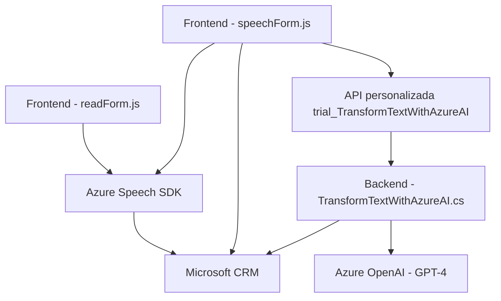

# Resumen técnico

El proyecto es una integración que aprovecha **Azure Speech SDK**, **Microsoft Dynamics CRM SDK** y **Azure OpenAI** para realizar funcionalidades avanzadas de reconocimiento de voz, procesamiento de texto, y síntesis de texto a voz. Está compuesto principalmente por un frontend en **JavaScript** que interactúa con formularios en un contexto probablemente relacionado con CRM, y un plugin en **C#** para realizar transformaciones avanzadas de texto mediante Azure OpenAI (GPT-4).

---

# Descripción de la arquitectura

La solución sigue un enfoque **modular con capas**, dividiendo responsabilidades específicas:
1. **Frontend (readForm.js y speechForm.js)**:
   - Procesa la entrada de datos del formulario y los convierte en texto sintetizado por **Azure Speech SDK**.
   - Captura comandos de voz, los interpreta, y actualiza formularios en un contexto CRM.
   - Implementa lógica para procesar tanto comandos simples como datos basados en inteligencia artificial (IA).
2. **Backend (plugin C#)**:
   - Implementado como un plugin de **Microsoft Dynamics CRM**.
   - Extiende la funcionalidad del CRM para transformar texto mediante llamadas HTTP al servicio **Azure OpenAI** y devolver resultados JSON estructurados.
3. **Integración con Servicios Externos**:
   - Comunicación directa al **Azure Speech SDK** para reconocimiento de voz y síntesis de texto a voz.
   - Reutilización de servicios del **Microsoft Dynamics CRM SDK** para manipulación de formularios.
   - Uso de **API personalizada** para llamadas al modelo GPT-4 en Azure OpenAI.

La arquitectura de la solución puede calificarse como **n-capas desacoplada**:
- **Capa de presentación**: Formulario y JavaScript para manejo de datos y entrada de voz en el frontend.
- **Capa de aplicación**: Plugin C# para lógica avanzada de inteligencia artificial y comunicación con el sistema CRM.
- **Capa externa**: Integración con servicios de Azure (Speech SDK y OpenAI).

---

# Tecnologías usadas

### Frontend (Archivos `readForm.js` y `speechForm.js`)
- **JavaScript**:
  - Manejo de DOM.
  - Procesamiento de datos estructurados.
  - Modularidad basada en funciones.
- **Azure Speech SDK**:
  - Reconocimiento de voz.
  - Síntesis de texto a voz.
- **Dynamics CRM SDK (JavaScript)**:
  - Manipulación dinámica de formularios y datos en el contexto CRM.
  
### Backend (Archivo `TransformTextWithAzureAI.cs`)
- **C#**:
  - Desarrollo de plugins para Dynamics CRM.
  - Manipulación de datos mediante clases auxiliares como `Json`, `Regex`.
- **Microsoft CRM SDK**:
  - Interacción con CRM mediante servicios como `IOrganizationService`.
- **Azure OpenAI**:
  - Consumo de servicios de inteligencia artificial (GPT-4) mediante solicitudes HTTP.

---

# Diagrama Mermaid

Aquí se muestra un flujo general de la interacción entre componentes en la solución:

---

# Conclusión

La solución es un sistema híbrido que combina procesamiento frontend para interacción directa con usuarios (formularios y voz) y backend para lógica avanzada de texto mediante un plugin integrado en Dynamics CRM. Su arquitectura modular permite la integración fluida de servicios externos como Azure OpenAI y Azure Speech SDK, dotando al sistema de capacidades avanzadas de reconocimiento y transformación de datos.

Los patrones aplicados (n-capas y arquitectura basada en plugins) aseguran una alta cohesión entre los módulos y desacoplamiento de servicios externos. Una posible mejora sería implementar pruebas automatizadas para todos los componentes y reforzar la seguridad en la comunicación con Azure OpenAI mediante autenticación robusta.