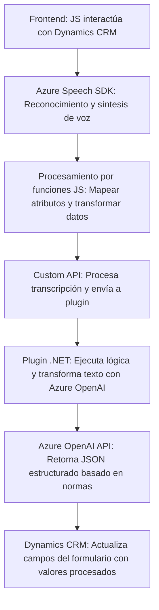

## Breve resumen técnico

La solución descrita es un sistema integrado que permite la interacción avanzada con formularios de Dynamics CRM mediante reconocimiento de voz, síntesis de texto a voz, y la transformación de texto basado en Azure Speech SDK y Azure OpenAI. Es una combinación de frontend (visualización y captura de datos), integración con servicios IA y un backend extendido mediante plugins. El propósito central es facilitar la interacción mediante funcionalidad habilitada por inteligencia artificial y servicios en la nube.

---

## Descripción de arquitectura

La solución utiliza una arquitectura de **n capas**:
1. **Frontend**:
   - Implementado en JavaScript para interactuar con los formularios de Dynamics CRM (extracción de datos visibles y manipulación de atributos del formulario).
   - Utiliza el **Azure Speech SDK** y personaliza las interacciones con datos, como la carga dinámica, procesos asíncronos y callbacks.
2. **Middle layer**:
   - Funciones para reconocimiento de voz, síntesis de voz y transformación lógica de datos (mapas y procesamiento de transcripciones).
   - Usa una Custom API de Dynamics CRM que conecta con la capa de backend.
3. **Backend**:
   - Extendido mediante un plugin (.NET) que implementa lógica de transformación avanzada sobre texto, realizando consultas y respuestas a través de la **Azure OpenAI API**.

---

## Tecnologías usadas

1. **Frontend**:
   - Lenguaje: **JavaScript**.
   - SDK: **Azure Speech SDK** para reconocimiento y síntesis de voz.
   - Integración: API de Dynamics CRM (`Xrm.WebApi` mediante funciones internas como `formContext`).

2. **Backend**:
   - Framework: **.NET** (C#) con Dynamics CRM SDK (`IPlugin`).
   - Servicios externos: **Azure OpenAI API** para procesamiento de texto.
   - Librerías adicionales: **Newtonsoft.Json**, **System.Net.Http**, **System.Text.Json**.

3. **Plataforma general**:
   - **Dynamics CRM**: Base contextual para formularios y APIs personalizadas.
   - **Azure**: Servicios de Speech SDK y OpenAI que habilitan inteligencia artificial.

---

## Diagrama Mermaid válido para GitHub

---

## Conclusión final

La solución es un sistema integrado que emplea tecnologías modernas y servicios en la nube para habilitar interacciones avanzadas con formularios de Dynamics CRM. Su diseño modular y extensible utiliza una arquitectura de **n capas**, donde cada capa tiene responsabilidades separadas como interacción de usuario (frontend), procesamiento lógico (middleware), y transformación avanzada de datos (backend). Destaca el uso de **Azure Speech SDK** para habilitar procesos de reconocimiento/síntesis de voz y el aprovechamiento de la **Azure OpenAI API** desde plugins para el procesamiento con lógica de IA.

Es adecuado para entornos empresariales donde se requiera interacción natural y automatización de procesamiento de datos, haciendo uso de plataformas líderes como Microsoft Dynamics y Azure Cloud Services.