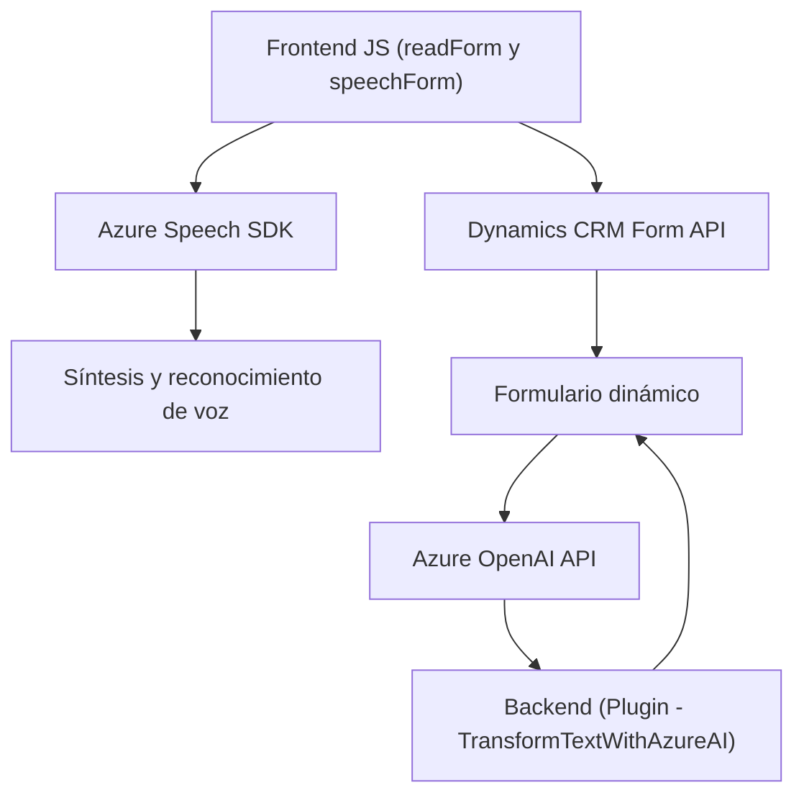

### Breve resumen técnico
El repositorio muestra componentes de una solución orientada a la interacción por voz con sistemas de gestión de información como Microsoft Dynamics 365. Utiliza tecnologías como el **Azure Speech SDK** y **Azure OpenAI Service (GPT-4)** para implementar procesos relacionados con la síntesis de voz, reconocimiento de voz y transformación de texto. Además, implementa un plugin en C# para la integración directa con Dynamics CRM.

---

### Descripción de arquitectura
La arquitectura general es híbrida, agrupando varias capas y microservicios alrededor de los recursos de **Azure services** y Dynamics CRM. La solución es **modular**, con cada elemento diseñado para cumplir un rol específico:
- **Frontend**: Archivos JavaScript constituyen un cliente pesado para la interacción con el SDK de Azure Speech, permitiendo la síntesis de voz y actualización dinámica de formularios.
- **Backend Plugin (Dynamics CRM)**: Este módulo contribuye al procesamiento del texto y su transformación mediante Azure OpenAI.

Adopta patrones como **Event-driven architecture**, **Facade pattern** y **Service integration** para orquestar las interacciones entre los SDK y APIs externas.

---

### Tecnologías usadas
1. **Frontend (JavaScript)**:
   - **Azure Speech SDK**: Para reconocimiento de voz, síntesis de texto en audio y manipulación de flujos de voz.
   - **Microsoft Dynamics 365 APIs**: Integración de datos del CRM en formularios dinámicos.
   - **Modern JS/ES6**: Uso de `async/await`, objetos JSON y funciones asíncronas.

2. **Backend (C# Plugin)**:
   - **Azure OpenAI Service (GPT-4)**: Transformación avanzada de texto en respuesta a un contexto.
   - **Microsoft Dynamics CRM SDK (IPlugin)**: Para integrar lógica personalizada directamente en Dynamics 365.
   - **HttpClient**: Para realizar solicitudes HTTP al servicio Azure OpenAI.
   - **Json.NET (Newtonsoft)**: Para trabajar con datos JSON eficientemente.

---

### Dependencias o componentes externos
1. **Externos**:
   - **Azure Speech SDK**: Carga desde CDN o recurso online (`https://aka.ms/csspeech/jsbrowserpackageraw`).
   - **Azure OpenAI Service**: Comunicación directa para procesamiento avanzado de texto.
   - **Dynamics 365 APIs**: Gestión y actualización de formularios con datos dinámicos.

2. **Internos**:
   - Enlace entre formularios dinámicos de Dynamics CRM con las funcionalidades de voz/síntesis en `speechForm.js` y `readForm.js`.
   - Gestión del desarrollo modular en C# mediante el plugin.
   - Herramientas propias como mapeo dinámico (`getFieldMap()`).

---

### Diagrama Mermaid
El diagrama representa el flujo de trabajo principal en la solución, detallando las interacciones entre los componentes y servicios externos.

---

### Conclusión final
La solución presentada es un sistema que integra tecnologías modernas de reconocimiento de voz y procesamiento de lenguaje natural con herramientas empresariales como Dynamics CRM. La arquitectura combina una interfaz frontend en **JavaScript** con un backend en **C#**, que utiliza el **Azure Speech SDK** para la interacción basada en voz y el **Azure OpenAI Service** para procesamiento avanzado de texto.

La estructura del proyecto refleja una **arquitectura híbrida modular** con elementos de **n capas** en el backend y frontend independientes, junto con comunicación hacia servicios externos. Destaca el uso de patrones de diseño como *Event-driven*, *Facade* y *Service Integration*, generando un sistema extensible y escalable especialmente diseñado para mejorar la accesibilidad y automatización en sistemas empresariales como CRM.