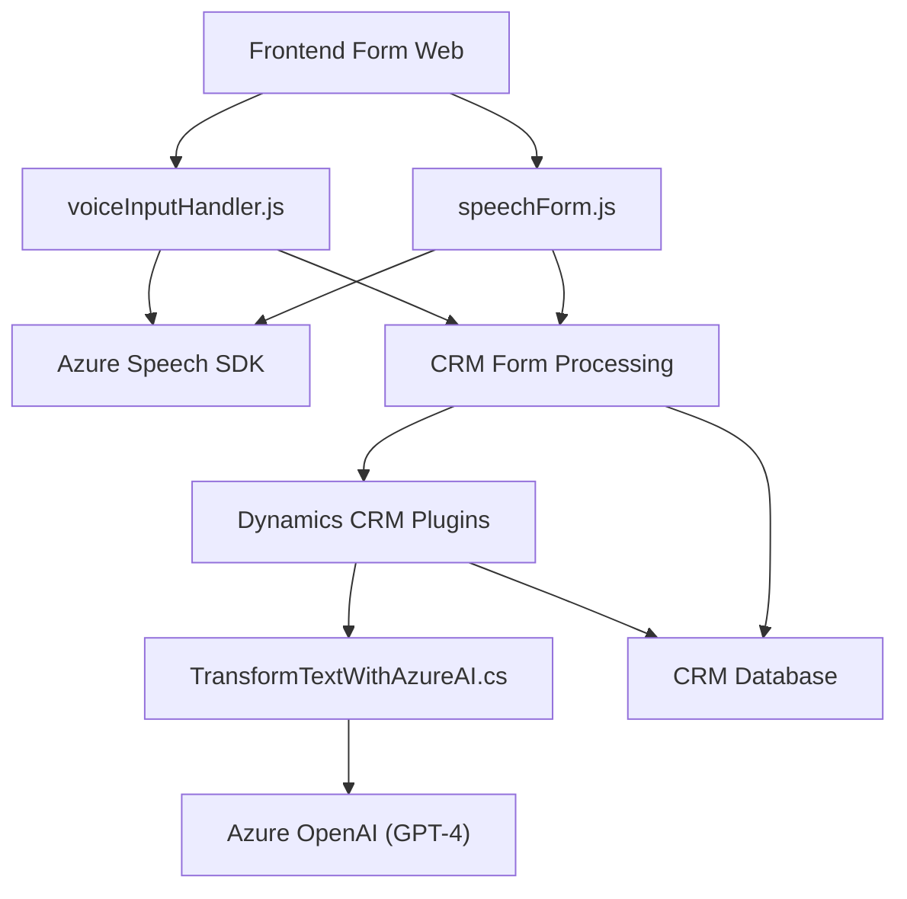

## Breve resumen técnico:
Este repositorio abarca múltiples módulos que integran herramientas avanzadas de Microsoft Dynamics CRM junto con soluciones de reconocimiento de voz (Azure Speech SDK) y procesamiento de texto (Azure OpenAI). El propósito principal es optimizar y extender la funcionalidad de formularios interactivos utilizando servicios de inteligencia artificial (IA) y voz.

## Descripción de arquitectura:
La arquitectura global se asemeja a un modelo **multicapa orientado a servicios**:
1. **Capa de presentación (Frontend):** Se encuentran módulos JavaScript para interactuar con el usuario a través de formularios web habilitados para voz y reconocimiento de audio. El frontend integra el Azure Speech SDK para procesar texto y voz.
2. **Capa de negocios (Dynamics CRM y plugin backend):** Los Plugins como `TransformTextWithAzureAI.cs` en el backend procesan texto y reglas específicas. Aquí se ejecuta la lógica avanzada de negocios y la comunicación externa con Azure OpenAI.
3. **Capa de servicios externos:** Usa Azure Speech SDK y Azure OpenAI para reconocimiento de voz y procesamiento de texto.

### Modelo:
El sistema parece estar estructurado bajo una **arquitectura n-capas hacia clientes empresariales** donde las responsabilidades y la integración están divididas entre múltiples capas funcionales.

## Tecnologías usadas:
1. **Frontend:**
   - **JavaScript DOM:** Para manipulación dinámica del navegador.
   - **Azure Speech SDK:** Reconocimiento de voz y síntesis.
   - **Dynamics CRM context (`formContext`):** Para gestionar los formularios y sus datos.
2. **Backend:**
   - **C# y .NET/Framework:** Base para los plugins de Dynamics CRM.
   - **Microsoft Dynamics CRM SDK:** Integraciones para gestión de datos empresariales.
   - **Azure OpenAI (GPT-4):** Procesamiento avanzado de texto.
   - **HTTP clients:** Para comunicación con servicios externos (Azure).
3. **Infraestructura externa:**
   - Azure Speech SDK.
   - Azure OpenAI para GPT-4.

## Dependencias o componentes externos:
1. **Azure Speech SDK:** Utilizado para interactuar con interfaces de voz.
2. **Azure OpenAI:** Procesamiento de texto usando modelos IA avanzados.
3. **Dynamics CRM Web API:** Comunicación con la base de datos y manipulación de objetos CRM.
4. **C# libraries:** Gestión de JSON (`Newtonsoft.Json`), consultas (`System.Net.Http`) y manipulación de texto (`System.Text.*`).

## Diagrama Mermaid compatible con GitHub Markdown:

## Conclusión final:
El repositorio exhibe un **sistema modular multicapas** que optimiza procesos empresariales mediante integración de IA y voz con formularios interactivos, todo sobre Microsoft Dynamics CRM. El frontend utiliza reconocimiento de voz y generación de texto hablado como una interfaz de usuario innovadora, mientras que el backend usa plugins y comunicación con servicios avanzados (Azure OpenAI) para procesamiento automatizado. Es una solución escalable, moderna y orientada a servicios externos, ideal para mejorar la eficiencia en aplicaciones empresariales altamente dinámicas.