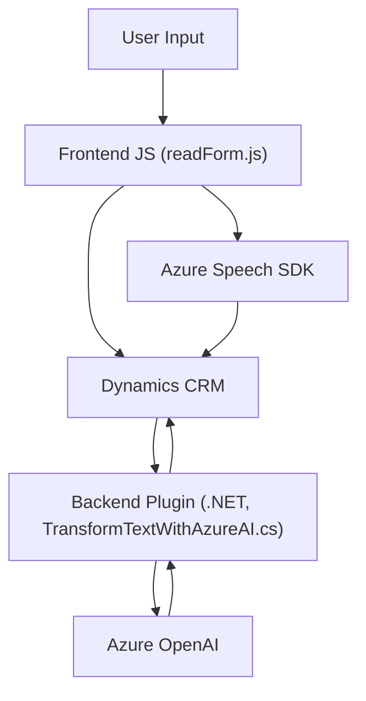

### Breve resumen técnico:

Este repositorio implementa una solución que combina integración de voz y texto con Microsoft Dynamics 365 CRM y tecnologías de inteligencia artificial (AI). La funcionalidad principal incluye:
1. Captura y síntesis de voz utilizando **Azure Speech SDK**.
2. Transformación de texto mediante **Azure OpenAI API**, con implementación directa en Dynamics CRM mediante plugins.
3. Operaciones contextuales sobre formularios y datos CRM, como la lectura, escritura y actualización de campos.

---

### Descripción de arquitectura:

La solución se basa en arquitectura **cliente-servidor** y está dividida en dos principales capas:
1. **Frontend**:
   - Implementa la interacción cliente mediante JavaScript en elementos visibles de un formulario (Dynamics 365).
   - Utiliza el **Azure Speech SDK** para entrada/salida de voz.
2. **Backend**:
   - Describe un plugin en .NET que opera dentro de Dynamics CRM para la transformación de datos usando **Azure OpenAI** como servicio externo.
   - Este plugin sigue el patrón de **Plugin extensibility** de Dynamics.

La solución no utiliza una arquitectura estrictamente modular como Hexagonal o de microservicios, pero combina elementos de **integración de servicios externos** mediante SDKs y APIs, encapsulando funciones específicas por responsabilidad.

---

### Tecnologías usadas:

#### **Frontend**:
1. Frameworks/Bibliotecas:
   - **Azure Speech SDK**: Captura y síntesis de voz.
   - Uso del DOM para manipulación de formularios.
2. Lenguaje de programación:
   - **JavaScript**.
3. Patrones:
   - Modularización de lógica.
   - Carga dinámica de dependencias (Azure Speech SDK).
   - Integración cliente-servidor (trabajo con Dynamics Web API).

#### **Backend/Plugins**:
1. Lenguaje de programación:
   - **C#**.
2. Frameworks/Bibliotecas:
   - `Microsoft.Xrm.Sdk`: Extensibilidad de plugins para Dynamics CRM.
   - `System.Net.Http`, `System.Text.Json`: Interacción con APIs web y manejo JSON.
   - `Newtonsoft.Json.Linq`: Procesamiento avanzado de JSON.
3. Dependencias externas:
   - **Azure OpenAI API**: Transformación de texto con inteligencia artificial.
4. Patrones:
   - **Plugin extensibility**: Estándar para integración con Dynamics CRM.
   - Encapsulación en servicios independientes como lógica de transformación de texto.

---

### Diagrama Mermaid válido para GitHub Markdown:

---

### Conclusión final:

Esta solución muestra la integración entre un frontend basado en **JavaScript**, un backend con **Plugins de Dynamics CRM**, y dos servicios externos de **Azure**: Speech SDK para síntesis/reconocimiento de voz y OpenAI API para la transformación de texto con AI.

La arquitectura sigue un enfoque client-server con comunicación basada en SDKs y HTTP REST APIs. Aunque no es una solución completamente basada en microservicios o técnica de arquitectura avanzada como Hexagonal, utiliza varias buenas prácticas, como modularización de código y encapsulación de lógica.

**Consideraciones de mejora**:
1. Seguridad: Evitar el uso de credenciales hardcodeadas para el acceso a servicios externos. Se recomienda el uso de Azure Key Vault.
2. Escalabilidad del plugin backend: Migrar el procesamiento síncrono de las solicitudes HTTP a una arquitectura asíncrona o basada en filas (queues) como Azure Service Bus.
3. Optimización de carga en frontend: Implementar un sistema de caché al cargar dependencias externas como el Azure Speech SDK.