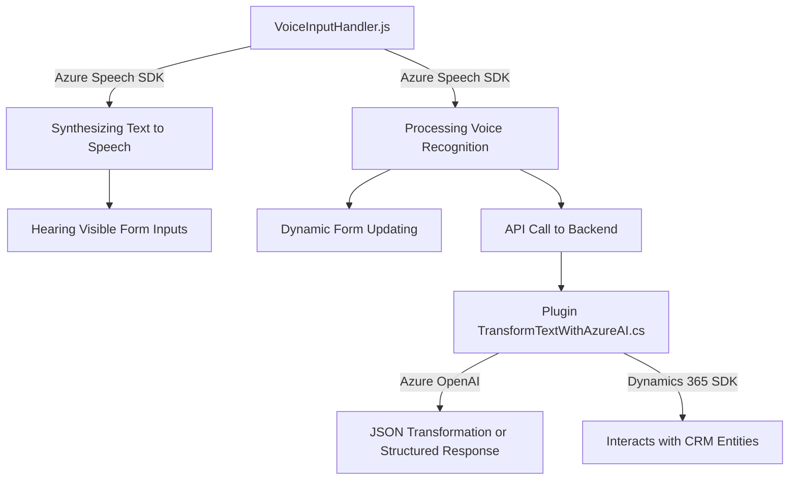

### Breve Resumen Técnico
El repositorio contiene tres archivos principales, de los cuales dos están orientados a la funcionalidad del front-end dentro de entornos basados en formularios (Dynamics 365). Utilizan el **Azure Speech SDK** para sintetización y reconocimiento de voz, y uno de los archivos (back-end en C# .NET) implementa un plugin de Dynamics CRM que realiza operaciones de transformación con **Azure OpenAI**, permitiendo estructurar texto hablado en JSON o seguir normas específicas. La solución parece destinada a mejorar la experiencia en entornos empresariales al integrar inteligencia artificial para interactuar con formularios.

---

### Descripción de Arquitectura
Este sistema combina una arquitectura híbrida, pero orientada a una implementación **n-capas** claramente estructurada:
- **Presentación/Frontend**: Maneja interacción de formularios dinámicos en Dynamics 365 utilizando JavaScript y Azure Speech SDK.
- **Middleware/API**: Implementa lógica con el uso de Azure AI/SDK para procesamiento de voz y OpenAI para manipulación de textos complejos.
- **Integración con la capa de Datos/Backend**: Se conecta y extiende las funcionalidades de Dynamics CRM vía plugins personalizados en .NET (c#), para realizar llamados a APIs y gestionar datos de entidades CRM.

El uso de **Azure SDK** y **OpenAI API** como servicios externos evidencia una arquitectura orientada a **integración de servicios externos**. Esto refuerza la separación de responsabilidades y permite desacoplar partes del sistema, que es una característica de la arquitectura **n-capas**.

---

### Tecnologías Usadas
1. **Frontend (JavaScript)**:
   - **JavaScript ES6**: Usado para manejar interacciones.
   - **Microsoft Azure Speech SDK**: Para reconocimiento de voz y sintetización en el navegador.
   - **Dynamics 365 APIs**: Clase `Xrm.WebApi` para integración con formularios del sistema CRM.
   - **Diseño modular**: Cada función tiene responsabilidades claramente definidas.

2. **Backend (C# .NET)**:
   - **Microsoft Dynamics CRM SDK**: Usando clases como `IPluginExecutionContext` para extender funciones dentro de plugins.
   - **Azure OpenAI API**: Consumidor externo REST para transformación de mensajes.
   - **Bibliotecas de manejo HTTP/JSON**: `System.Net.Http`, `System.Text.Json`, etc.

3. **Servicios Integrados**:
   - **Azure Speech SDK**: Para reconocimiento de voz y síntesis en tiempo real.
   - **Azure OpenAI API**: Para procesamiento avanzado de texto hablado o visual.
   - **Dynamics 365 Web APIs**: Manejo de entidades y operaciones relacionadas.

---

### Diagrama Mermaid

---

### Conclusión Final
Este repositorio representa una **solución híbrida n-capas**, principalmente enfocada en mejorar la interacción usuario-sistema en **Dynamics 365 CRM**. Aprovecha los servicios avanzados de **Azure Speech SDK** para interacción con formularios mediante reconocimiento y síntesis de voz, y utiliza **Azure OpenAI API** para procesamiento complejo de texto en el backend.

Además, el sistema enfatiza la modularidad y la integración con servicios externos mediante el uso de promesas asíncronas y diseño desacoplado. Este lo convierte en una solución escalable y extensible, ideal para empresas que requieren integrar experiencias innovadoras basadas en inteligencia artificial. Sin embargo, el desempeño dependerá de elementos configuracionales externos, como claves API y disponibilidad de los servicios de Azure correspondientes.