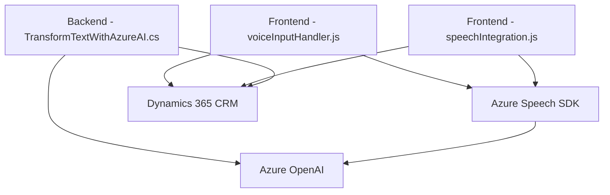

### Breve resumen técnico:
El repositorio muestra un sistema orientado a la integración entre CRM (Microsoft Dynamics 365) y servicios externos como Azure Speech SDK y Azure OpenAI. Contiene implementaciones tanto en el frontend como en el backend (plugins), con funcionalidades dedicadas a entrada de voz, síntesis de texto a voz, y transformación de texto mediante IA. Por lo tanto, el proyecto puede clasificarse como una solución híbrida que interactúa con sistemas CRM de Dynamics.

---

### Descripción de arquitectura:
La solución utiliza una **arquitectura modular en capas**, con dos puntos principales de interacción:
1. **Frontend**: Realiza manipulaciones en el formulario web del CRM mediante APIs externas. Utiliza Azure Speech SDK para entrada y salida de voz.
2. **Backend (Plugin)**: Implementa lógica y transformación de texto en el contexto del CRM, interactuando con servicios como Azure OpenAI para enriquecimiento de datos. 

La arquitectura general sigue el modelo:
- **Cliente (Frontend)**: Lógica rica para interacciones dinámicas del formulario y entrada por voz.
- **Servidor (Backend)**: Proceso de texto y lógica empresarial alojada en plugins del CRM.
  
Adicionalmente, emplea patrones como **Carga Asíncrona de SDK** y **Gestión de Dependencias Externas**.

---

### Tecnologías utilizadas:
1. **Frontend**:
   - **Vanilla JS**: Manipulación DOM y configuración dinámica de SDK.
   - **Azure Speech SDK**: Para entrada de voz y síntesis de texto a voz.
   - **Dynamics 365 Form API**: Modificación de campos en formularios CRM.
   - **Asynchronous Callbacks**: Control de flujos dependientes (carga y procesamiento).

2. **Backend**:
   - **Microsoft Dynamics CRM SDK**: Manejo de estructuras y eventos CRM.
   - **Azure OpenAI**: Consumo de GPT-4 para transformación semántica de texto.
   - **HTTP Client (System.Net.Http)**: Comunicación con Azure OpenAI.
   - **JSON Libraries**:
     - `Newtonsoft.Json` y `System.Text.Json` para manipulación de datos.
   - **Plugin Model**: Implementación de lógica en la interfaz `IPlugin`.

---

### Dependencias externas o componentes adicionales:
- **Azure Speech SDK**: Para síntesis y entrada de voz desde el frontend.
- **Azure OpenAI**: Comunicación con modelos GPT-4 hospedados en Azure.
- **Dynamics 365 Custom APIs**: Backend del CRM para producir lógica personalizada relacionada con transcripciones y campos.
- **ORM del CRM**: Para gestión de entidades y búsqueda dinámica de registros `lookup`.

---

### Diagrama Mermaid válido para GitHub:

---

### Conclusión final:
Este repositorio implementa una solución **híbrida orientada a servicios (SOA)** con un enfoque modular en capas. El frontend habilita funcionalidades avanzadas en el CRM mediante integración con Azure Speech SDK; mientras que el backend refuerza estas capacidades, empleando inteligencia artificial (Azure OpenAI) para procesamiento de texto enriquecido. La arquitectura permite escalar el sistema y una alta adaptabilidad a distintas implementaciones dentro del ecosistema de Dynamics, confirmando su idoneidad en sistemas empresariales que priorizan la interacción y automatización inteligente.