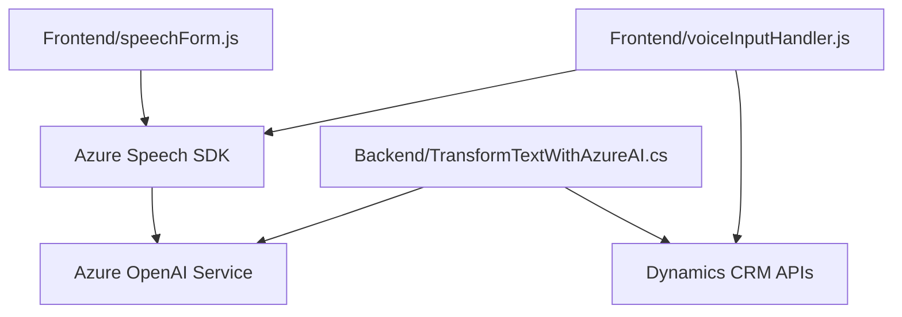

### Breve Resumen Técnico

El repositorio contiene archivos para manejar entrada y salida de voz, transcripción de texto a partir de voz y transformación avanzada de texto mediante integración con servicios de Azure (Azure Speech y Azure OpenAI). La solución está fuertemente orientada a integraciones entre una aplicación Dynamics CRM, servicios de Azure, y funcionalidades de procesamiento de formularios.

---

### Descripción de Arquitectura

1. **Tipo de Solución**: 
   - Es una solución híbrida compuesta de:
     - **Frontend/JS**: Scripts para integrar funcionalidades avanzadas en formularios de Dynamics CRM utilizando entrada de voz.
     - **Backend/Plugin**: Plugin en C# que establece una conexión entre Dynamics CRM y la API de Azure OpenAI.

2. **Arquitectura**: 
   - Basada en **arquitectura de capas**, donde el sistema tiene:
     - Capa de presentación: Los archivos frontend/JS gestionan la interacción entre el usuario y los formularios de CRM.
     - Capa de lógica de negocios: La lógica en el plugin de C# procesa las entradas utilizando Microsoft Dynamics y servicios de Azure.
     - Capa de servicios/infraestructura: Integra recursos externos como el Azure Speech SDK y Azure OpenAI para ejecutar operaciones avanzadas.

3. **Patrones usados**:
   - **Modularidad en Frontend**: Divisiones funcionales en componentes independientes (lectura/salida de voz, procesamiento de datos).
   - **Callback y promesas**: Manejo de operaciones asíncronas al cargar SDKs y consultar APIs.
   - **Plugin-based architecture en Backend**: Extensibilidad mediante integración directa con Dynamics CRM.
   - **Adaptador/Integración**: Comunicación con servicios externos como Azure OpenAI y Speech SDK.

---

### Tecnologías Usadas

1. **Frontend**:
   - JavaScript.
   - Azure Speech SDK: Para reconocimiento de voz y síntesis de texto a voz.
   - Dynamics CRM APIs: Gestión de formularios (Xrm).

2. **Backend**:
   - Lenguaje: C#.
   - Microsoft Dynamics CRM SDK: Para interacción directa con contexto y métodos del sistema CRM.
   - Azure OpenAI Service: Procesamiento de texto con lenguaje natural basado en GPT model.
   - .NET Framework.
   
3. **Dependencias externas**:
   - Azure Services: Speech y OpenAI.
   - HTTP Client y bibliotecas JSON (Newtonsoft.Json).

---

### Diagrama **Mermaid** válido para GitHub

---

### Conclusión Final

La solución parece diseñada para extender las funcionalidades de Microsoft Dynamics CRM mediante la integración de tecnologías avanzadas de Azure. Su arquitectura combina una adecuada separación de capas y componentes, facilitando la modularidad y el mantenimiento. En términos de integración, destaca el uso de servicios externos (Azure) para mejorar la experiencia del usuario por medio de procesamiento de voz, autocompletado de formularios, y transformación inteligente de texto. Es ideal para entornos empresariales con alta dependencia de CRM y necesidades de automatización avanzada.