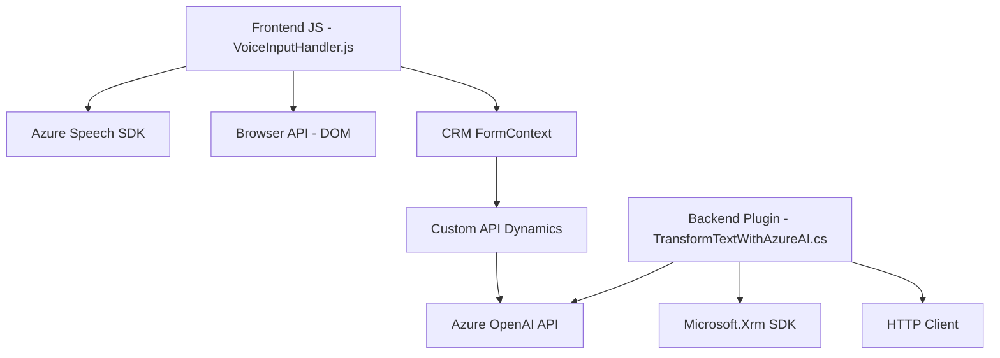

### Breve resumen técnico
El repositorio contiene varios componentes relacionados con el manejo de voz y procesamiento de texto en el contexto de formularios dentro de un sistema de CRM, utilizando principalmente Microsoft Dynamics CRM y los servicios de Azure, como Speech SDK y OpenAI API. La solución incluye:
- **Frontend**: Para interacción con el usuario a través del navegador.
- **CRM Plugins**: Para extensiones de funcionalidad directamente en la plataforma Dynamics.
- Integración extensiva con APIs de Azure para síntesis y reconocimiento de voz, además de procesamiento avanzado de texto.

---

### Descripción de la arquitectura
La solución parece seguir una **arquitectura híbrida basada en capas**:
1. **Frontend Layer (Presentation)**: Implementa la interacción con el usuario y utiliza servicios de Azure para voz y texto.
   - Organización modular en JavaScript con responsabilidades específicas por archivo.
   - Carga dinámica de dependencias como el Azure Speech SDK.
2. **Backend Layer (Logic)**:
   - Plugins de Dynamics CRM que procesan datos, delegando tareas específicas a servicios externos.
   - Ejemplo: `TransformTextWithAzureAI.cs` delega la generación de JSON a Azure OpenAI API.
3. **Integration Layer**:
   - Utiliza servicios como Azure Speech SDK y OpenAI API para entregar funcionalidades altamente especializadas (voz y procesamiento de texto).
   - La comunicación con estas APIs ocurre mayormente mediante HTTP.

La arquitectura mezcla principios de **n capas** (para la estructura del repositorio) y **event-driven architecture** en el manejo de escucha y síntesis de voz. Además, presenta integración con tecnologías externas para maximizar la funcionalidad del sistema.

---

### Tecnologías usadas
- **Frontend:** 
   - Lenguaje: JavaScript.
   - Frameworks/Librerías: Azure Speech SDK para síntesis/entrada de voz.
   - Browser API: Manipulación de DOM y carga dinámica de scripts.
   
- **Backend:** 
   - Lenguaje: C#.
   - Framework de Plugin: `Microsoft.Xrm.Sdk` para CRM Dynamics.
   - HTTP Client: `System.Net.Http` para enviar datos a la Azure OpenAI API.
   
- **Servicios externos:**
   - Azure Speech SDK (entrada/salida de voz) integrado con el navegador.
   - Azure OpenAI API para procesamiento avanzado de texto y transformación en JSON.

---

### Diagrama Mermaid válido para GitHub Markdown

---

### Conclusión final
La solución implementa una arquitectura centrada en la integración de herramientas de Azure (Speech SDK y OpenAI API) con Dynamics CRM para transformar y sintetizar información a través de voz y texto. Está diseñada para operar en un entorno corporativo, maximizando la usabilidad de formularios y simplificando la interacción con entradas y procesamiento mediante IA.

- **Puntos destacados:**
   - Modularidad clara tanto en el frontend como en el backend.
   - Uso de dependencias dinámicas y servicios externos para cubrir necesidades específicas.
   - Patrones como **Single Responsibility** y **Integration Architecture** fueron aplicados eficazmente.

