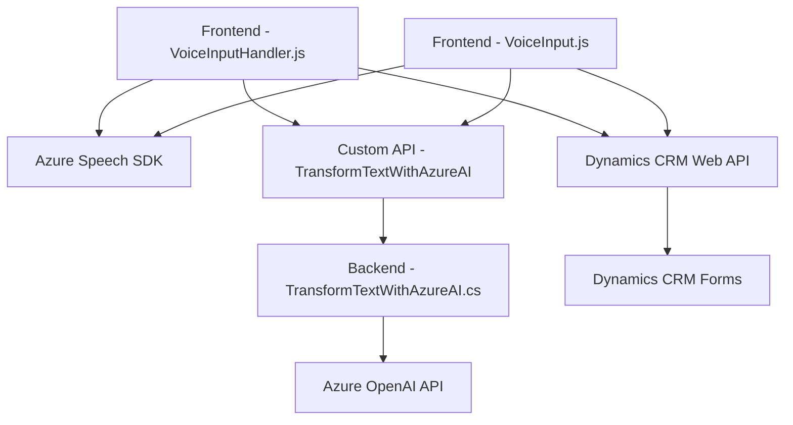

### Breve resumen técnico:

Este repositorio contiene tres archivos principales que trabajan en conjunto para proporcionar funcionalidades de procesamiento de voz y texto en un entorno de Dynamics CRM, integrando servicios como Azure Speech SDK y Azure OpenAI. Las dos implementaciones en JavaScript (`readForm.js`, `speechForm.js`) trabajan sobre el frontend, mientras que el archivo `TransformTextWithAzureAI.cs` sirve como un plugin backend en Dynamics CRM para procesar texto mediante la integración con Azure OpenAI API.

---

### Descripción de arquitectura:

La solución emplea una **arquitectura basada en n capas**, donde las responsabilidades se dividen en diferentes niveles:

1. **Frontend**: Incluye el procesamiento del reconocimiento de voz y la síntesis de voz, además de interactuar con los formularios de Dynamics CRM mediante APIs personalizadas.
2. **Backend/Plugin**: Funcionalidades de procesamiento en la nube mediante Azure OpenAI y Dynamics CRM SDK.
3. **Servicios externos (Azure)**: Los servicios en la nube, Azure Speech SDK y Azure OpenAI, son esenciales para el reconocimiento de voz y la transformación de texto.

Este diseño refleja principios de descentralización de responsabilidades con interacción entre módulos autónomos integrados por API y SDK externos.

---

### Tecnologías usadas:

1. **Frontend**:
   - **Azure Speech SDK**: Reconocimiento y síntesis de voz basado en la plataforma de Azure.
   - **JavaScript**: Para interacción con el cliente y lógica de negocio en Dynamics CRM forms.
   - **Dynamics CRM Web API**: Para comunicación con servicios personalizados del backend.
2. **Backend**:
   - **Microsoft Dynamics CRM SDK**: Extensiones a través de la implementación del sistema de plugins.
   - **Azure OpenAI API**: Uso de la API REST para transformación de texto utilizando inteligencia artificial.
   - **.NET Framework / C#**: Implementación de lógica de negocio, manejo de HTTP requests y validación de datos.
3. **Patrones de diseño**:
   - Modularidad y separación de responsabilidades.
   - Integración con APIs externas mediante servicios HTTP.
   - Programación orientada a eventos para el manejo de dependencias como SDKs y cargas dinámicas.
   - Plugin Microservices para encapsulación backend en Dynamics.

---

### Diagrama **Mermaid**:

---

### Conclusión Final:

La solución presentada es un sistema integrado basado en n capas que emplea tecnologías modernas como Azure Speech SDK y Azure OpenAI para unificar funcionalidades de voz y procesamiento de texto. En el frontend, se realizan tareas de reconocimiento y síntesis de voz, así como interacciones dinámicas con formularios de Dynamics CRM. El backend, implementado como un plugin de Dynamics CRM, aplica transformaciones avanzadas sobre texto utilizando IA mediante el servicio Azure OpenAI.

Este diseño garantiza modularidad, escalabilidad y adaptabilidad asociada a la integración de SDKs de terceros y APIs. Es especialmente idóneo para escenarios que requieren procesamiento semántico automatizado e interacción con usuarios mediante voz.