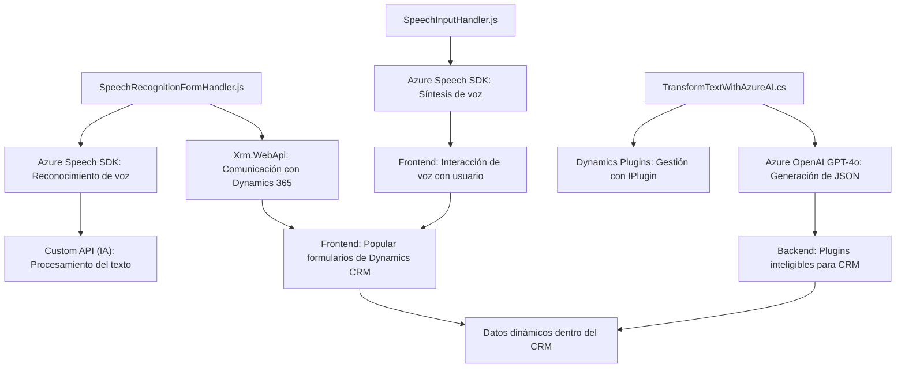

### Análisis técnico

#### Breve resumen técnico:
El repositorio contiene tres archivos principales que colaboran en una solución integrada basada en tecnologías de Microsoft Dynamics 365 y Azure. Cada archivo implementa funcionalidades específicas:
- **SpeechInputHandler.js**: Convierte datos visibles de un formulario en voz usando Azure Speech SDK.
- **SpeechRecognitionFormHandler.js**: Realiza reconocimiento de voz y procesa el texto hablado para popular formularios de Dynamics 365.
- **TransformTextWithAzureAI.cs**: Plugin en C# que transforma texto en un formato JSON utilizando Azure OpenAI dentro de Dynamics 365.

---

#### Descripción de arquitectura:
Esta solución se compone de una mezcla de **frontend web** (JavaScript) y **backend de Dynamics 365** (C#). El diseño contempla una arquitectura modular con integración a servicios externos como Azure Speech SDK y Azure OpenAI. Es una arquitectura híbrida cliente/servidor que combina:
1. **Frontend**: Código JavaScript para interacción directa con usuarios, enfocado en procesamiento de voz y lectura de formularios.
2. **Backend**: Plugins y APIs que extienden la funcionalidad de Dynamics CRM mediante servicios externos.

Aunque utiliza varios componentes, la solución no se adapta completamente al modelo **microservicios**, debido a la fuerte dependencia de Dynamics CRM. La arquitectura puede clasificarse como **n-capas**, donde cada capa (frontend y backend) tiene responsabilidades bien definidas.

---

#### Tecnologías usadas:
1. **Frontend (JavaScript)**:
   - Azure Speech SDK: Para síntesis y reconocimiento de voz.
   - Dynamics 365 Context API: Para interacción de datos en formularios.
   - Modularidad basada en funciones para mejorar mantenibilidad y reutilización.

2. **Backend (C#)**:
   - Dynamics CRM SDK (`Microsoft.Xrm.Sdk`): Para crear plugins.
   - Azure OpenAI: Para procesamiento avanzado de contenido compatible con estándares JSON.
   - Framework .NET (ASP.NET): Gestión de lógica servidor.

3. **Otros**:
   - API dinámica de Dynamics 365 (`Xrm.WebApi`) para ejecución de servicios en tiempo real.

---

#### Dependencias o componentes externos:
- **Requeridos explícitamente**:
  - Azure Speech SDK: Cargado dinámicamente en el frontend.
  - Azure OpenAI GPT-4o: Usado en backend para transformar texto.
  - Xrm.WebApi: Dynamics 365 API utilizada en el frontend web.
  - System.Net.Http y Newtonsoft Json: Librerías para manejo de peticiones HTTP y JSON en el backend.

- **Potenciales**:
  - **Configuración segura y API keys**: Credenciales para Azure servicios y Dynamics 365 deben gestionarse en un entorno seguro.
  - **Dynamics 365 Entity Definitions**: Los archivos dependen de la estructura específica de formularios y entidades de Dynamics CRM.

---

#### Diagrama **Mermaid**:

---

### Conclusión final:
La solución presenta una integración altamente especializada entre el frontend y backend para automatizar la interacción con formularios basados en Dynamics CRM. Utiliza el reconocimiento y la síntesis de voz en el frontend, procesando datos con servicios de Azure, y complementa su funcionalidad con un plugin en el backend que ejecuta transformación de texto con inteligencia artificial. 

La arquitectura es **n-capas** y modular, revestida por patrones como carga dinámica de dependencias, encapsulación lógica por funciones, y manejo eficiente de datos cliente/servidor. Aunque aprovecha servicios externos de Azure, la solución está fuertemente vinculada a Dynamics 365, reflejando un entorno específico de negocio.