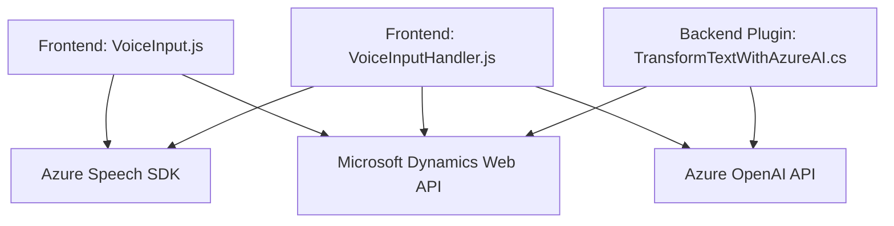

### Breve Resumen Técnico

El repositorio contiene componentes de una solución orientada a mejorar la interacción de usuarios con formularios mediante entrada y salida de voz, procesamiento inteligente de datos con inteligencia artificial (Azure OpenAI), y un plugin implementado en Dynamics CRM que permite realizar tareas específicas relacionadas con transformación de texto. La solución integra funcionalidades frontend en JavaScript y backend con C#. Está claramente diseñada para ofrecer interacción dinámica con plataformas, posiblemente en un contexto CRM o similar.

---

### Descripción de Arquitectura

La arquitectura combina elementos **modulares** con integración de servicios externos. 

1. **Componentes Frontend**: Utilizan el Azure Speech SDK y Microsoft Dynamics Web API para habilitar entrada y salida de voz, así como sincronización de datos en formularios. El frontend emplea funciones modulares con patrones MVC (Modelo-Vista-Controlador).
   
2. **Backend Plugin**: Implementa una **plugin-based architecture** típica de Dynamics CRM, utilizando la API para enviar texto a Azure OpenAI y generar resultados JSON que vuelven al sistema como salida procesada.

3. **Patrones**:
   - **Interacción Cliente-Servidor (RESTful)** para comunicación con APIs externas.
   - **Gestión Dinámica de Dependencias**, cargando SDK únicamente cuando es necesario (Ahorrar ciclos de procesamiento y ancho de banda).
   - **Separación de Responsabilidades** entre frontend y backend.

---

### Tecnologías Usadas

- **Frontend**:
  - **JavaScript**: Lenguaje principal para interacción con formularios y SDKs.
  - **Azure Speech SDK**: Para síntesis de voz y entrada de voz en tiempo real.
  - **Microsoft Dynamics Web API**: Manipulación de datos en formularios CRM.

- **Backend**:
  - **C#**: Lenguaje principal.
  - **Microsoft Dynamics CRM SDK**: Para desarrollar plugins y extensiones de Dynamics CRM.
  - **Azure OpenAI API (GPT)**: Para transformar texto con inteligencia artificial.
  - **Newtonsoft.Json** / **System.Text.Json**: Manejo de JSON en el plugin.

---

### Diagrama Mermaid

Este diagrama muestra cómo interactúan los componentes correspondientes en esta solución: desde el frontend para capturar y sintetizar datos hasta el backend para transformarlos con IA.

---

### Conclusión Final

La solución integra inteligentemente múltiples tecnologías modernas, como SDKs de Azure y la API de Dynamics CRM, para extender capacidades de voz y procesamiento de datos en un entorno CRM. La estructura modular del frontend facilita la navegación entre funciones. En el backend, el uso de un plugin que interactúa con Azure OpenAI agrega una capa de inteligencia artificial que convierte datos ingresados en formatos más útiles para el negocio.

Con esta arquitectura, la solución presenta un diseño sólido y flexible orientado a microservicios. Sin embargo, aún tiene elementos compartidos (por ejemplo, dependencias del plugin y frontend con Dynamics CRM). Una posible mejora sería avanzar hacia una arquitectura hexagonal que facilite pruebas y escalabilidad.