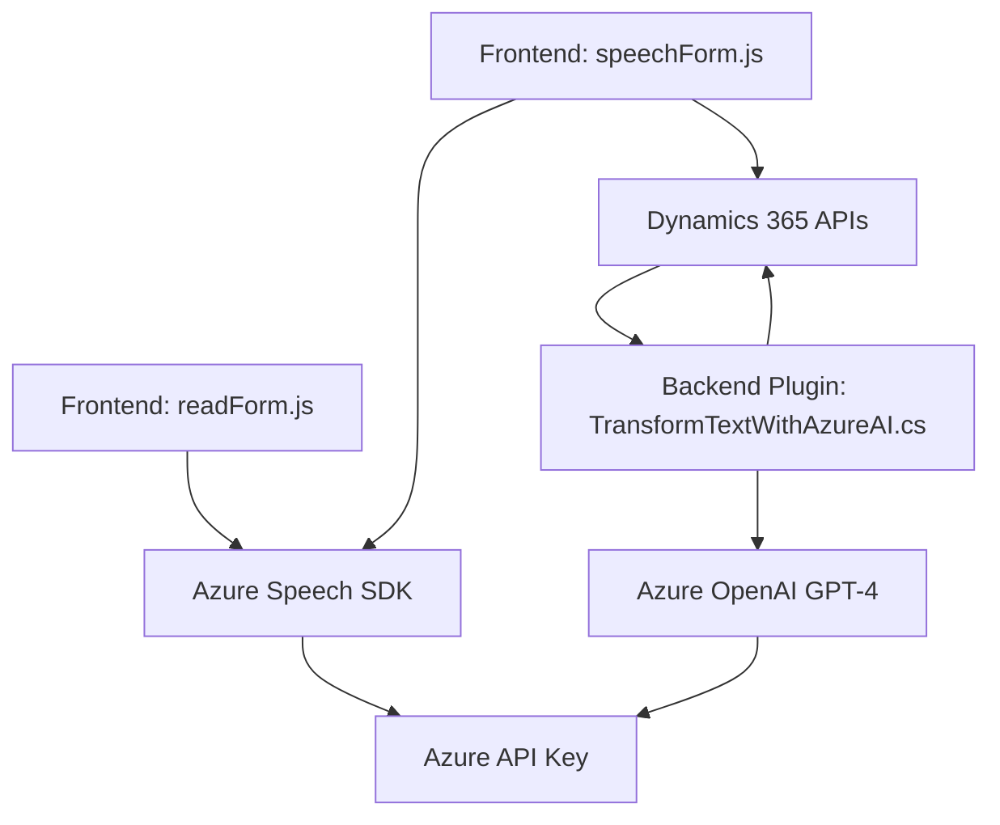

### Breve resumen técnico:
Este repositorio claramente implementa funcionalidades relacionadas con el procesamiento de formularios dinámicos, entrada y salida de voz, integración con servicios externos como **Azure Speech SDK** y **Azure OpenAI**, y manejo de APIs de **Dynamics 365**. La solución abarca tanto frontend (procesamiento en navegador) como plugins backend para Dynamics CRM y análisis de datos con IA.

---

### Descripción de arquitectura:
#### Tipo de solución:
- Es una solución híbrida que combina:
  - **Frontend (JavaScript)**: Implementa funcionalidad en el navegador para interactuar con formularios de Dynamics 365, utilizando reconocimiento de voz y síntesis de texto a audio.
  - **Backend (C# Plugins)**: Extiende la funcionalidad de Dynamics 365 con lógica adicional apoyada por servicios de IA.

#### Arquitectura:
- **N capas**:
  - Presentación: Código JavaScript que interactúa con el usuario.
  - Lógica de negocio: Plugins personalizados en Dynamics CRM que procesan datos mediante servicios externos como Azure OpenAI.
  - Integración y almacenamiento: APIs de Dynamics 365 y servicios externos.
- **Service-Oriented Architecture (SOA)**:
  - Extensivo uso de servicios externos (Azure Speech SDK y Azure OpenAI).
- **Modular diseño**:
  - Claramente cada módulo tiene su propia responsabilidad (voz, integración IA, formularios, etc.).
- **Carga Dinámica**:
  - SDK de Azure Speech se carga dinámicamente en los scripts frontend.

---

### Tecnologías usadas:
1. **Frontend**:
   - Lenguaje: JavaScript (ES6).
   - Servicios externos: Azure Speech SDK para reconocimiento y síntesis de audio.
   - Framework/formularios: Microsoft Dynamics 365 Form Context API.
   
2. **Backend**:
   - Lenguaje: C#.
   - Framework usado: Microsoft Dynamics SDK (`Microsoft.Xrm.Sdk`).
   - Servicio externo: Azure OpenAI (GPT-4 en modo REST).

3. **Patrones de diseño**:
   - Modularidad.
   - Service-Oriented Architecture (SOA).
   - Plugin Pattern (Dynamics CRM).
   - Dynamic Loading (Azure Speech SDK).

---

### Diagrama Mermaid:

---

### Conclusión final:
La solución está bien diseñada para manejar procesamiento de formularios dinámicos y enriquecer la experiencia del usuario mediante integración avanzada con sistemas de reconocimiento de voz y tecnologías IA. Utiliza un enfoque modular en el frontend y emplea una arquitectura de capas con principios SOA y Plugins en el backend. Sin embargo, se destacan áreas de mejora como:
1. **Seguridad**: La gestión de claves de Azure (API Keys) podría ser más segura mediante entornos específicos o variables protegidas.
2. **Separación de responsabilidades**: Una división más clara de módulos y funciones podría ayudar en el mantenimiento del proyecto.

El repositorio refleja una solución moderna y extensible basada en tecnologías altamente integradas con servicios de Microsoft Azure.